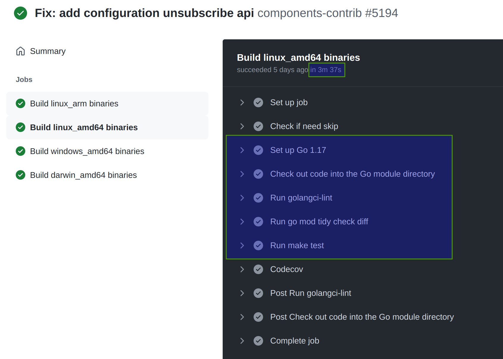
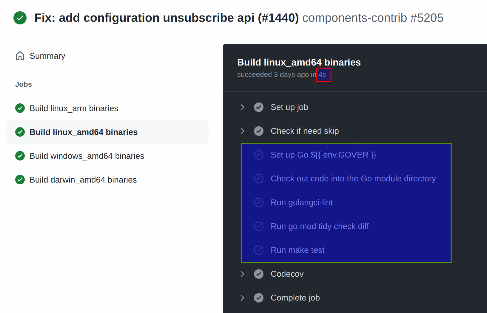

components-contrib 仓库的 workflow 有多个：

https://github.com/dapr/components-contrib/tree/master/.github/workflows

先看最核心的 components-contrib.yml

https://github.com/dapr/components-contrib/blob/master/.github/workflows/components-contrib.yml

## action基本设置

和 kit 仓库完全一致，这块感觉应该各个go仓库都差不多。

## steps配置

### step: Set up job

这是 github action 自身的job，主要是准备操作系统和相关的软件, 以及准备相关的 actions，以备后续步骤使用：

```
Prepare workflow directory
Prepare all required actions
Getting action download info
Download action repository 'fkirc/skip-duplicate-actions@v3.4.0' (SHA:4c656bbdb6906310fa6213604828008bc28fe55d)
Download action repository 'actions/setup-go@v2' (SHA:424fc82d43fa5a37540bae62709ddcc23d9520d4)
Download action repository 'actions/checkout@v2' (SHA:ec3a7ce113134d7a93b817d10a8272cb61118579)
Download action repository 'golangci/golangci-lint-action@v2.2.1' (SHA:54a84d46fb7183443c869b1b7d0dc34f640fcfd7)
Download action repository 'codecov/codecov-action@v1' (SHA:29386c70ef20e286228c72b668a06fd0e8399192)
```

和 kit 相比，`fkirc/skip-duplicate-actions@v3.4.0` 是个新的内容，其他都相同。

### step: Check if need skip

和 kit 仓库相比，这是最大的不同，多了一个是否需要跳过的检查，在之后的多个步骤中，都相应的增加了对是否可以跳过的判断。

```yaml
      - name: Check if need skip
        id: skip_check
        uses: fkirc/skip-duplicate-actions@v3.4.0
        with:
          cancel_others: 'true'
          paths_ignore: '["**.md", ".codecov.yaml", ".github/workflows/dapr-automerge.yml"]'
```

好处就是可以极大的提高CI执行的速度，因为如果判断出来可以跳过（之前执行过检查而之后没有文件变化），就会让后续的各个步骤直接跳过执行过程从而让CI极快的通过。

这是正常执行的 workflow 的情况, 绿色框中的步骤都正常执行，总耗时3分钟37秒：



这是跳过之后的 workflow 的执行情况，可以看到绿色框中的步骤都被跳过，然后总耗时就从之前的3分钟37秒降到4秒：



检查一下日志，看这个step是怎么执行的：

```yaml
Run fkirc/skip-duplicate-actions@v3.4.0
  with:
    cancel_others: true
    paths_ignore: ["**.md", ".codecov.yaml", ".github/workflows/dapr-automerge.yml"]
    github_token: ***
    paths: []
    skip_after_successful_duplicate: true					# 在成功之后的重复就跳过
    do_not_skip: ["workflow_dispatch", "schedule"]
    concurrent_skipping: never
  env:
    GOVER: 1.17
    GOOS: linux
    GOARCH: amd64
    GOPROXY: https://proxy.golang.org
    GOLANGCI_LINT_VER: v1.31
Did not find other workflow-runs to be cancelled
Skip execution because the exact same files have been successfully checked in https://github.com/dapr/components-contrib/actions/runs/1715733057							# 发现之前有成功的检查，而文件和当前完全相同
```

学习一下 `fkirc/skip-duplicate-actions` ：

https://github.com/fkirc/skip-duplicate-actions

> skip-duplicate-actions 提供了以下功能来优化GitHub Actions: 
>
> - 在合并、拉动请求或类似情况下，跳过重复的工作流运行。
> - 跳过并发的或平行的工作流运行，以避免运行两次。
> - 跳过忽略的路径，以加快文档更改或类似的速度。
> - 如果路径没有改变，则跳过目录特定的测试等内容。
> - 在分支推送后取消过时的工作流运行。
> 
> 所有这些功能都有助于节省时间和成本；特别是对于长期运行的工作流程。你可以选择这些功能的任何子集。

### step: Set up Go 

安装go的步骤，使用到前面准备的 action `actions/setup-go@v1`:

```yaml
      - name: Set up Go ${{ env.GOVER }}
        if: ${{ steps.skip_check.outputs.should_skip != 'true' }}
        uses: actions/setup-go@v2
        with:
          go-version: ${{ env.GOVER }}
```

和 kit 仓库相比，只是多了一个 `steps.skip_check.outputs.should_skip != 'true'` 的判断，其他是一样的。

### step: Check out code

checkout 代码的步骤，使用到前面准备的 action `actions/checkout@v2`:

```yaml
      - name: Check out code into the Go module directory
        if: ${{ steps.skip_check.outputs.should_skip != 'true' }}
        uses: actions/checkout@v2
```

和 kit 仓库相比，只是多了一个 `steps.skip_check.outputs.should_skip != 'true'` 的判断，其他是一样的。

### step：Run golangci-lint

执行golangci-lint的步骤，使用到前面准备的 action `golangci/golangci-lint-action@v2.2.1`:

```yaml
      - name: Run golangci-lint
        if: matrix.target_arch == 'amd64' && matrix.target_os == 'linux' && steps.skip_check.outputs.should_skip != 'true'
        uses: golangci/golangci-lint-action@v2.2.1
        with:
          version: ${{ env.GOLANGCI_LINT_VER }}
```

和 kit 仓库相比，只是多了一个 `steps.skip_check.outputs.should_skip != 'true'` 的判断，其他是一样的。

### step: Run go mod tidy check diff

使用到 Makefile 中定义的 `target modtidy-all`  和 `check-diff`:

```yaml
      - name: Run go mod tidy check diff
        if: matrix.target_arch == 'amd64' && matrix.target_os == 'linux' && steps.skip_check.outputs.should_skip != 'true'
        run: make modtidy-all check-diff
```

和 kit 仓库相比, 除了需要检查的 go.mod 文件是多个之外，只是多了一个 `steps.skip_check.outputs.should_skip != 'true'` 的判断，其他是一样的。

### step: Run make test

```yaml
      - name: Run make test
        env:
          COVERAGE_OPTS: "-coverprofile=coverage.txt -covermode=atomic"
        if: matrix.target_arch != 'arm' && steps.skip_check.outputs.should_skip != 'true'
        run: make test
```

和 kit 仓库相比，只是多了一个 `steps.skip_check.outputs.should_skip != 'true'` 的判断，其他是一样的。

### step: Codecov

### step: Post Run golangci-lint

### step: Post Check out code 

和 kit 仓库相同。

## 总结

components-contrib 的 workflow 和 kit 仓库基本相同，只是多了一个 skip-duplicate-actions 的优化。

> 备注： 估计是 kit 仓库还没有来得及做这个 skip-duplicate-actions 优化，如果做了，就又一致了。

