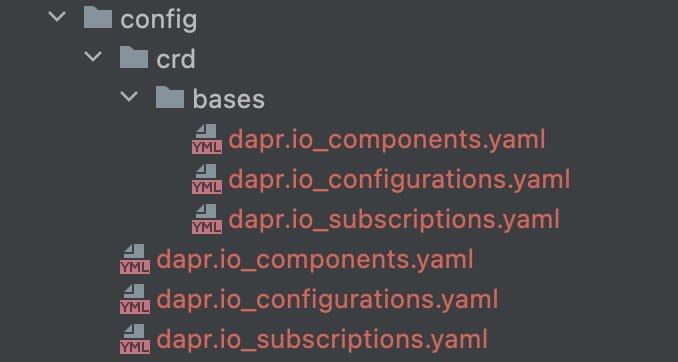

https://github.com/dapr/dapr/blob/master/Makefile

```makefile
################################################################################
# Target: codegen                                                              #
################################################################################
include tools/codegen.mk
```

https://github.com/dapr/dapr/blob/master/tools/codegen.mk

## 变量定义

```makefile
# 依然是这六个 proto 模块
PROTOS = operator placement sentry common runtime internals

ifeq (,$(shell go env GOBIN))
GOBIN=$(shell go env GOPATH)/bin
else
GOBIN=$(shell go env GOBIN)
endif
```

### Target: code-generate

```makefile
# Generate code
code-generate: controller-gen
	$(CONTROLLER_GEN) object:headerFile="./tools/boilerplate.go.txt" \
		crd:trivialVersions=true crd:crdVersions=v1 paths="./pkg/apis/..." output:crd:artifacts:config=config/crd/bases
```

执行结果输出如下：

```bash
$ make code-generate   
go: downloading sigs.k8s.io/controller-tools v0.5.0
go: downloading github.com/spf13/cobra v1.1.1
go: downloading github.com/fatih/color v1.9.0
go: downloading golang.org/x/tools v0.0.0-20200616133436-c1934b75d054
go: downloading sigs.k8s.io/yaml v1.2.0
go: downloading k8s.io/api v0.20.2
go: downloading k8s.io/apimachinery v0.20.2
go: downloading gopkg.in/yaml.v3 v3.0.0-20200615113413-eeeca48fe776
go: downloading k8s.io/apiextensions-apiserver v0.20.2
go: downloading github.com/gobuffalo/flect v0.2.2
go: downloading gopkg.in/yaml.v2 v2.3.0
go: downloading github.com/gogo/protobuf v1.3.1
go: downloading k8s.io/utils v0.0.0-20201110183641-67b214c5f920
go: downloading k8s.io/klog/v2 v2.4.0
go: downloading sigs.k8s.io/structured-merge-diff/v4 v4.0.2
go: downloading golang.org/x/sys v0.0.0-20201112073958-5cba982894dd
go: downloading github.com/go-logr/logr v0.2.0
go: downloading github.com/json-iterator/go v1.1.10
go: downloading golang.org/x/net v0.0.0-20201110031124-69a78807bb2b
go: downloading github.com/modern-go/reflect2 v1.0.1
go: downloading golang.org/x/text v0.3.4
go get: installing executables with 'go get' in module mode is deprecated.
        Use 'go install pkg@version' instead.
        For more information, see https://golang.org/doc/go-get-install-deprecation
        or run 'go help get' or 'go help install'.
/Users/sky/work/soft/gopath/bin/controller-gen object:headerFile="./tools/boilerplate.go.txt" \
                crd:trivialVersions=true crd:crdVersions=v1 paths="./pkg/apis/..." output:crd:artifacts:config=config/crd/bases
```

再次运行，在 controller-gen 已经下载好的情况下日志就干净很多了：

```bash
$ make code-generate 
/Users/sky/work/soft/gopath/bin/controller-gen object:headerFile="./tools/boilerplate.go.txt" \
                crd:trivialVersions=true crd:crdVersions=v1 paths="./pkg/apis/..." output:crd:artifacts:config=config/crd/bases
```

生成的代码存放在 dapr 项目根目录下的 `config` 子目录：



TBD：有空再细看。

### Target: controller-gen

controller-gen target的定义有三部分。首先是找到 controller-gen，如果没有就下载：

```makefile
# find or download controller-gen
# download controller-gen if necessary
controller-gen:
ifeq (, $(shell which controller-gen))
	@{ \
		set -e ;\
		CONTROLLER_GEN_TMP_DIR="$$(mktemp -d)" ;\
		cd "$$CONTROLLER_GEN_TMP_DIR" ;\
		GO111MODULE=on go get sigs.k8s.io/controller-tools/cmd/controller-gen@v0.5.0 ; \
		rm -rf "$$CONTROLLER_GEN_TMP_DIR" ;\
	}
CONTROLLER_GEN=$(GOBIN)/controller-gen
else
CONTROLLER_GEN=$(shell which controller-gen)
endif
```

然后是一段方法定义,  动态定义了多个 `protoc-gen-$(1)-v1` target：

```makefile
define genProtoForTarget
.PHONY: $(1)
protoc-gen-$(1)-v1:
	protoc -I . ./dapr/proto/$(1)/v1/*.proto --go_out=plugins=grpc:.
	cp -R ./github.com/dapr/dapr/pkg/proto/$(1)/v1/*.go ./pkg/proto/$(1)/v1
	rm -rf ./github.com
endef
```

循环 PROTOS，为每个模块执行 `protoc-gen-$(1)-v1` target：

```makefile
PROTOS = operator placement sentry common runtime internals
# Generate proto gen targets
$(foreach ITEM,$(PROTOS),$(eval $(call genProtoForTarget,$(ITEM))))

PROTOC_ALL_TARGETS:=$(foreach ITEM,$(PROTOS),protoc-gen-$(ITEM)-v1)

protoc-gen: $(PROTOC_ALL_TARGETS)
```


