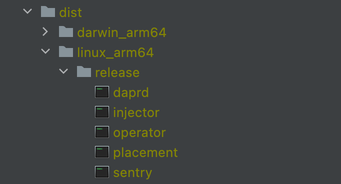
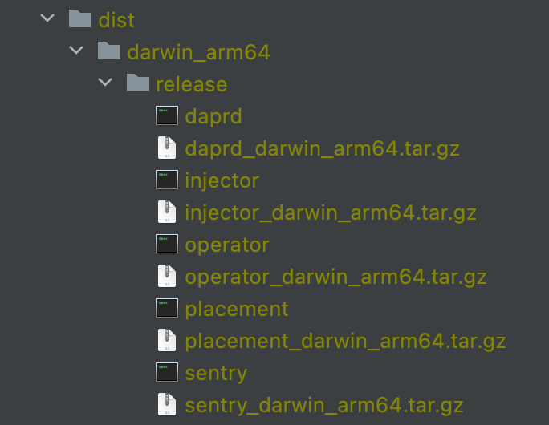
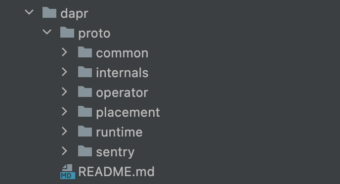
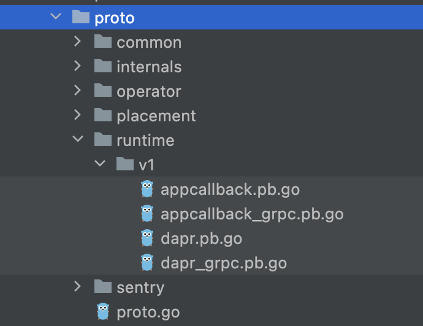

https://github.com/dapr/dapr/blob/master/Makefile

## 变量定义

和 kit/components-contrib 仓库一致内容就跳过了，只看新增的内容。

```makefile
# 需要打包的二进制模块，默认是这五个
BINARIES    ?= daprd placement operator injector sentry
# 默认不开启 HA 模式
HA_MODE     ?= false
# Force in-memory log for placement
FORCE_INMEM ?= true

# Add latest tag if LATEST_RELEASE is true
LATEST_RELEASE ?=

PROTOC ?=protoc
# name of protoc-gen-go when protoc-gen-go --version is run.
PROTOC_GEN_GO_NAME = "protoc-gen-go"
ifdef REL_VERSION
	DAPR_VERSION := $(REL_VERSION)
else
	DAPR_VERSION := edge
endif
```

和二进制打包相关的定义：

```makefile
ifeq ($(GOARCH),amd64)
	LATEST_TAG=latest
else
	LATEST_TAG=latest-$(GOARCH)
endif

LOCAL_OS := $(shell uname)
ifeq ($(LOCAL_OS),Linux)
   TARGET_OS_LOCAL = linux
else ifeq ($(LOCAL_OS),Darwin)
   TARGET_OS_LOCAL = darwin
else
   TARGET_OS_LOCAL ?= windows
   PROTOC_GEN_GO_NAME := "protoc-gen-go.exe"
endif
export GOOS ?= $(TARGET_OS_LOCAL)

PROTOC_GEN_GO_NAME+= "v1.26.0"

# Default docker container and e2e test targst.
TARGET_OS ?= linux
TARGET_ARCH ?= amd64
TEST_OUTPUT_FILE_PREFIX ?= ./test_report

ifeq ($(GOOS),windows)
BINARY_EXT_LOCAL:=.exe
GOLANGCI_LINT:=golangci-lint.exe
export ARCHIVE_EXT = .zip
else
BINARY_EXT_LOCAL:=
GOLANGCI_LINT:=golangci-lint
export ARCHIVE_EXT = .tar.gz
endif

export BINARY_EXT ?= $(BINARY_EXT_LOCAL)

OUT_DIR := ./dist
```

和 helm 相关的定义：

```makefile
# Helm template and install setting
HELM:=helm
RELEASE_NAME?=dapr
DAPR_NAMESPACE?=dapr-system
DAPR_MTLS_ENABLED?=true
HELM_CHART_ROOT:=./charts
HELM_CHART_DIR:=$(HELM_CHART_ROOT)/dapr
HELM_OUT_DIR:=$(OUT_DIR)/install
HELM_MANIFEST_FILE:=$(HELM_OUT_DIR)/$(RELEASE_NAME).yaml
HELM_REGISTRY?=daprio.azurecr.io
```

和 go build 相关的定义：

```makefile
################################################################################
# Go build details                                                             #
################################################################################
BASE_PACKAGE_NAME := github.com/dapr/dapr
LOGGER_PACKAGE_NAME := github.com/dapr/kit/logger

DEFAULT_LDFLAGS:=-X $(BASE_PACKAGE_NAME)/pkg/version.gitcommit=$(GIT_COMMIT) \
  -X $(BASE_PACKAGE_NAME)/pkg/version.gitversion=$(GIT_VERSION) \
  -X $(BASE_PACKAGE_NAME)/pkg/version.version=$(DAPR_VERSION) \
  -X $(LOGGER_PACKAGE_NAME).DaprVersion=$(DAPR_VERSION)
  
  ifeq ($(origin DEBUG), undefined)
  BUILDTYPE_DIR:=release
  LDFLAGS:="$(DEFAULT_LDFLAGS) -s -w"
else ifeq ($(DEBUG),0)
  BUILDTYPE_DIR:=release
  LDFLAGS:="$(DEFAULT_LDFLAGS) -s -w"
else
  BUILDTYPE_DIR:=debug
  GCFLAGS:=-gcflags="all=-N -l"
  LDFLAGS:="$(DEFAULT_LDFLAGS)"
  $(info Build with debugger information)
endif

DAPR_OUT_DIR := $(OUT_DIR)/$(GOOS)_$(GOARCH)/$(BUILDTYPE_DIR)
DAPR_LINUX_OUT_DIR := $(OUT_DIR)/linux_$(GOARCH)/$(BUILDTYPE_DIR)
```


## build target

然后就是正式的 build target 定义了。

其中  target lint / target check-diff  和 components-contrib 仓库完全一致，跳过。

### Target: build

```makefile
# 前面的 BINARIES 定义
BINARIES    ?= daprd placement operator injector sentry
BUILDTYPE_DIR:=release 或着 debug
export BINARY_EXT ?= $(BINARY_EXT_LOCAL)  # 在windows 上构建时 BINARY_EXT_LOCAL 才会设置为 .exe
################################################################################
# Target: build                                                                #
################################################################################
.PHONY: build
DAPR_BINS:=$(foreach ITEM,$(BINARIES),$(DAPR_OUT_DIR)/$(ITEM)$(BINARY_EXT))
build: $(DAPR_BINS)

# Generate builds for dapr binaries for the target
# Params:
# $(1): the binary name for the target
# $(2): the binary main directory
# $(3): the target os
# $(4): the target arch
# $(5): the output directory
define genBinariesForTarget
.PHONY: $(5)/$(1)
$(5)/$(1):
	CGO_ENABLED=$(CGO) GOOS=$(3) GOARCH=$(4) go build $(GCFLAGS) -ldflags=$(LDFLAGS) \
	-o $(5)/$(1) $(2)/;
endef

# Generate binary targets
$(foreach ITEM,$(BINARIES),$(eval $(call genBinariesForTarget,$(ITEM)$(BINARY_EXT),./cmd/$(ITEM),$(GOOS),$(GOARCH),$(DAPR_OUT_DIR))))
```

循环构建 BINARIES 中定义的二进制模块。

在 macos + m1 芯片的 MacBook 上，输出如下：

```bash
make build 
CGO_ENABLED=0 GOOS=darwin GOARCH=arm64 go build  -ldflags="-X github.com/dapr/dapr/pkg/version.gitcommit=551722f533afa5dfee97482fe3e63d8ff6233d50 -X github.com/dapr/dapr/pkg/version.gitversion=v1.5.1-rc.3-411-g551722f -X github.com/dapr/dapr/pkg/version.version=edge -X github.com/dapr/kit/logger.DaprVersion=edge -s -w" -o ./dist/darwin_arm64/release/daprd ./cmd/daprd/;
go: downloading github.com/dapr/components-contrib v1.6.0-rc.1.0.20220307041340-f1209fb068c7
CGO_ENABLED=0 GOOS=darwin GOARCH=arm64 go build  -ldflags="-X github.com/dapr/dapr/pkg/version.gitcommit=551722f533afa5dfee97482fe3e63d8ff6233d50 -X github.com/dapr/dapr/pkg/version.gitversion=v1.5.1-rc.3-411-g551722f -X github.com/dapr/dapr/pkg/version.version=edge -X github.com/dapr/kit/logger.DaprVersion=edge -s -w" -o ./dist/darwin_arm64/release/placement ./cmd/placement/;
CGO_ENABLED=0 GOOS=darwin GOARCH=arm64 go build  -ldflags="-X github.com/dapr/dapr/pkg/version.gitcommit=551722f533afa5dfee97482fe3e63d8ff6233d50 -X github.com/dapr/dapr/pkg/version.gitversion=v1.5.1-rc.3-411-g551722f -X github.com/dapr/dapr/pkg/version.version=edge -X github.com/dapr/kit/logger.DaprVersion=edge -s -w" -o ./dist/darwin_arm64/release/operator ./cmd/operator/;
CGO_ENABLED=0 GOOS=darwin GOARCH=arm64 go build  -ldflags="-X github.com/dapr/dapr/pkg/version.gitcommit=551722f533afa5dfee97482fe3e63d8ff6233d50 -X github.com/dapr/dapr/pkg/version.gitversion=v1.5.1-rc.3-411-g551722f -X github.com/dapr/dapr/pkg/version.version=edge -X github.com/dapr/kit/logger.DaprVersion=edge -s -w" -o ./dist/darwin_arm64/release/injector ./cmd/injector/;
CGO_ENABLED=0 GOOS=darwin GOARCH=arm64 go build  -ldflags="-X github.com/dapr/dapr/pkg/version.gitcommit=551722f533afa5dfee97482fe3e63d8ff6233d50 -X github.com/dapr/dapr/pkg/version.gitversion=v1.5.1-rc.3-411-g551722f -X github.com/dapr/dapr/pkg/version.version=edge -X github.com/dapr/kit/logger.DaprVersion=edge -s -w" -o ./dist/darwin_arm64/release/sentry ./cmd/sentry/;
```

构建成功的二进制文件存在放 `./dist/darwin_arm64/release/` 目录下:


### Target: build-linux

```makefile
################################################################################
# Target: build-linux                                                          #
################################################################################
BUILD_LINUX_BINS:=$(foreach ITEM,$(BINARIES),$(DAPR_LINUX_OUT_DIR)/$(ITEM))
build-linux: $(BUILD_LINUX_BINS)

# Generate linux binaries targets to build linux docker image
ifneq ($(GOOS), linux)
$(foreach ITEM,$(BINARIES),$(eval $(call genBinariesForTarget,$(ITEM),./cmd/$(ITEM),linux,$(GOARCH),$(DAPR_LINUX_OUT_DIR))))
endif
```


在 macos + m1 芯片的 MacBook 上，输出如下：

```bash
$ make build-linux 
CGO_ENABLED=0 GOOS=linux GOARCH=arm64 go build  -ldflags="-X github.com/dapr/dapr/pkg/version.gitcommit=551722f533afa5dfee97482fe3e63d8ff6233d50 -X github.com/dapr/dapr/pkg/version.gitversion=v1.5.1-rc.3-411-g551722f -X github.com/dapr/dapr/pkg/version.version=edge -X github.com/dapr/kit/logger.DaprVersion=edge -s -w" -o ./dist/linux_arm64/release/daprd ./cmd/daprd/;                                                                                
CGO_ENABLED=0 GOOS=linux GOARCH=arm64 go build  -ldflags="-X github.com/dapr/dapr/pkg/version.gitcommit=551722f533afa5dfee97482fe3e63d8ff6233d50 -X github.com/dapr/dapr/pkg/version.gitversion=v1.5.1-rc.3-411-g551722f -X github.com/dapr/dapr/pkg/version.version=edge -X github.com/dapr/kit/logger.DaprVersion=edge -s -w" -o ./dist/linux_arm64/release/placement ./cmd/placement/;
CGO_ENABLED=0 GOOS=linux GOARCH=arm64 go build  -ldflags="-X github.com/dapr/dapr/pkg/version.gitcommit=551722f533afa5dfee97482fe3e63d8ff6233d50 -X github.com/dapr/dapr/pkg/version.gitversion=v1.5.1-rc.3-411-g551722f -X github.com/dapr/dapr/pkg/version.version=edge -X github.com/dapr/kit/logger.DaprVersion=edge -s -w" -o ./dist/linux_arm64/release/operator ./cmd/operator/;
CGO_ENABLED=0 GOOS=linux GOARCH=arm64 go build  -ldflags="-X github.com/dapr/dapr/pkg/version.gitcommit=551722f533afa5dfee97482fe3e63d8ff6233d50 -X github.com/dapr/dapr/pkg/version.gitversion=v1.5.1-rc.3-411-g551722f -X github.com/dapr/dapr/pkg/version.version=edge -X github.com/dapr/kit/logger.DaprVersion=edge -s -w" -o ./dist/linux_arm64/release/injector ./cmd/injector/;
CGO_ENABLED=0 GOOS=linux GOARCH=arm64 go build  -ldflags="-X github.com/dapr/dapr/pkg/version.gitcommit=551722f533afa5dfee97482fe3e63d8ff6233d50 -X github.com/dapr/dapr/pkg/version.gitversion=v1.5.1-rc.3-411-g551722f -X github.com/dapr/dapr/pkg/version.version=edge -X github.com/dapr/kit/logger.DaprVersion=edge -s -w" -o ./dist/linux_arm64/release/sentry ./cmd/sentry/;
```

构建成功的二进制文件存在放 `./dist/linux_arm64/release/` 目录下:



注意是 arm64，不是 amd64.

### Target: archive

```makefile
# 相关的变量定义
OUT_DIR := ./dist
DAPR_OUT_DIR := $(OUT_DIR)/$(GOOS)_$(GOARCH)/$(BUILDTYPE_DIR)
DAPR_LINUX_OUT_DIR := $(OUT_DIR)/linux_$(GOARCH)/$(BUILDTYPE_DIR)

################################################################################
# Target: archive                                                              #
################################################################################
ARCHIVE_OUT_DIR ?= $(DAPR_OUT_DIR)
ARCHIVE_FILE_EXTS:=$(foreach ITEM,$(BINARIES),archive-$(ITEM)$(ARCHIVE_EXT))

archive: $(ARCHIVE_FILE_EXTS)

# Generate archive files for each binary
# $(1): the binary name to be archived
# $(2): the archived file output directory
define genArchiveBinary
ifeq ($(GOOS),windows)
archive-$(1).zip:
	7z.exe a -tzip "$(2)\\$(1)_$(GOOS)_$(GOARCH)$(ARCHIVE_EXT)" "$(DAPR_OUT_DIR)\\$(1)$(BINARY_EXT)"
else
archive-$(1).tar.gz:
	tar czf "$(2)/$(1)_$(GOOS)_$(GOARCH)$(ARCHIVE_EXT)" -C "$(DAPR_OUT_DIR)" "$(1)$(BINARY_EXT)"
endif
endef

# Generate archive-*.[zip|tar.gz] targets
$(foreach ITEM,$(BINARIES),$(eval $(call genArchiveBinary,$(ITEM),$(ARCHIVE_OUT_DIR))))
```

打包为 ta r.gz 或者 zip 文件。

在 macos + m1 芯片的 MacBook 上，输出如下：

```bash
$ make archive    
tar czf "./dist/darwin_arm64/release/daprd_darwin_arm64.tar.gz" -C "./dist/darwin_arm64/release" "daprd"
tar czf "./dist/darwin_arm64/release/placement_darwin_arm64.tar.gz" -C "./dist/darwin_arm64/release" "placement"
tar czf "./dist/darwin_arm64/release/operator_darwin_arm64.tar.gz" -C "./dist/darwin_arm64/release" "operator"
tar czf "./dist/darwin_arm64/release/injector_darwin_arm64.tar.gz" -C "./dist/darwin_arm64/release" "injector"
tar czf "./dist/darwin_arm64/release/sentry_darwin_arm64.tar.gz" -C "./dist/darwin_arm64/release" "sentry"
```




### Target: manifest-gen

```makefile
################################################################################
# Target: manifest-gen                                                         #
################################################################################

# Generate helm chart manifest
manifest-gen: dapr.yaml

dapr.yaml: check-docker-env
	$(info Generating helm manifest $(HELM_MANIFEST_FILE)...)
	@mkdir -p $(HELM_OUT_DIR)
	$(HELM) template \
		--include-crds=true  --set global.ha.enabled=$(HA_MODE) --set dapr_config.dapr_config_chart_included=false --set-string global.tag=$(DAPR_TAG) --set-string global.registry=$(DAPR_REGISTRY) $(HELM_CHART_DIR) > $(HELM_MANIFEST_FILE)
```

需要先设置 DAPR_REGISTRY 变量，如果没有设置则会报错：

```bash
make manifest-gen 
docker/docker.mk:76: *** DAPR_REGISTRY environment variable must be set.  Stop.
```

### Target: Target: upload-helmchart

```makefile
################################################################################
# Target: upload-helmchart
################################################################################

# Upload helm charts to Helm Registry
upload-helmchart:
	export HELM_EXPERIMENTAL_OCI=1; \
	$(HELM) chart save ${HELM_CHART_ROOT}/${RELEASE_NAME} ${HELM_REGISTRY}/${HELM}/${RELEASE_NAME}:${DAPR_VERSION}; \
	$(HELM) chart push ${HELM_REGISTRY}/${HELM}/${RELEASE_NAME}:${DAPR_VERSION}
```

TBD

### Target: docker-deploy-k8s

```makefile
################################################################################
# Target: docker-deploy-k8s                                                    #
################################################################################

PULL_POLICY?=Always
docker-deploy-k8s: check-docker-env check-arch
	$(info Deploying ${DAPR_REGISTRY}/${RELEASE_NAME}:${DAPR_TAG} to the current K8S context...)
	$(HELM) install \
		$(RELEASE_NAME) --namespace=$(DAPR_NAMESPACE) --wait --timeout 5m0s \
		--set global.ha.enabled=$(HA_MODE) --set-string global.tag=$(DAPR_TAG)-$(TARGET_OS)-$(TARGET_ARCH) \
		--set-string global.registry=$(DAPR_REGISTRY) --set global.logAsJson=true \
		--set global.daprControlPlaneOs=$(TARGET_OS) --set global.daprControlPlaneArch=$(TARGET_ARCH) \
		--set dapr_placement.logLevel=debug --set dapr_sidecar_injector.sidecarImagePullPolicy=$(PULL_POLICY) \
		--set global.imagePullPolicy=$(PULL_POLICY) --set global.imagePullSecrets=${DAPR_TEST_REGISTRY_SECRET} \
		--set global.mtls.enabled=${DAPR_MTLS_ENABLED} \
		--set dapr_placement.cluster.forceInMemoryLog=$(FORCE_INMEM) $(HELM_CHART_DIR)
```

TBD

### Target: docker-deploy-k8s

```makefile
################################################################################
# Target: docker-deploy-k8s                                                    #
################################################################################

PULL_POLICY?=Always
docker-deploy-k8s: check-docker-env check-arch
	$(info Deploying ${DAPR_REGISTRY}/${RELEASE_NAME}:${DAPR_TAG} to the current K8S context...)
	$(HELM) install \
		$(RELEASE_NAME) --namespace=$(DAPR_NAMESPACE) --wait --timeout 5m0s \
		--set global.ha.enabled=$(HA_MODE) --set-string global.tag=$(DAPR_TAG)-$(TARGET_OS)-$(TARGET_ARCH) \
		--set-string global.registry=$(DAPR_REGISTRY) --set global.logAsJson=true \
		--set global.daprControlPlaneOs=$(TARGET_OS) --set global.daprControlPlaneArch=$(TARGET_ARCH) \
		--set dapr_placement.logLevel=debug --set dapr_sidecar_injector.sidecarImagePullPolicy=$(PULL_POLICY) \
		--set global.imagePullPolicy=$(PULL_POLICY) --set global.imagePullSecrets=${DAPR_TEST_REGISTRY_SECRET} \
		--set global.mtls.enabled=${DAPR_MTLS_ENABLED} \
		--set dapr_placement.cluster.forceInMemoryLog=$(FORCE_INMEM) $(HELM_CHART_DIR)
```

TBD

### Target: test

```makefile
################################################################################
# Target: test                                                                 #
################################################################################
.PHONY: test
test: test-deps
	gotestsum --jsonfile $(TEST_OUTPUT_FILE_PREFIX)_unit.json --format standard-quiet -- ./pkg/... ./utils/... ./cmd/... $(COVERAGE_OPTS)
	go test ./tests/...
```

TBD

在 macos + m1 芯片的 MacBook 上，输出如下：

```bash
make test        
# The desire here is to download this test dependency without polluting go.mod
# In golang >=1.16 there is a new way to do this with `go install gotest.tools/gotestsum@latest`
# But this doesn't work with <=1.15.
# (see: https://golang.org/ref/mod#go-install)
command -v gotestsum || go install gotest.tools/gotestsum@latest
/Users/sky/work/soft/gopath/bin/gotestsum
gotestsum --jsonfile ./test_report_unit.json --format standard-quiet -- ./pkg/... ./utils/... ./cmd/... 
ok      github.com/dapr/dapr/pkg/acl    0.850s
ok      github.com/dapr/dapr/pkg/apis/subscriptions/v2alpha1    (cached)
ok      github.com/dapr/dapr/pkg/components/bindings    0.769s
ok      github.com/dapr/dapr/pkg/components/configuration       1.025s
......
ok      github.com/dapr/dapr/pkg/actors/internal        15.492s
ok      github.com/dapr/dapr/pkg/health 14.228s
ok      github.com/dapr/dapr/pkg/placement      10.674s
ok      github.com/dapr/dapr/pkg/sentry/ca      8.499s
......
# actor的测试实在是太夸张了
ok      github.com/dapr/dapr/pkg/actors 220.119s
......
DONE 1369 tests in 231.313s
```


### Tareget: init-proto

```makefile
################################################################################
# Target: init-proto                                                            #
################################################################################
.PHONY: init-proto
init-proto:
	go install google.golang.org/protobuf/cmd/protoc-gen-go@v1.26
	go install google.golang.org/grpc/cmd/protoc-gen-go-grpc@v1.1
```

初始化安装 protoc-gen-go 和 protoc-gen-go-grpc 。

```bash
$ make init-proto
go install google.golang.org/protobuf/cmd/protoc-gen-go@v1.26
go: downloading google.golang.org/protobuf v1.26.0
go install google.golang.org/grpc/cmd/protoc-gen-go-grpc@v1.1
go: downloading google.golang.org/grpc/cmd/protoc-gen-go-grpc v1.1.0
go: downloading google.golang.org/protobuf v1.23.0
```

### Tareget: gen-proto

```makefile
################################################################################
# Target: gen-proto                                                            #
################################################################################
# 这是各个模块的 proto 文件 
GRPC_PROTOS:=common internals operator placement runtime sentry
PROTO_PREFIX:=github.com/dapr/dapr

# Generate archive files for each binary
# $(1): the binary name to be archived
define genProtoc
.PHONY: gen-proto-$(1)
gen-proto-$(1):
	$(PROTOC) --go_out=. --go_opt=module=$(PROTO_PREFIX) --go-grpc_out=. --go-grpc_opt=require_unimplemented_servers=false,module=$(PROTO_PREFIX) ./dapr/proto/$(1)/v1/*.proto
endef

$(foreach ITEM,$(GRPC_PROTOS),$(eval $(call genProtoc,$(ITEM))))

GEN_PROTOS:=$(foreach ITEM,$(GRPC_PROTOS),gen-proto-$(ITEM))

.PHONY: gen-proto
gen-proto: check-proto-version $(GEN_PROTOS) modtidy
```

Proto 源文件存放在 `dapr/dapr` 仓库下的 `dapr/proto` 目录中，子目录名对应 GRPC_PROTOS 变量。



注意在执行前要先安装好 protoc，否则会报错：

```bash
$ make gen-proto 
make: protoc: Command not found
please use protoc 3.14.0 to generate proto, see https://github.com/dapr/dapr/blob/master/dapr/README.md#proto-client-generation
make: *** [check-proto-version] Error 1
```

执行输出如下：

```bash
$ make gen-proto
protoc --go_out=. --go_opt=module=github.com/dapr/dapr --go-grpc_out=. --go-grpc_opt=require_unimplemented_servers=false,module=github.com/dapr/dapr ./dapr/proto/common/v1/*.proto
protoc --go_out=. --go_opt=module=github.com/dapr/dapr --go-grpc_out=. --go-grpc_opt=require_unimplemented_servers=false,module=github.com/dapr/dapr ./dapr/proto/internals/v1/*.proto
protoc --go_out=. --go_opt=module=github.com/dapr/dapr --go-grpc_out=. --go-grpc_opt=require_unimplemented_servers=false,module=github.com/dapr/dapr ./dapr/proto/operator/v1/*.proto
protoc --go_out=. --go_opt=module=github.com/dapr/dapr --go-grpc_out=. --go-grpc_opt=require_unimplemented_servers=false,module=github.com/dapr/dapr ./dapr/proto/placement/v1/*.proto
protoc --go_out=. --go_opt=module=github.com/dapr/dapr --go-grpc_out=. --go-grpc_opt=require_unimplemented_servers=false,module=github.com/dapr/dapr ./dapr/proto/runtime/v1/*.proto
protoc --go_out=. --go_opt=module=github.com/dapr/dapr --go-grpc_out=. --go-grpc_opt=require_unimplemented_servers=false,module=github.com/dapr/dapr ./dapr/proto/sentry/v1/*.proto
go mod tidy
```

生成的 go 文件会存放在 `pkg/proto` 目录下，子目录结构同样对应 GRPC_PROTOS 定义：



### Target: check-proto-version

```makefile
################################################################################
# Target: check-proto-version                                                         #
################################################################################
.PHONY: check-proto-version
check-proto-version: ## Checking the version of proto related tools
	@test "$(shell protoc --version)" = "libprotoc 3.14.0" \
	|| { echo "please use protoc 3.14.0 to generate proto, see https://github.com/dapr/dapr/blob/master/dapr/README.md#proto-client-generation"; exit 1; }

	@test "$(shell protoc-gen-go-grpc --version)" = "protoc-gen-go-grpc 1.1.0" \
	|| { echo "please use protoc-gen-go-grpc 1.1.0 to generate proto, see https://github.com/dapr/dapr/blob/master/dapr/README.md#proto-client-generation"; exit 1; }

	@test "$(shell protoc-gen-go --version 2>&1)" = "$(PROTOC_GEN_GO_NAME)" \
	|| { echo "please use protoc-gen-go v1.26.0 to generate proto, see https://github.com/dapr/dapr/blob/master/dapr/README.md#proto-client-generation"; exit 1; }
```

检查 proto 代码生成相关的工具的版本，因为不同版本生成的代码会有差异，如果混合不同版本使用，则这些生成的代码的 git 记录会混乱无比。

备注：这个 target 是我加的。

### Target: check-proto-diff

```makefile
################################################################################
# Target: check-proto-diff                                                           #
################################################################################
.PHONY: check-proto-diff
check-proto-diff:
	git diff --exit-code ./pkg/proto/common/v1/common.pb.go # check no changes
	git diff --exit-code ./pkg/proto/internals/v1/status.pb.go # check no changes
	git diff --exit-code ./pkg/proto/operator/v1/operator.pb.go # check no changes
	git diff --exit-code ./pkg/proto/operator/v1/operator_grpc.pb.go # check no changes
	git diff --exit-code ./pkg/proto/runtime/v1/appcallback.pb.go # check no changes
	git diff --exit-code ./pkg/proto/runtime/v1/appcallback_grpc.pb.go # check no changes
	git diff --exit-code ./pkg/proto/runtime/v1/dapr.pb.go # check no changes
	git diff --exit-code ./pkg/proto/runtime/v1/dapr_grpc.pb.go # check no changes
	git diff --exit-code ./pkg/proto/sentry/v1/sentry.pb.go # check no changes
```

检查 proto 生成的代码是否有变化。

```bash
$ make check-proto-diff   
git diff --exit-code ./pkg/proto/common/v1/common.pb.go # check no changes
git diff --exit-code ./pkg/proto/internals/v1/status.pb.go # check no changes
git diff --exit-code ./pkg/proto/operator/v1/operator.pb.go # check no changes
git diff --exit-code ./pkg/proto/operator/v1/operator_grpc.pb.go # check no changes
git diff --exit-code ./pkg/proto/runtime/v1/appcallback.pb.go # check no changes
git diff --exit-code ./pkg/proto/runtime/v1/appcallback_grpc.pb.go # check no changes
git diff --exit-code ./pkg/proto/runtime/v1/dapr.pb.go # check no changes
git diff --exit-code ./pkg/proto/runtime/v1/dapr_grpc.pb.go # check no changes
git diff --exit-code ./pkg/proto/sentry/v1/sentry.pb.go # check no changes
```

### Target: get-components-contrib

```makefile
################################################################################
# Target: get-components-contrib                                               #
################################################################################
.PHONY: get-components-contrib
get-components-contrib:
	go get github.com/dapr/components-contrib@master
```

获取 components-contrib 仓库 master 分支的最新代码。

执行结果输出如下：

```bash
$ make get-components-contrib 
go get github.com/dapr/components-contrib@master
go: downloading github.com/dapr/components-contrib v1.6.0-rc.1.0.20220310012151-027204f2d3c5
go get: upgraded github.com/dapr/components-contrib v1.6.0-rc.1.0.20220307041340-f1209fb068c7 => v1.6.0-rc.1.0.20220310012151-027204f2d3c5
```


