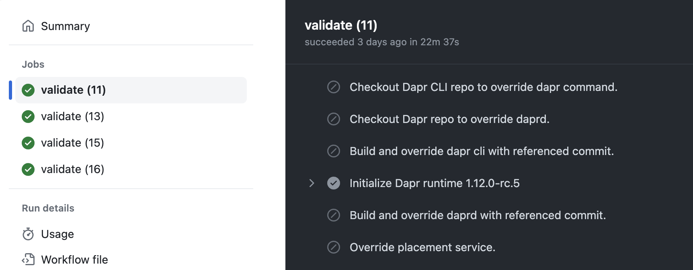

name：Auto Validate Examples

https://github.com/dapr/java-sdk/actions/workflows/validate.yml

脚本源文件：

https://github.com/dapr/java-sdk/blob/master/.github/workflows/validate.yml


## on

适用于 push 和 PR：

```yaml
on:
  workflow_dispatch:
  push:
    branches:
      - master
      - release-*
    tags:
      - v*

  pull_request:
    branches:
    - master
    - release-*
```

## Job 详细

```yaml
jobs:
  validate:
    runs-on: ubuntu-latest
    strategy:
      fail-fast: false # Keep running if one leg fails.
      matrix:
        java: [ 11, 13, 15, 16 ]
```

Java matrix 包含 11 / 13 / 15 / 16 等多个 Java 版本，

https://github.com/dapr/java-sdk/actions/runs/7492324406/job/20395558712?pr=987



### 环境变量准备

```yaml
    env:
      GOVER: "1.20"
      GOOS: linux
      GOARCH: amd64
      GOPROXY: https://proxy.golang.org
      JDK_VER: ${{ matrix.java }}
      DAPR_CLI_VER: 1.12.0-rc.1
      DAPR_RUNTIME_VER: 1.12.0-rc.5
      DAPR_INSTALL_URL: https://raw.githubusercontent.com/dapr/cli/v1.12.0-rc.1/install/install.sh
      DAPR_CLI_REF:
      DAPR_REF:
```


## 步骤

### 前期准备工作

#### actions/checkout

```yaml
      - uses: actions/checkout@v4
```

#### Set up OpenJDK

```yaml
      - name: Set up OpenJDK ${{ env.JDK_VER }}
        uses: actions/setup-java@v4
        with:
          distribution: 'adopt'
          java-version: ${{ env.JDK_VER }}
```

其中 JDK_VER 来源于 matrix.java：

```yaml
JDK_VER: ${{ matrix.java }}
```

#### Set up Dapr CLI

```yaml
      - name: Set up Dapr CLI
        run: wget -q ${{ env.DAPR_INSTALL_URL }} -O - | /bin/bash -s ${{ env.DAPR_CLI_VER }}
```


#### Set up Go

```yaml
      - name: Set up Go ${{ env.GOVER }}
        if: env.DAPR_REF != '' || env.DAPR_CLI_REF != ''
        uses: actions/setup-go@v5
        with:
          go-version: ${{ env.GOVER }}
```


#### Checkout Dapr CLI repo to override dapr command.

```yaml
      - name: Checkout Dapr CLI repo to override dapr command.
        uses: actions/checkout@v4
        if: env.DAPR_CLI_REF != ''
        with:
          repository: dapr/cli
          ref: ${{ env.DAPR_CLI_REF }}
          path: cli
```


#### Checkout Dapr repo to override daprd.

```yaml
      - name: Checkout Dapr repo to override daprd.
        uses: actions/checkout@v4
        if: env.DAPR_REF != ''
        with:
          repository: dapr/dapr
          ref: ${{ env.DAPR_REF }}
          path: dapr
```


#### Build and override dapr cli with referenced commit

```yaml
      - name: Build and override dapr cli with referenced commit.
        if: env.DAPR_CLI_REF != ''
        run: |
          cd cli
          make
          sudo cp dist/linux_amd64/release/dapr /usr/local/bin/dapr
          cd ..
```

#### Initialize Dapr runtime

```yaml
      - name: Initialize Dapr runtime ${{ env.DAPR_RUNTIME_VER }}
        run: |
          dapr uninstall --all
          dapr init --runtime-version ${{ env.DAPR_RUNTIME_VER }}
```

#### Build and override daprd with referenced commit

```yaml
      - name: Build and override daprd with referenced commit.
        if: env.DAPR_REF != ''
        run: |
          cd dapr
          make
          mkdir -p $HOME/.dapr/bin/
          cp dist/linux_amd64/release/daprd $HOME/.dapr/bin/daprd
          cd ..
```

#### Override placement service

```yaml
      - name: Override placement service.
        if: env.DAPR_REF != ''
        run: |
          docker stop dapr_placement
          cd dapr
          ./dist/linux_amd64/release/placement &
```

#### Install utilities dependencies

```yaml
      - name: Install utilities dependencies
        run: |
          echo "PATH=$PATH:$HOME/.local/bin" >> $GITHUB_ENV
          pip3 install setuptools wheel
          pip3 install mechanical-markdown
```

#### Install Local mongo database using docker-compose

```yaml
      - name: Install Local mongo database using docker-compose
        run: |
          docker-compose -f ./sdk-tests/deploy/local-test.yml up -d mongo
          docker ps
```

### 构建 java SDK

#### Clean up files

```yaml
      - name: Clean up files
        run: ./mvnw clean
```

#### Build sdk

```yaml
      - name: Build sdk
        run: ./mvnw compile -q
```

#### Install jars

```yaml
      - name: Install jars
        run: ./mvnw install -q
```


#### Validate invoke http example

```yaml
      - name: Validate invoke http example
        working-directory: ./examples
        run: |
          mm.py ./src/main/java/io/dapr/examples/invoke/http/README.md
```


## debug错误


```yaml
  ./mvnw install -q
  shell: /usr/bin/bash -e {0}
  env:
    GOVER: 1.20
    GOOS: linux
    GOARCH: amd64
    GOPROXY: https://proxy.golang.org
    JDK_VER: 11
    DAPR_CLI_VER: 1.12.0-rc.1
    DAPR_RUNTIME_VER: 1.12.0-rc.5
    DAPR_INSTALL_URL: https://raw.githubusercontent.com/dapr/cli/v1.12.0-rc.1/install/install.sh
    DAPR_CLI_REF: 
    DAPR_REF: 
    JAVA_HOME: /opt/hostedtoolcache/Java_Adopt_jdk/11.0.21-9/x64
    JAVA_HOME_11_X64: /opt/hostedtoolcache/Java_Adopt_jdk/11.0.21-9/x64
    PATH: /opt/hostedtoolcache/Java_Adopt_jdk/11.0.21-9/x64/bin:/snap/bin:/home/runner/.local/bin:/opt/pipx_bin:/home/runner/.cargo/bin:/home/runner/.config/composer/vendor/bin:/usr/local/.ghcup/bin:/home/runner/.dotnet/tools:/usr/local/sbin:/usr/local/bin:/usr/sbin:/usr/bin:/sbin:/bin:/usr/games:/usr/local/games:/snap/bin:/home/runner/.local/bin
```


```yaml
./mvnw install -q
  shell: /usr/bin/bash -e {0}
  env:
    GOVER: 1.20
    GOOS: linux
    GOARCH: amd64
    GOPROXY: https://proxy.golang.org
    JDK_VER: 17
    DAPR_CLI_VER: 1.12.0-rc.1
    DAPR_RUNTIME_VER: 1.12.0-rc.5
    DAPR_INSTALL_URL: https://raw.githubusercontent.com/dapr/cli/v1.12.0-rc.1/install/install.sh
    DAPR_CLI_REF: 
    DAPR_REF: 
    JAVA_HOME: /opt/hostedtoolcache/Java_Adopt_jdk/17.0.9-9/x64
    JAVA_HOME_17_X64: /opt/hostedtoolcache/Java_Adopt_jdk/17.0.9-9/x64
    PATH: /opt/hostedtoolcache/Java_Adopt_jdk/17.0.9-9/x64/bin:/snap/bin:/home/runner/.local/bin:/opt/pipx_bin:/home/runner/.cargo/bin:/home/runner/.config/composer/vendor/bin:/usr/local/.ghcup/bin:/home/runner/.dotnet/tools:/usr/local/sbin:/usr/local/bin:/usr/sbin:/usr/bin:/sbin:/bin:/usr/games:/usr/local/games:/snap/bin:/home/runner/.local/bin
Error:  Error fetching link: /home/runner/work/java-sdk/java-sdk/sdk-autogen/target/javadoc-bundle-options. Ignored it.
```


```bash
== APP == [INFO] --- exec:3.1.1:java (default-cli) @ dapr-sdk-tests ---
== APP == [WARNING] 
== APP == java.lang.UnsupportedClassVersionError: io/dapr/it/actors/services/springboot/DemoActorService has been compiled by a more recent version of the Java Runtime (class file version 61.0), this version of the Java Runtime only recognizes class file versions up to 55.0
== APP ==     at java.lang.ClassLoader.defineClass1 (Native Method)
== APP ==     at java.lang.ClassLoader.defineClass (ClassLoader.java:1022)
== APP ==     at java.security.SecureClassLoader.defineClass (SecureClassLoader.java:174)
== APP ==     at java.net.URLClassLoader.defineClass (URLClassLoader.java:555)
== APP ==     at java.net.URLClassLoader$1.run (URLClassLoader.java:458)
== APP ==     at java.net.URLClassLoader$1.run (URLClassLoader.java:452)
== APP ==     at java.security.AccessController.doPrivileged (Native Method)
== APP ==     at java.net.URLClassLoader.findClass (URLClassLoader.java:451)
== APP ==     at org.codehaus.mojo.exec.URLClassLoaderBuilder$ExecJavaClassLoader.loadClass (URLClassLoaderBuilder.java:138)
== APP ==     at java.lang.ClassLoader.loadClass (ClassLoader.java:527)
== APP ==     at org.codehaus.mojo.exec.ExecJavaMojo.lambda$execute$0 (ExecJavaMojo.java:273)
== APP ==     at java.lang.Thread.run (Thread.java:829)

== APP == [ERROR] Failed to execute goal org.codehaus.mojo:exec-maven-plugin:3.1.1:java (default-cli) on project dapr-sdk-tests: An exception occurred while executing the Java class. io/dapr/it/actors/services/springboot/DemoActorService has been compiled by a more recent version of the Java Runtime (class file version 61.0), this version of the Java Runtime only recognizes class file versions up to 55.0 -> [Help 1]

```


```bash
		Started a new sub-workflow model workflow with instance ID: bb8fe22c-d76b-4db1-ae77-51981ead07e2
		workflow instance with ID: bb8fe22c-d76b-4db1-ae77-51981ead07e2 completed with result: !wolfkroW rpaD olleH
		
	ERROR expected lines not found:
		calling subworkflow with input: Hello Dapr Workflow!
		SubWorkflow finished with: !wolfkroW rpaD olleH
	Expected stderr (output_match_mode: substring, match_order: none):
	Actual stderr:
```

