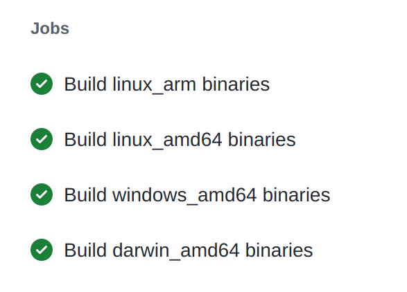
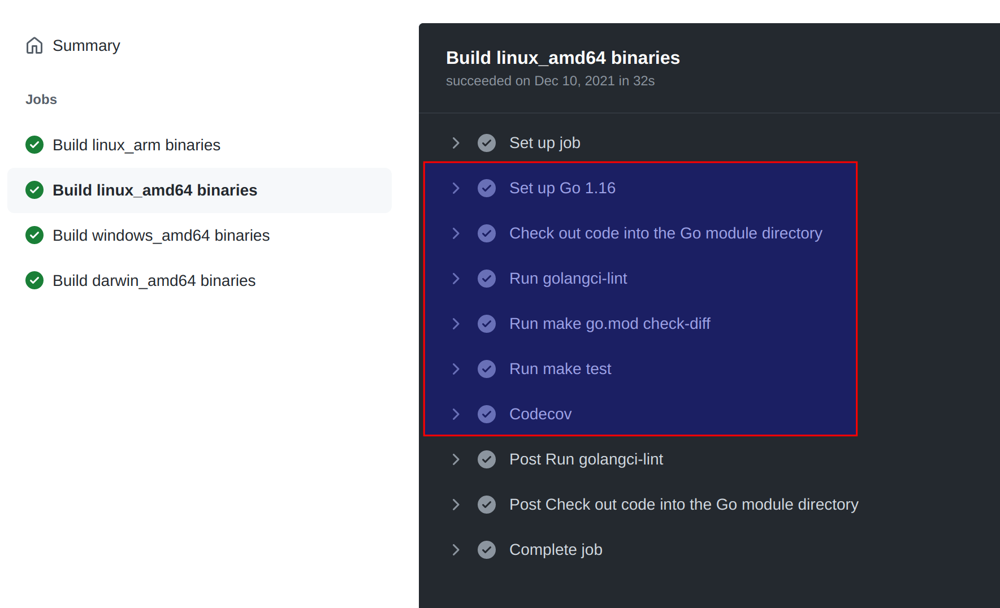
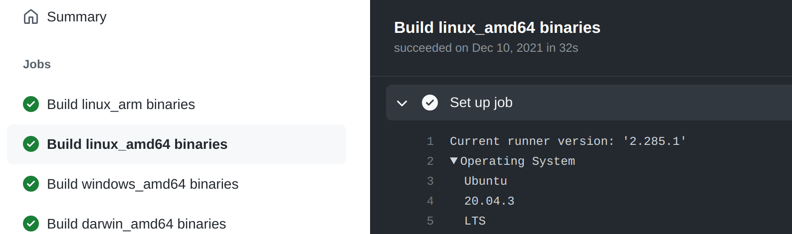
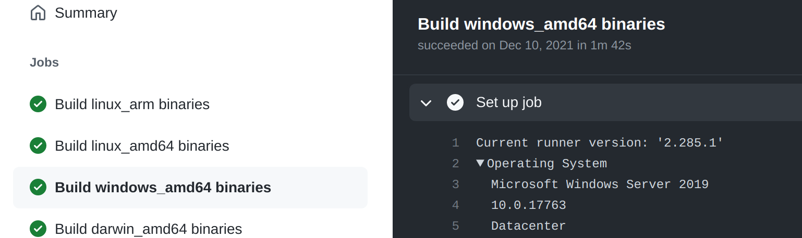
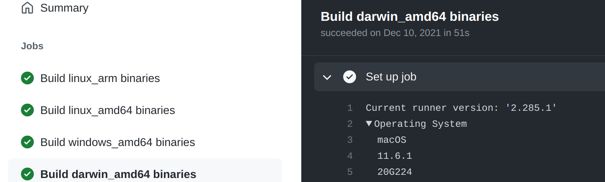

Dapr 采用 github action作为 CI，其中 kit 仓库的 workflow 是最简单的，只有一个 workflow：

https://github.com/dapr/kit/blob/main/.github/workflows/kit.yml

## action基本设置

参考 github action 的说明：

https://docs.github.com/en/actions/using-workflows/workflow-syntax-for-github-actions

> 工作流(workflow) 是一个由一个或多个工作组成的可配置的自动化流程。你必须创建一个YAML文件来定义你的工作流配置。
>
> 工作流文件使用YAML语法，并且必须有一个 `.yml` 或 `.yaml` 的文件扩展名。
>
> 必须将工作流文件存储在版本库的 `.github/workflows`目录中。

kit仓库下 `.github/workflows/kit.yml` 文件的内容:

```yaml
name: kit

on:
  push:
    branches:
      - main
      - release-*
    tags:
      - v*
  pull_request:
    branches:
      - main
      - release-*
......
```

- `name`: 工作流的名称。GitHub 会在仓库的操作页面上显示工作流的名称。如果省略名称，GitHub 会将其设置为相对于仓库根目录的工作流文件路径。
- `on`:  要自动触发一个工作流程，使用 on 来定义哪些事件可以导致工作流程的运行。关于可用事件的列表，请参见 "触发工作流程的事件"。 可以定义单个或多个可以触发工作流程的事件，或设置一个时间计划。还可以限制工作流的执行，使其只发生在特定的文件、标记或分支变化上。这些选项将在以下章节中描述。
- `on: push`: 当推送到工作流仓库中时工作流将运行。
- `on: pull_request` : 当工作流仓库中有PR时工作流将运行。

push 和 pull_request 都带有过滤器配置：

```yaml
on:
  push:
    branches:
      - main
      - release-*
    tags:
      - v*
```

https://docs.github.com/en/actions/using-workflows/events-that-trigger-workflows#using-filters

> 有些事件有过滤器，可以让你对工作流的运行时间有更多控制。
>
> 例如，推送事件有一个分支过滤器，它使你的工作流只在发生推送到符合分支过滤器的分支时运行，而不是在发生任何推送时运行。

## jobs

https://docs.github.com/en/actions/using-jobs/using-jobs-in-a-workflow

> 工作流程的运行是由一个或多个作业组成的，默认情况下是平行运行的。要按顺序运行作业，你可以使用 `job.<job_id>.needs` 关键字定义对其他作业的依赖性。
>
> 每个作业都在由 `runs-on` 指定的运行器环境中运行。

为了方便理解和对照，建议在 https://github.com/dapr/kit/actions 下打开任意一个实际运行过的 workflow，对照里面的输出进行学习。

### matrix配置

dapr的build都是采用 matrix 方式配置，以便支持多个操作系统 (windows / linux / macos) 和架构(amd64和arm)。目前实际支持的是四个：

- linux arm
- linux amd64
- windows amd64
- darwin amd64

具体的配置内容是:

```yaml
jobs:
  build:
    name: Build ${{ matrix.target_os }}_${{ matrix.target_arch }} binaries
    runs-on: ${{ matrix.os }}
    strategy:
      matrix:
        os: [ubuntu-latest, windows-latest, macOS-latest]
        target_arch: [arm, amd64]
        include:
          - os: ubuntu-latest
            target_os: linux
          - os: windows-latest
            target_os: windows
          - os: macOS-latest
            target_os: darwin
        exclude:
          - os: windows-latest
            target_arch: arm
          - os: macOS-latest
            target_arch: arm
```

三个操作系统和两个架构，本来是应该有6个组合的，但是通过 exclude 去掉了 windows + arm 和 macos + arm 两个，就剩下4个了。

对照 "name: Build ${{ matrix.target_os }}_${{ matrix.target_arch }} binaries" 这一行的配置和下图实际运行时的job就清晰了：

具体配置方法可参考：

https://docs.github.com/en/actions/using-jobs/using-a-build-matrix-for-your-jobs

### go配置

这里配置有go相关的信息:

```yaml
    env:
      GOVER: 1.16
      GOOS: ${{ matrix.target_os }}
      GOARCH: ${{ matrix.target_arch }}
      GOPROXY: https://proxy.golang.org
      GOLANGCI_LINT_VER: v1.31
```

其中 go 用的是 1.16 版本， 而 golangci-lint 是 v1.31 版本。

## steps配置

kit.yml 中定义了6个step，分别是:

```yaml
    steps:
      - name: Set up Go ${{ env.GOVER }}
      - name: Check out code into the Go module directory
      - name: Run golangci-lint
      - name: Run make go.mod check-diff
      - name: Run make test
      - name: Codecov
```

下图是实际运行的 linux_amd64 job，可以看到它的 step 信息里面有和这6个steps对应的内容：



### step: Set up job

这是 github action 自身的job，主要是准备操作系统和相关的软件。

其中linux采用的是ubuntu server 20.04.3：



 windows 采用的是 windows server 2019:



macos 采用的是 11.6.1 :



以及准备相关的 actions，以备后续步骤使用：

```
Prepare workflow directory
Prepare all required actions
Getting action download info
Download action repository 'actions/setup-go@v1' (SHA:0caeaed6fd66a828038c2da3c0f662a42862658f)
Download action repository 'actions/checkout@v2' (SHA:ec3a7ce113134d7a93b817d10a8272cb61118579)
Download action repository 'golangci/golangci-lint-action@v2.2.1' (SHA:54a84d46fb7183443c869b1b7d0dc34f640fcfd7)
Download action repository 'codecov/codecov-action@v1' (SHA:29386c70ef20e286228c72b668a06fd0e8399192)
```

### step: Set up Go 

安装go的步骤，使用到前面准备的 action `actions/setup-go@v1`:

```yaml
      - name: Set up Go ${{ env.GOVER }}
        uses: actions/setup-go@v1
        with:
          go-version: ${{ env.GOVER }}
```

运行时的实际日志为：

```yaml
Run actions/setup-go@v1
  with:
    go-version: 1.16
  env:
    GOVER: 1.16
    GOOS: linux
    GOARCH: amd64
    GOPROXY: https://proxy.golang.org
    GOLANGCI_LINT_VER: v1.31
/usr/bin/tar xzC /home/runner/work/_temp/5958e440-fd50-4948-9fe2-e9948b31e2fc -f /home/runner/work/_temp/62766d82-8d66-40b2-a183-1c35bd69a430
```

### step: Check out code

checkout 代码的步骤，使用到前面准备的 action `actions/checkout@v2`:

```yaml
      - name: Check out code into the Go module directory
        uses: actions/checkout@v2
```

运行时的实际日志为：

```yaml
Run actions/checkout@v2
  with:
    repository: dapr/kit
    ......
Syncing repository: dapr/kit
Deleting the contents of '/home/runner/work/kit/kit'
Initializing the repository
  /usr/bin/git init /home/runner/work/kit/kit
  ......
  Initialized empty Git repository in /home/runner/work/kit/kit/.git/
  /usr/bin/git remote add origin https://github.com/dapr/kit
  ......
  /usr/bin/git -c protocol.version=2 fetch --no-tags --prune --progress --no-recurse-submodules --depth=1 origin +867d7d9f3e6454864b4357941bab7601ae1cbd0a:refs/remotes/origin/main
  /usr/bin/git checkout --progress --force -B main refs/remotes/origin/main
  /usr/bin/git log -1 --format='%H'
  '867d7d9f3e6454864b4357941bab7601ae1cbd0a'
```

这个步骤比预料中要复杂：不是简单的 `git clone` 然后 `git checkout branch/commit-id`  ，而是重新新建了一个空的git仓库，然后设置remote指向https://github.com/dapr/kit，在执行复杂的 fetch 和 checkout 命令。

### step：Run golangci-lint

执行golangci-lint的步骤，使用到前面准备的 action `golangci/golangci-lint-action@v2.2.1`:

```yaml
      - name: Run golangci-lint
        if: matrix.target_arch == 'amd64' && matrix.target_os == 'linux'
        uses: golangci/golangci-lint-action@v2.2.1
        with:
          version: ${{ env.GOLANGCI_LINT_VER }}
```

运行时的实际日志为：

```yaml
Run golangci/golangci-lint-action@v2.2.1
  with:
    version: v1.31
  env:
    GOVER: 1.16
    GOOS: linux
    GOARCH: amd64
    GOPROXY: https://proxy.golang.org
    GOLANGCI_LINT_VER: v1.31
    GOROOT: /opt/hostedtoolcache/go/1.16.12/x64

Requested golangci-lint 'v1.31', using 'v1.31.0', calculation took 240ms
Installing golangci-lint v1.31.0...
Downloading https://github.com/golangci/golangci-lint/releases/download/v1.31.0/golangci-lint-1.31.0-linux-amd64.tar.gz ...
Cache not found for input keys: golangci-lint.cache-2710-0af295f28debd8dc18877aa104c7829fdda983ce, golangci-lint.cache-2710-, golangci-lint.cache-
/usr/bin/tar xz --warning=no-unknown-keyword -C /home/runner -f /home/runner/work/_temp/c61d00e3-ed1e-4299-acc1-480cd4b965b0
Installed golangci-lint into /home/runner/golangci-lint-1.31.0-linux-amd64/golangci-lint in 407ms
```

但比较有意思的是，在 golangci-lint-action 准备的过程中，没有使用前面构建好的go 1.16，而是自己从 cache 里面找到了一个 go 1.17.3 版本：

```yaml
prepare environment
  Finding needed golangci-lint version...
  Setup go stable version spec 1
  Found in cache @ /opt/hostedtoolcache/go/1.17.3/x64
  Added go to the path
  Successfully setup go version 1
  go version go1.17.3 linux/amd64
  
  go env
  ......
  GOROOT="/opt/hostedtoolcache/go/1.17.3/x64"
  GOTOOLDIR="/opt/hostedtoolcache/go/1.17.3/x64/pkg/tool/linux_amd64"
  GOVERSION="go1.17.3"
```

最后执行 golangci-lint: 

```yaml
run golangci-lint
  Running [/home/runner/golangci-lint-1.31.0-linux-amd64/golangci-lint run --out-format=github-actions] in [] ...
  golangci-lint found no issues
  Ran golangci-lint in 10405ms
```

### step: Run make go.mod check-diff

执行 `make go.mod` 和  `make check-diff` 的步骤，使用到 Makefile 中定义的 `target go.mod`  和 `check-diff`:

```yaml
      - name: Run make go.mod check-diff
        if: matrix.target_arch != 'arm'		# arm 构架上还不用跑这个step
        run: make go.mod check-diff
```

运行时的实际日志为：

```yaml
Run make go.mod check-diff
  make go.mod check-diff
  shell: /usr/bin/bash -e {0}
  env:
    GOVER: 1.16
    GOOS: linux
    GOARCH: amd64
    GOPROXY: https://proxy.golang.org
    GOLANGCI_LINT_VER: v1.31
    GOROOT: /opt/hostedtoolcache/go/1.17.3/x64		# 这里的goroot也乱了，用了 1.17.3
go mod tidy
go: downloading gopkg.in/check.v1 v0.0.0-20161208181325-20d25e280405
git diff --exit-code ./go.mod # check no changes
```

### step: Run make test

终于到了跑测试的step，用到了  Makefile 中定义的 target `test` ：

```yaml
      - name: Run make test
        env:
          COVERAGE_OPTS: "-coverprofile=coverage.txt -covermode=atomic"
        if: matrix.target_arch != 'arm'
        run: make test
```

对照 Makefile 中的 target test：

```makefile
.PHONY: test
test:
	go test ./... $(COVERAGE_OPTS) $(BUILDMODE)
```

kit.yml 这里设置了 COVERAGE_OPTS，内容为 "-coverprofile=coverage.txt -covermode=atomic"，因此以后本地跑 coverage 时也可以同样设置，以便本地执行的结果和CI中尽量一致。

运行时的实际日志为：

```yaml
Run make test
go test ./... -coverprofile=coverage.txt -covermode=atomic 
ok  	github.com/dapr/kit/config	0.014s	coverage: 95.5% of statements
ok  	github.com/dapr/kit/logger	0.007s	coverage: 87.0% of statements
ok  	github.com/dapr/kit/retry	0.004s	coverage: 97.6% of statements
```

注意这里已经有了单元测试覆盖率的信息，我试了一下在本地开发环境中用同样的命令跑了一下，结果和CI的完全一致，因此以后可以在本地将覆盖率做好之后再提交PR，避免因为覆盖率问题反复提交：

```bash
go test ./... -coverprofile=coverage.txt -covermode=atomic
ok      github.com/dapr/kit/config      0.008s  coverage: 95.5% of statements
ok      github.com/dapr/kit/logger      0.007s  coverage: 87.0% of statements
ok      github.com/dapr/kit/retry       0.006s  coverage: 97.6% of statements
```

### step: Codecov

执行覆盖率分析和上传的步骤，使用到前面准备的 action `codecov/codecov-action@v1`:

```yaml
      - name: Codecov
        if: matrix.target_arch == 'amd64' && matrix.target_os == 'linux'		# 目前是只在 amd 64 + linux 平台上跑覆盖率检查
        uses: codecov/codecov-action@v1
```

运行时的实际日志为：

```yaml
Run codecov/codecov-action@v1
/usr/bin/bash codecov.sh -n  -F  -Q github-action-v1.5.2
......
==> Searching for coverage reports in:
    + .
    -> Found 2 reports
==> Detecting git/mercurial file structure
==> Reading reports
    + ./coverage.txt bytes=8253
    + ./.codecov.yaml bytes=260
    Uploading reports
    url: https://codecov.io
    ......
    Reports have been successfully queued for processing at https://codecov.io/github/dapr/kit/commit/867d7d9f3e6454864b4357941bab7601ae1cbd0a
```

这里实际就是将上一个make test 步骤生成的覆盖率信息收集上传到 codecov.io。

### step: Post Run golangci-lint

运行时的实际日志为：

```yaml
Post job cleanup.
/usr/bin/tar --posix --use-compress-program zstd -T0 -cf cache.tzst -P -C /home/runner/work/kit/kit --files-from manifest.txt
Cache saved successfully
Saved cache for golangci-lint from paths '/home/runner/.cache/golangci-lint, /home/runner/.cache/go-build, /home/runner/go/pkg' in 795ms
```

打包了一下cache文件。

### step: Post Check out code 

没啥内容，忽略。

## 总结

由于 kit 仓库内容简单，因此它的CI流程和相应的 github action workflow 都非常简单，其核心内容就是执行下面三个检查:

-  make test
- code coverage
- golangci-lint

其他步骤都是为这三个步骤做准备。

但麻雀虽小五脏俱全，github action workflow 相关的基本配置和基本流程都在。了解这些基本内容之后再继续看其他仓库的 workflow 就可以把重点放在其他地方。
