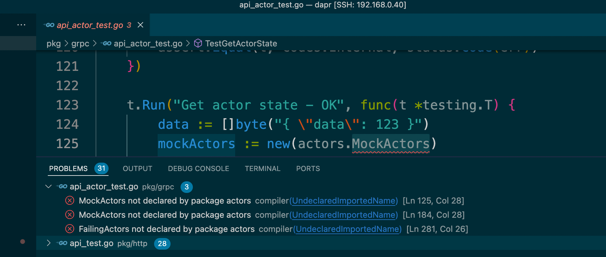
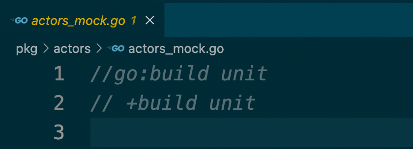

## 在终端中构建

在终端中执行以下命令：

```bash
make modtidy
make modtidy-all
make test
make lint
make check-diff
```

备注： conf-tests 和 e2e-tests-zeebe 在本地是跑不起来的。


## 在vs code中构建

### 设置 build tag

在 vs code 中打开 dapr/dapr 项目之后，会遇到报错：



原因是。MockActors 定义在  `pkg/actors/actors_mock.go` 这个文件中，但它的 build tag 设置为 unit，而默认 vs code 没有使用 build tag，所以这个 MockActors 文件不在编译范围内，导致使 MockActors 的其他 go 文件报错。



解决方式是设置 vs code 的 build tags（以及test tags），打开 （如果没有就新建）项目根目录下的 `.vscoee/settings.json`，加入以下内容:

```json
{
    ......
    "go.buildFlags": [
        "-tags=unit,e2e"
    ],
    "go.testTags": "unit,e2e",
}
```

正常就立即生效，错误消失。如果没有，则重启 vscode 看是否生效。
