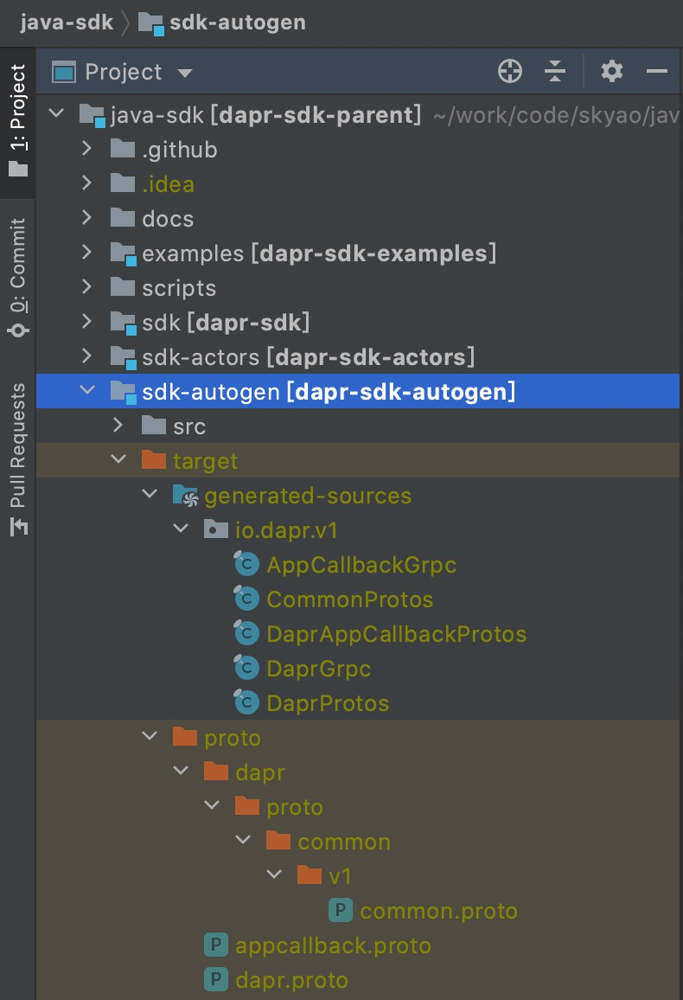

从 [dapr java sdk 仓库](https://github.com/dapr/java-sdk) clone下来代码之后，直接用IDE 如 IntelliJ 导入，是会报错的：有部分 dapr 的类找不到。这是因为这些代码是需要从 dapr 的 proto 代码中临时生成然后被项目装载。因此如果要进行 dapr java sdk 项目的开发或者代码阅读，需要从proto文件中生成这些类。

> 备注: 
>
> 不同语言的sdk对生成代码的处理方式不同：
>
> - java sdk：采用的是不保存生成的代码到git仓库，每次需要的时候从proto文件生成，然后以 generated-sources 的方式被挂载到 mvn 项目中。
> - go sdk：有些语言的sdk如 go sdk，是将生成的代码直接提交到git仓库，这样如果不需要重新生成代码，是可以clone下来仓库就直接可以使用和阅读的。

## 准备protoc等工具

安装Protoc，目前 daprd 要求的版本是 [v3.14.0](https://github.com/protocolbuffers/protobuf/releases/tag/v3.14.0)。sdk 和 daprd保持一致。

具体见准备工作中的 [安装Protoc]( )

## 从proto文件生成Java代码

在 dapr java sdk 项目下，有名为 `sdk-augogen`的子项目，在这里执行 `generate-sources` 命令就可以生成对应的java类：

```bash
$ cd sdk-augogen
$ mvn generate-sources
```

代码生成的过程有几个主要步骤：

### 步骤1: 下载proto文件

从命令输出中能看到，maven会下载三个proto文件： common.proto， dapr.proto，appcallback.proto：

```bash
[INFO] --- download-maven-plugin:1.6.0:wget (getCommonProto) @ dapr-sdk-autogen ---
[INFO] Downloading: https://raw.githubusercontent.com/dapr/dapr/4a6369caaba9cf46eae9bfa4fa6e76b474854c89/dapr/proto/common/v1/common.proto
[INFO] Downloading: https://raw.githubusercontent.com/dapr/dapr/4a6369caaba9cf46eae9bfa4fa6e76b474854c89/dapr/proto/runtime/v1/dapr.proto
[INFO] Downloading: https://raw.githubusercontent.com/dapr/dapr/4a6369caaba9cf46eae9bfa4fa6e76b474854c89/dapr/proto/runtime/v1/appcallback.proto
```

对照 sdk-autogen 子项目下的 pom.xml 文件，可以找到相关的maven插件配置：

```xml
<plugin>
        <groupId>com.googlecode.maven-download-plugin</groupId>
        <artifactId>download-maven-plugin</artifactId>
        <version>1.6.0</version>
        <executions>
          <execution>
            <id>getCommonProto</id>
            <!-- the wget goal actually binds itself to this phase by default -->
            <phase>initialize</phase>
            <goals>
              <goal>wget</goal>
            </goals>
            <configuration>
              <url>${dapr.proto.baseurl}/common/v1/common.proto</url>
              <outputFileName>common.proto</outputFileName>
              <!-- default target location, just to demonstrate the parameter -->
              <outputDirectory>${protobuf.input.directory}/dapr/proto/common/v1</outputDirectory>
            </configuration>
          </execution>
          <execution>
            <id>getDaprProto</id>
            <!-- the wget goal actually binds itself to this phase by default -->
            <phase>initialize</phase>
            <goals>
              <goal>wget</goal>
            </goals>
            <configuration>
              <url>${dapr.proto.baseurl}/runtime/v1/dapr.proto</url>
              <outputFileName>dapr.proto</outputFileName>
              <!-- default target location, just to demonstrate the parameter -->
              <outputDirectory>${protobuf.input.directory}</outputDirectory>
            </configuration>
          </execution>
          <execution>
            <id>getDaprClientProto</id>
            <!-- the wget goal actually binds itself to this phase by default -->
            <phase>initialize</phase>
            <goals>
              <goal>wget</goal>
            </goals>
            <configuration>
              <url>${dapr.proto.baseurl}/runtime/v1/appcallback.proto</url>
              <outputFileName>appcallback.proto</outputFileName>
              <!-- default target location, just to demonstrate the parameter -->
              <outputDirectory>${protobuf.input.directory}</outputDirectory>
            </configuration>
          </execution>
        </executions>
      </plugin>
```

在这里特别要注意的是 `${dapr.proto.baseurl}`，这个属性在根目录下的 pom.xml 中设置，比如我当前版本的值是:

```xml
  <dapr.proto.baseurl>
https://raw.githubusercontent.com/dapr/
dapr/4a6369caaba9cf46eae9bfa4fa6e76b474854c89/dapr/proto
  </dapr.proto.baseurl>
```

这意味着如果要针对某个版本的 proto 文件进行代码生成，则需要修改这里的 `${dapr.proto.baseurl}` 的值，比如指向某个分支/tag或者如上面指向某个commit。

### 步骤2: 生成代码

protoc-jar-maven-plugin 插件负责将前面下载的proto文件生成java 代码，生成之后的代码存在的 `target/generated-sources` 目录下：

```bash
[INFO] --- protoc-jar-maven-plugin:3.11.4:run (default) @ dapr-sdk-autogen ---
[INFO] Protoc version: 3.13.0
protoc-jar: protoc version: 3.13.0, detected platform: osx-x86_64 (mac os x/x86_64)
protoc-jar: cached: /var/folders/vr/8yl21p696dd41c776p67qlkm0000gp/T/protocjar.webcache/com/google/protobuf/protoc/maven-metadata.xml
protoc-jar: cached: /var/folders/vr/8yl21p696dd41c776p67qlkm0000gp/T/protocjar.webcache/com/google/protobuf/protoc/3.13.0/protoc-3.13.0-osx-x86_64.exe
protoc-jar: executing: [/var/folders/vr/8yl21p696dd41c776p67qlkm0000gp/T/protocjar852218627845177615/bin/protoc.exe, --version]
libprotoc 3.13.0

[INFO]     Processing (grpc-java): dapr.proto
[INFO]     Processing (grpc-java): common.proto
[INFO]     Processing (grpc-java): appcallback.proto

[INFO] Adding generated sources (java): /Users/sky/work/code/skyao/java-sdk/sdk-autogen/target/generated-sources
[INFO] Adding generated sources (grpc-java): /Users/sky/work/code/skyao/java-sdk/sdk-autogen/target/generated-sources

[INFO] BUILD SUCCESS
```

刷新项目，比如 idea 下可以在 java-sdk 根目录下pom.xml上右键 maven -> reload project 。

### 相关的文件路径小结

一目了然：



## 遇到过的问题

### proto文件缓存

有一个比较坑的事情是，download-maven-plugin 插件在下载文件时，不是每次都去请求，有时会从maven本地缓存中拿文件。

比如我某次被坑的时候，就发现有如下日志：

```bash
[INFO] --- download-maven-plugin:1.6.0:wget 
[INFO] Got from cache: /Users/sky/.m2/repository/.cache/download-maven-plugin/common.proto_d701b2bbc1c789dfa25b99c95a8cd8c2
[INFO] Got from cache: /Users/sky/.m2/repository/.cache/download-maven-plugin/dapr.proto_372181342afa932d4684925872c96d22
[INFO] Got from cache: /Users/sky/.m2/repository/.cache/download-maven-plugin/appcallback.proto_e110e7ac8ee53213ecf133574e146d64
[INFO] 
```

这个缓存会导致拿到的 proto 文件和原来期望的proto文件内容可能不一样，因此后面生成的代码也会有偏差，某些情况下就会出现代码编译不过，错误可能是某个类或者某个方法找不到。

这个时候最简单的办法就是删除这个缓存目录，让 maven 去远程下载，然后再重新生成：

```bash
rm -rf ~/.m2/repository/.cache/download-maven-plugin/

mvn generate-sources
```

### Error extracting protoc for version 3.17.3 错误

在配置 Artifactory 开启 mirror 之后，遇到一个奇怪的问题：

```bash
[ERROR] Failed to execute goal com.github.os72:protoc-jar-maven-plugin:3.11.4:run (default) on project dapr-sdk-autogen: Error extracting protoc for version 3.17.3: Unsupported platform: protoc-3.17.3-linux-x86_64.exe -> [Help 1]
org.apache.maven.lifecycle.LifecycleExecutionException: Failed to execute goal com.github.os72:protoc-jar-maven-plugin:3.11.4:run (default) on project dapr-sdk-autogen: Error extracting protoc for version 3.17.3
    at org.apache.maven.lifecycle.internal.MojoExecutor.doExecute (MojoExecutor.java:306)
    at org.apache.maven.lifecycle.internal.MojoExecutor.execute (MojoExecutor.java:211)
......
Caused by: org.apache.maven.plugin.MojoExecutionException: Error extracting protoc for version 3.17.3
......
Caused by: java.io.FileNotFoundException: Unsupported platform: protoc-3.17.3-linux-x86_64.exe
......

```

修改 maven settings.xml ，不使用 artifactory 而是直接连接 maven 中央仓库，就可以回避这个问题。

参考： https://github.com/os72/protoc-jar-maven-plugin/issues/68
