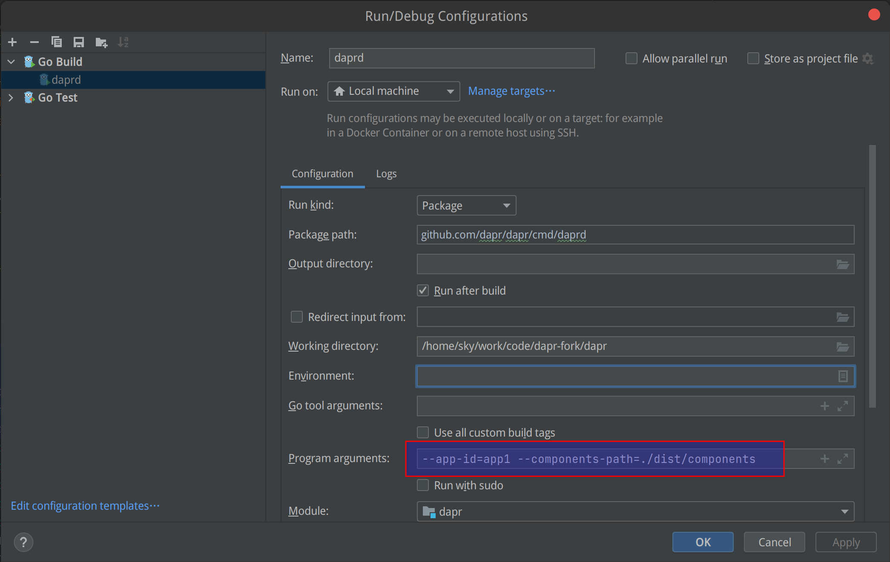

## 运行二进制文件

daprd的二进制文件可以来自从源码编译的 `dist/release` 目录下，也可以来自通过 dapr cli 安装的 daprd。大多数情况下我们在开发时是运行刚编译出来的daprd 二进制文件。

Daprd 在运行时，通常需要和业务应用一起启动，需要和配置的外部组件相互连接，有些功能还需要 dapr 控制面的配合。

### 最小依赖运行

这是启动 daprd 最简单的方式，只需要指定 `app-id` 和 `components-path` (里面为空，不配置component)：

```bash
$ ./dist/linux_amd64/release/daprd --components-path=./dist/components --app-id=app1

INFO[0000] starting Dapr Runtime -- version edge -- commit b298e16f6bd641545c1b76b074b622578989f171  app_id=app1 instance=skywork scope=dapr.runtime type=log ver=edge
INFO[0000] log level set to: info                        app_id=app1 instance=skywork scope=dapr.runtime type=log ver=edge
INFO[0000] metrics server started on :9090/              app_id=app1 instance=skywork scope=dapr.metrics type=log ver=edge
INFO[0000] loading default configuration                 app_id=app1 instance=skywork scope=dapr.runtime type=log ver=edge
INFO[0000] standalone mode configured                    app_id=app1 instance=skywork scope=dapr.runtime type=log ver=edge
INFO[0000] app id: app1                                  app_id=app1 instance=skywork scope=dapr.runtime type=log ver=edge
INFO[0000] mTLS is disabled. Skipping certificate request and tls validation  app_id=app1 instance=skywork scope=dapr.runtime type=log ver=edge
INFO[0000] local service entry announced: app1 -> 192.168.100.10:35921  app_id=app1 instance=skywork scope=dapr.contrib type=log ver=edge
INFO[0000] Initialized name resolution to mdns           app_id=app1 instance=skywork scope=dapr.runtime type=log ver=edge
INFO[0000] loading components                            app_id=app1 instance=skywork scope=dapr.runtime type=log ver=edge
INFO[0000] waiting for all outstanding components to be processed  app_id=app1 instance=skywork scope=dapr.runtime type=log ver=edge
INFO[0000] all outstanding components processed          app_id=app1 instance=skywork scope=dapr.runtime type=log ver=edge
INFO[0000] gRPC proxy enabled                            app_id=app1 instance=skywork scope=dapr.runtime type=log ver=edge
INFO[0000] enabled gRPC tracing middleware               app_id=app1 instance=skywork scope=dapr.runtime.grpc.api type=log ver=edge
INFO[0000] enabled gRPC metrics middleware               app_id=app1 instance=skywork scope=dapr.runtime.grpc.api type=log ver=edge
INFO[0000] API gRPC server is running on port 50001      app_id=app1 instance=skywork scope=dapr.runtime type=log ver=edge
INFO[0000] enabled metrics http middleware               app_id=app1 instance=skywork scope=dapr.runtime.http type=log ver=edge
INFO[0000] enabled tracing http middleware               app_id=app1 instance=skywork scope=dapr.runtime.http type=log ver=edge
INFO[0000] http server is running on port 3500           app_id=app1 instance=skywork scope=dapr.runtime type=log ver=edge
INFO[0000] The request body size parameter is: 4         app_id=app1 instance=skywork scope=dapr.runtime type=log ver=edge
INFO[0000] enabled gRPC tracing middleware               app_id=app1 instance=skywork scope=dapr.runtime.grpc.internal type=log ver=edge
INFO[0000] enabled gRPC metrics middleware               app_id=app1 instance=skywork scope=dapr.runtime.grpc.internal type=log ver=edge
INFO[0000] internal gRPC server is running on port 35921  app_id=app1 instance=skywork scope=dapr.runtime type=log ver=edge
WARN[0000] app channel is not initialized. did you make sure to configure an app-port?  app_id=app1 instance=skywork scope=dapr.runtime type=log ver=edge
WARN[0000] failed to init actors: no actor state store defined  app_id=app1 instance=skywork scope=dapr.runtime type=log ver=edge
WARN[0000] failed to read from bindings: app channel not initialized   app_id=app1 instance=skywork scope=dapr.runtime type=log ver=edge
INFO[0000] dapr initialized. Status: Running. Init Elapsed 2.781127ms  app_id=app1 instance=skywork scope=dapr.runtime type=log ver=edge
```

如果需要启动指定的 component ，则需要在通过 `--components-path` 指定的目录下(如`./dist/components` )放置对应的 yaml 文件。

### 依赖外部组件

当测试某些构建块的功能时，如 state / pubsub 等，流程比较简单，本机开发时只需要在本机将对应的组件的外部依赖启动起来，然后在 daprd 将配置好 component 的 yaml 文件放置在 `--components-path` 指定的目录下(如`./dist/components` ) 即可。

### 需要和业务App互动

TBD

### 需要dapr控制平面

TBD

## 在IDE中运行

### 最小依赖运行

在 IDE  (如 goland)  中启动 daprd 的方式是打开 `cmd/daprd/main.go` 文件，然后运行，注意也要配置最基本的参数如 `app-id` 和 `components-path` 。

以 goland 为例：



运行日志如下：

```bash
GOROOT=/usr/local/go #gosetup
GOPATH=/home/sky/work/soft/gopath #gosetup
/usr/local/go/bin/go build -o /tmp/GoLand/___daprd github.com/dapr/dapr/cmd/daprd #gosetup
/tmp/GoLand/___daprd --app-id=app1 --components-path=./dist/components
INFO[0000] starting Dapr Runtime -- version edge -- commit   app_id=app1 instance=skywork scope=dapr.runtime type=log ver=unknown
......
```

在 IDE 中用这种方式运行 daprd，最大的优势在于可以 debug！


