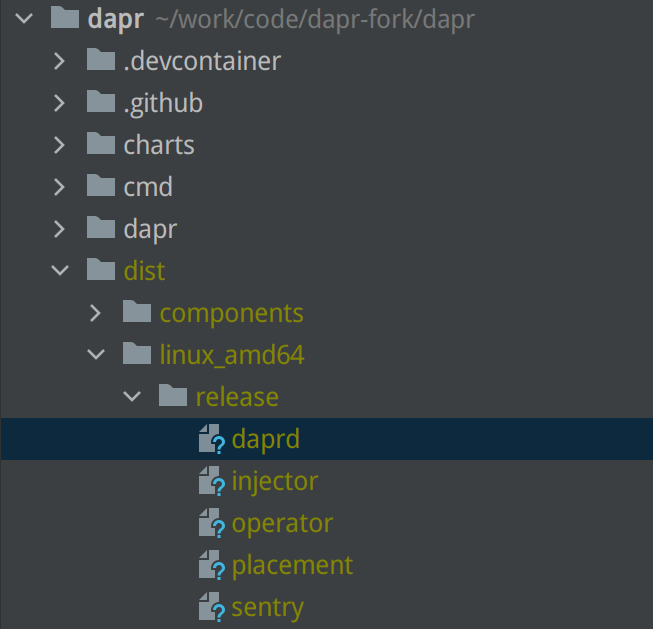

## 编码


### 通过 replace 引用修改的代码

以 dapr 仓库 和 components-contrib 仓库为例，如果我们在本地修改了 components-contrib 仓库的代码，然后希望在  dapr 仓库中使用这些修改后的代码，则可以修改 dapr 仓库中的 go.mod 文件，将对 components-contrib 仓库的依赖进行 replace 。

如果目标代码还没有提交到 github，则 replace 为 components-contrib 仓库的本地目录，如：

```go
replace github.com/dapr/components-contrib => /home/sky/work/code/dapr-fork/components-contrib
```

如果代码已经提交到 github 仓库，则可以指定要 replace 的仓库、分支和commit：

```go
replace github.com/dapr/components-contrib => github.com/skyao/components-contrib v1.7.1-0.20220418003919-48d8dbd6dfc8
```

后面这个方案适合在提交跨多个仓库的pr时使用。


## 测试

本地跑单元测试：

```bash
make test
```

e2e 测试和性能测试等运行比较麻烦，单独在测试篇中讲。

## 打包

### 构建二进制包

在 dapr/dapr 仓库下执行 `make build` 命令：

```bash
$ make build

CGO_ENABLED=0 GOOS=linux GOARCH=amd64 go build  -ldflags="-X github.com/dapr/dapr/pkg/version.gitcommit=b298e16f6bd641545c1b76b074b622578989f171 -X github.com/dapr/dapr/pkg/version.gitversion=v1.7.0-rc.4-34-gb298e16-dirty -X github.com/dapr/dapr/pkg/version.version=edge -X github.com/dapr/kit/logger.DaprVersion=edge -s -w" -o ./dist/linux_amd64/release/daprd ./cmd/daprd/;
CGO_ENABLED=0 GOOS=linux GOARCH=amd64 go build  -ldflags="-X github.com/dapr/dapr/pkg/version.gitcommit=b298e16f6bd641545c1b76b074b622578989f171 -X github.com/dapr/dapr/pkg/version.gitversion=v1.7.0-rc.4-34-gb298e16-dirty -X github.com/dapr/dapr/pkg/version.version=edge -X github.com/dapr/kit/logger.DaprVersion=edge -s -w" -o ./dist/linux_amd64/release/placement ./cmd/placement/;
CGO_ENABLED=0 GOOS=linux GOARCH=amd64 go build  -ldflags="-X github.com/dapr/dapr/pkg/version.gitcommit=b298e16f6bd641545c1b76b074b622578989f171 -X github.com/dapr/dapr/pkg/version.gitversion=v1.7.0-rc.4-34-gb298e16-dirty -X github.com/dapr/dapr/pkg/version.version=edge -X github.com/dapr/kit/logger.DaprVersion=edge -s -w" -o ./dist/linux_amd64/release/operator ./cmd/operator/;
CGO_ENABLED=0 GOOS=linux GOARCH=amd64 go build  -ldflags="-X github.com/dapr/dapr/pkg/version.gitcommit=b298e16f6bd641545c1b76b074b622578989f171 -X github.com/dapr/dapr/pkg/version.gitversion=v1.7.0-rc.4-34-gb298e16-dirty -X github.com/dapr/dapr/pkg/version.version=edge -X github.com/dapr/kit/logger.DaprVersion=edge -s -w" -o ./dist/linux_amd64/release/injector ./cmd/injector/;
CGO_ENABLED=0 GOOS=linux GOARCH=amd64 go build  -ldflags="-X github.com/dapr/dapr/pkg/version.gitcommit=b298e16f6bd641545c1b76b074b622578989f171 -X github.com/dapr/dapr/pkg/version.gitversion=v1.7.0-rc.4-34-gb298e16-dirty -X github.com/dapr/dapr/pkg/version.version=edge -X github.com/dapr/kit/logger.DaprVersion=edge -s -w" -o ./dist/linux_amd64/release/sentry ./cmd/sentry/;
```

生成的二进制文件存放在 `dist/linux_amd64` 目录下:



### 构建dapr容器

先设置 dapr 相关的环境变量：

```bash
export DAPR_TAG=dev
export DAPR_REGISTRY=docker.io/skyao
```

在 dapr/dapr 仓库下执行 `make docker-build` 命令：

```bash
$ make docker-build

Building docker.io/skyao/dapr:dev docker image ...
docker build --build-arg PKG_FILES=* -f ./docker/Dockerfile ./dist/linux_amd64/release -t docker.io/skyao/dapr:dev-linux-amd64
Sending build context to Docker daemon  236.4MB
Step 1/4 : FROM gcr.io/distroless/static:nonroot
 ---> bbd57f9cdb20
Step 2/4 : ARG PKG_FILES
 ---> Using cache
 ---> 0072a00d6320
Step 3/4 : WORKDIR /
 ---> Using cache
 ---> 01a8cf2e1345
Step 4/4 : COPY /$PKG_FILES /
 ---> Using cache
 ---> 42555e58ba97
Successfully built 42555e58ba97
Successfully tagged skyao/dapr:dev-linux-amd64
docker build --build-arg PKG_FILES=daprd -f ./docker/Dockerfile ./dist/linux_amd64/release -t docker.io/skyao/daprd:dev-linux-amd64
Sending build context to Docker daemon  236.4MB
Step 1/4 : FROM gcr.io/distroless/static:nonroot
 ---> bbd57f9cdb20
Step 2/4 : ARG PKG_FILES
 ---> Using cache
 ---> 0072a00d6320
Step 3/4 : WORKDIR /
 ---> Using cache
 ---> 01a8cf2e1345
Step 4/4 : COPY /$PKG_FILES /
 ---> Using cache
 ---> 3d189af067d0
Successfully built 3d189af067d0
Successfully tagged skyao/daprd:dev-linux-amd64
docker build --build-arg PKG_FILES=placement -f ./docker/Dockerfile ./dist/linux_amd64/release -t docker.io/skyao/placement:dev-linux-amd64
Sending build context to Docker daemon  236.4MB
Step 1/4 : FROM gcr.io/distroless/static:nonroot
 ---> bbd57f9cdb20
Step 2/4 : ARG PKG_FILES
 ---> Using cache
 ---> 0072a00d6320
Step 3/4 : WORKDIR /
 ---> Using cache
 ---> 01a8cf2e1345
Step 4/4 : COPY /$PKG_FILES /
 ---> Using cache
 ---> 18f7e2261d82
Successfully built 18f7e2261d82
Successfully tagged skyao/placement:dev-linux-amd64
docker build --build-arg PKG_FILES=sentry -f ./docker/Dockerfile ./dist/linux_amd64/release -t docker.io/skyao/sentry:dev-linux-amd64
Sending build context to Docker daemon  236.4MB
Step 1/4 : FROM gcr.io/distroless/static:nonroot
 ---> bbd57f9cdb20
Step 2/4 : ARG PKG_FILES
 ---> Using cache
 ---> 0072a00d6320
Step 3/4 : WORKDIR /
 ---> Using cache
 ---> 01a8cf2e1345
Step 4/4 : COPY /$PKG_FILES /
 ---> Using cache
 ---> 10523d0ff4a5
Successfully built 10523d0ff4a5
Successfully tagged skyao/sentry:dev-linux-amd64
```

生成的镜像文件可以通过 `docker images` 命令查看:

```bash
$ docker images
REPOSITORY                                 TAG               IMAGE ID       CREATED        SIZE
skyao/sentry                               dev-linux-amd64   10523d0ff4a5   2 days ago     39.4MB
skyao/placement                            dev-linux-amd64   18f7e2261d82   2 days ago     17MB
skyao/daprd                                dev-linux-amd64   3d189af067d0   2 days ago     113MB
skyao/dapr                                 dev-linux-amd64   42555e58ba97   2 days ago     239MB
```


