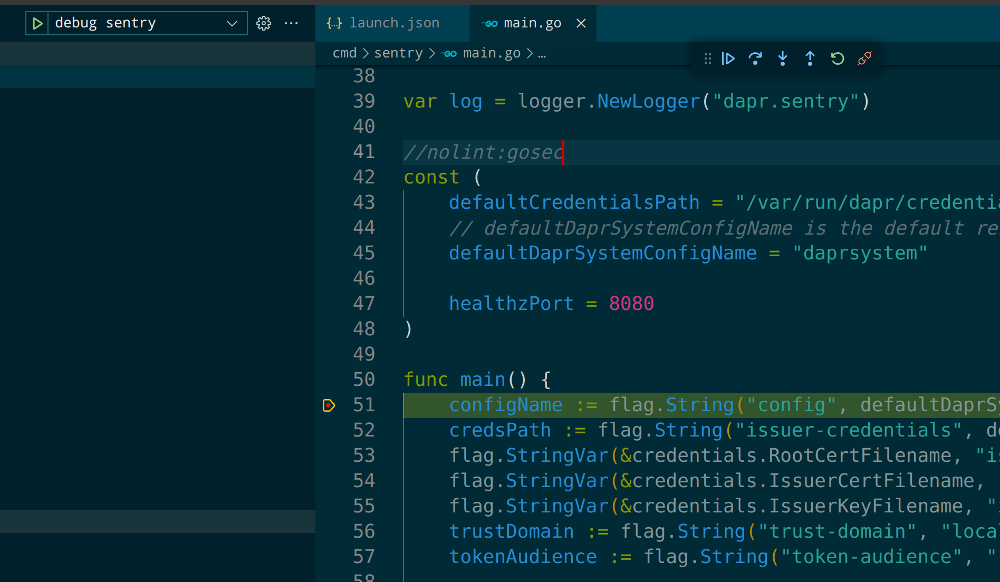

参考官方文档：

https://docs.dapr.io/developing-applications/debugging/debug-k8s/debug-dapr-services/

## 准备工作

### 打包和推送可debug的镜像

```bash
cd dapr
make release GOOS=linux GOARCH=amd64 DEBUG=1

export DAPR_TAG=dev
export DAPR_REGISTRY=docker.io/skyao
docker login
make docker-push DEBUG=1
```

但 docker-push 速度会很慢，非常拖累速度，本地开发和debug完全没有不要用 docker 的正式 register，完全可以本地启动一个私有的 registery 。

### docker private register

运行一下命令来启动一个容器承担 docker private register 的角色，以加速镜像文件推送到 docker  register 的速度，避免浪费太多时间在镜像的上传上：

```bash
 docker run -d -p 5000:5000 --name registry registry:2 
```

为了可以使用 http，而不是默认使用 https 来执行镜像推送，需要修改 docker 配置：

```bash
sudo vi /etc/docker/daemon.json
```

增加内容：

```yaml
{
		......,
        "insecure-registries": [
          "127.0.0.1:5000"
        ]
}
```

修改之后要重启 docker daemon,否则不生效: 

```bash
sudo systemctl daemon-reload
sudo systemctl restart docker
```

然后再重启 registry 容器，否则无法访问：

```bash
docker restart registry
```

这时可以访问 http://127.0.0.1:5000/v2/ 查看是否正常工作。

此时再执行 ` make docker-push DEBUG=1` 就非常快了:

```bash
export DAPR_TAG=dev
export DAPR_REGISTRY=127.0.0.1:5000
make docker-push DEBUG=1
```


参考资料：

- https://blog.csdn.net/weixin_38937840/article/details/104461025

### 准备 debug values 配置文件

准备一个 values-debug-templates.yaml 文件放在 dapr 仓库的 `charts/dapr/`  目录下，内容为：


```properties
global:
   registry: "docker.io/skyao"
   tag: "dev-linux-amd64"
dapr_operator:
  debug:
    enabled: true
  runAsNonRoot: false
dapr_placement:
  debug:
    enabled: true
  runAsNonRoot: false
dapr_sentry:
  debug:
    enabled: true
  runAsNonRoot: false
dapr_sidecar_injector:
  debug:
    enabled: true
  runAsNonRoot: false
  sidecarRunAsNonRoot: false
```

一般每次我们只debug 一个控制面组件，因此上面的四段内容我们只需要用对应的其中一段即可。

如果有本地启动 docker private registry, 注意修改这里的 registry 地址：

```yaml
global:
   registry: "127.0.0.1:5000"
   tag: "dev-linux-amd64"
......
```

## 开始 debug

### debug sentry 

复制 values-debug-templates.yaml 文件，改名 values-debug.yaml ，内容只保留 dapr_sentry 这一段：

```bash
global:
   registry: "127.0.0.1:5000"
   tag: "dev-linux-amd64"
dapr_sentry:
  debug:
    enabled: true
  runAsNonRoot: false
```

安装控制面：

```bash
cd dapr
helm install dapr charts/dapr --namespace dapr-system --values charts/dapr/values-debug.yaml --wait
```

其中 sentry 会以 debug 模式启动，然后等待连接：

```bash
k logs -n dapr-system dapr-sentry-7d9898fdb9-rt4kj  
2023-03-29T07:09:47Z warning layer=rpc Listening for remote connections (connections are not authenticated nor encrypted)
2023-03-29T07:09:47Z info layer=debugger launching process with args: [/sentry --log-level info --enable-metrics --metrics-port 9090 --trust-domain cluster.local]
API server listening at: [::]:40000
```

下面是 debug 模式启动的 sentry pod 的部分内容，可以看到容器的启动命令(/dlv)和参数(exec  /sentry)：

```yaml
  dapr-sentry:
    Container ID:  docker://6b1c380486b9d06c639b63f152ea5ca61a30bd740cf3cbdf4a80d899a3abb973
    Image:         127.0.0.1:5000/sentry:dev-linux-amd64
    Image ID:      docker-pullable://127.0.0.1:5000/sentry@sha256:6625c43de22c794ca4b5e828fe18ba9ccf8d7f62a77ed143129b1a78d6e35a4c
    Ports:         50001/TCP, 9090/TCP, 40000/TCP
    Host Ports:    0/TCP, 0/TCP, 0/TCP
    Command:
      /dlv
    Args:
      --listen=:40000
      --accept-multiclient
      --headless=true
      --log
      --api-version=2
      exec
      /sentry
      --
      --log-level
      info
      --enable-metrics
      --metrics-port
      9090
      --trust-domain
      cluster.local
    State:          Running
      Started:      Wed, 29 Mar 2023 16:11:08 +0800
    Ready:          False
    Restart Count:  0
    Liveness:       http-get http://:8080/healthz delay=30000s timeout=1s period=3s #success=1 #failure=5
    Readiness:      http-get http://:8080/healthz delay=30000s timeout=1s period=3s #success=1 #failure=5
    Environment:
      NAMESPACE:  dapr-system (v1:metadata.namespace)
    Mounts:
      /var/run/dapr/credentials from credentials (ro)
      /var/run/secrets/kubernetes.io/serviceaccount from kube-api-access-xwc55 (ro)
```

此时的 dapr 控制平面状态为：

```bash
$ kubectl get pods -n dapr-system -o wide
NAME                                    READY   STATUS             RESTARTS      AGE    IP             NODE      NOMINATED NODE   READINESS GATES
dapr-dashboard-7c5c6bf5cf-rs757         1/1     Running            0             6m1s   10.244.0.104   skywork   <none>           <none>
dapr-operator-cbcb6c4fb-vz625           0/1     Running            6 (90s ago)   6m1s   10.244.0.102   skywork   <none>           <none>
dapr-placement-server-0                 0/1     CrashLoopBackOff   6 (13s ago)   6m1s   10.244.0.103   skywork   <none>           <none>
dapr-sentry-7d9898fdb9-rt4kj            0/1     Running            0             6m1s   10.244.0.101   skywork   <none>           <none>
dapr-sidecar-injector-dcbd7fcbd-cj52p   1/1     Running            0             6m1s   10.244.0.105   skywork   <none>           <none>
```

做一下 dapr-sentry pod 的 debug 端口的端口映射：

```bash
$ kubectl port-forward -n dapr-system dapr-sentry-7d9898fdb9-rt4kj 40000:40000 
Forwarding from 127.0.0.1:40000 -> 40000
Forwarding from [::1]:40000 -> 40000
```

打开 IDE，以 vs code 为例，我打开 dapr/dapr 仓库，然后设置断点为 `cmd/sentry/main.go` 中 main 行数的第一行，这样就可以从 sentry 启动开始 debug。

修改 lanch.json 文件，加入以下内容：

```javascript
{
    "version": "0.2.0",
    "configurations": [
        {
            "name": "debug sentry",
            "type": "go",
            "request": "attach",
            "mode": "remote",
            "remotePath": "${workspaceFolder}",
            "port": 40000,
            "host": "127.0.0.1"
        }
    ]
}
```

然后在 “Run and Debug” 中选择 "debug sentry"，点击三角形启动：



图上可以看到 debug 启动成功，代码执行停留在 main() 函数的第一行位置，后面就可以按照自己的需要进行断点设置和代码debug了。

如果要重新开始 debug （比如再次debg sentry 启动的过程），最快捷的方式是重新启动 sentry 的pod：

```bash
# 删除 dapr-sentry 的现有 pod
k delete pod -n dapr-system dapr-sentry-7d9898fdb9-rt4kj
# 稍后 k8s 会重新启动一个新的 pod，然后依然是以 debug 的方式启动
# 需要再做一次端口映射
kubectl port-forward -n dapr-system dapr-sentry-7d9898fdb9-xxxx 40000:40000
```


## 常见错误

### runAsNonRoot 错误导致容器启动失败

```bash
cd dapr
helm install dapr charts/dapr --namespace dapr-system --values charts/dapr/values-debug.yaml --wait
```

发现 dapr 的控制面启动不起来：

```bash
$ k get pods -n dapr-system                                            
NAME                                     READY   STATUS                       RESTARTS      AGE
dapr-dashboard-7c5c6bf5cf-qkq9j          1/1     Running                      0             7m14s
dapr-operator-684d455b4f-9gwk5           0/1     CreateContainerConfigError   0             7m14s
dapr-placement-server-0                  0/1     CrashLoopBackOff             6 (78s ago)   7m14s
dapr-sentry-6b47f647bb-nr8ld             0/1     CreateContainerConfigError   0             7m14s
dapr-sidecar-injector-699dfb595f-xvgjc   0/1     CreateContainerConfigError   0             7m14s
```

injector 报错：

```bash
  Normal   Scheduled  6m25s                   default-scheduler  Successfully assigned dapr-system/dapr-sidecar-injector-699dfb595f-xvgjc to skywork
  Warning  Failed     4m18s (x12 over 6m25s)  kubelet            Error: container has runAsNonRoot and image will run as root (pod: "dapr-sidecar-injector-699dfb595f-xvgjc_dapr-system(1643bcd9-3453-430a-b135-a48361311639)", container: dapr-sidecar-injector)
  Normal   Pulled     75s (x25 over 6m25s)    kubelet            Container image "192.168.0.90:5000/injector:dev-linux-amd64" already present on machine
```

这是因为容器要求 runAsNonRoot，但是 debug 打包出来的镜像要求 root。

解决方式： 在 values 文件中将 runAsNonRoot 设置为 false 来暂时避开这个问题。

### sentry 调试时其他组件启动失败

```bash
k get pods -n dapr-system
NAME                                     READY   STATUS             RESTARTS      AGE
dapr-dashboard-7c5c6bf5cf-r5nsz          1/1     Running            0             37s
dapr-operator-6487d8f4fb-vqdnc           0/1     Running            0             37s
dapr-placement-server-0                  0/1     CrashLoopBackOff   2 (19s ago)   37s
dapr-sentry-b74b47fc-sfq6f               0/1     Running            0             37s
dapr-sidecar-injector-7699f486c6-lqxs8   1/1     Running            0             37s
```

placement 失败的原因是：

```bash
k logs -n dapr-system dapr-placement-server-0 
time="2023-03-28T15:55:27.175204696Z" level=info msg="Starting Dapr Placement Service -- version edge -- commit ccec8b8dc58f4b5e892f7806f895f6d5a85d7eeb" instance=dapr-placement-server-0 scope=dapr.placement type=log ver=edge
time="2023-03-28T15:55:27.175289436Z" level=info msg="Log level set to: info" instance=dapr-placement-server-0 scope=dapr.placement type=log ver=edge
time="2023-03-28T15:55:27.175357952Z" level=info msg="metrics server started on :9090/" instance=dapr-placement-server-0 scope=dapr.metrics type=log ver=edge
time="2023-03-28T15:55:27.175394106Z" level=fatal msg="open /var/run/dapr/credentials/ca.crt: no such file or directory" instance=dapr-placement-server-0 scope=dapr.placement type=log ver=edge
```

operator 失败的原因：

```bash
I0329 07:04:11.751075       1 leaderelection.go:248] attempting to acquire leader lease dapr-system/operator.dapr.io...
time="2023-03-29T07:04:11.852009943Z" level=info msg="Getting TLS certificates" instance=dapr-operator-6487d8f4fb-vqdnc scope=dapr.operator type=log ver=edge
time="2023-03-29T07:04:11.852046755Z" level=info msg="TLS certificate not found; waiting for disk changes. err=open /var/run/dapr/credentials/ca.crt: no such file or directory" instance=dapr-operator-6487d8f4fb-vqdnc scope=dapr.operator type=log ver=edge
time="2023-03-29T07:04:11.852065157Z" level=info msg="Starting watch for certs on filesystem: /var/run/dapr/credentials" instance=dapr-operator-6487d8f4fb-vqdnc scope=dapr.operator type=log ver=edge
```

