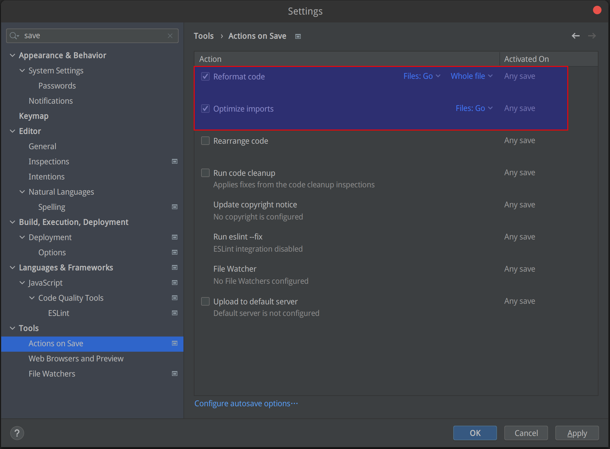
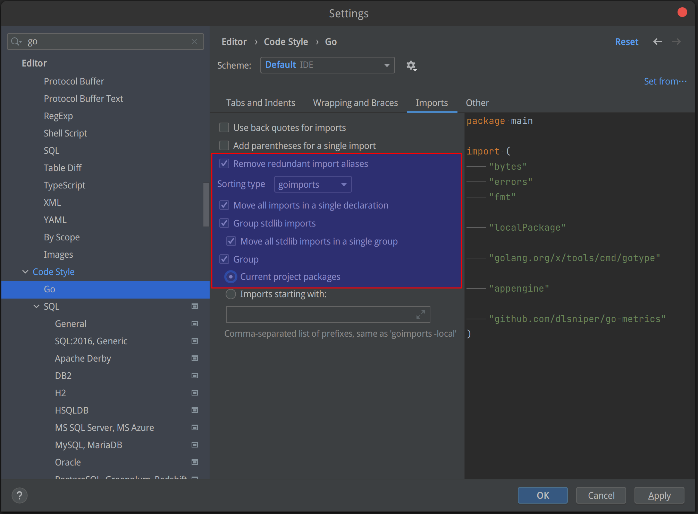
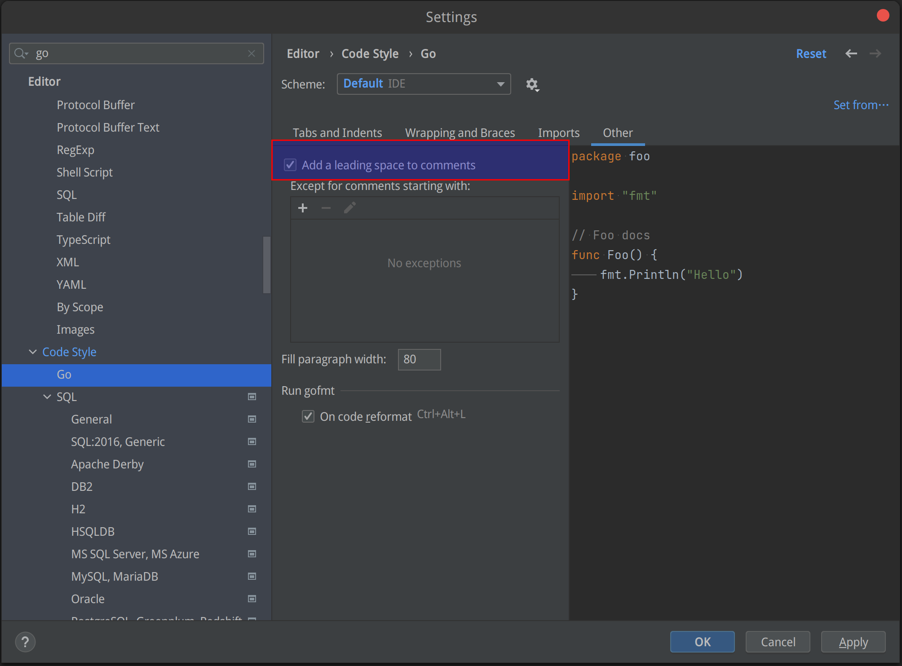

## golangci-lint

### amd64机器上安装

dapr提供了 `make lint`  target 来执行  golangci-lint， 如果没有安装 golangci-lint 则会报错：

```bash
$ make lint
# Due to https://github.com/golangci/golangci-lint/issues/580, we need to add --fix for windows
golangci-lint run --timeout=20m
make: golangci-lint: Command not found
make: *** [Makefile:72: lint] Error 127
```

安装方式参考 https://golangci-lint.run/usage/install/ 。linux下执行如下命令：

```bash
$ curl -sSfL https://raw.githubusercontent.com/golangci/golangci-lint/master/install.sh | sh -s -- -b $(go env GOPATH)/bin v1.43.0
golangci/golangci-lint info checking GitHub for tag 'v1.43.0'
golangci/golangci-lint info found version: 1.43.0 for v1.43.0/linux/amd64
golangci/golangci-lint info installed /home/sky/work/soft/gopath/bin/golangci-lint

$ golangci-lint --version
golangci-lint has version 1.43.0 built from 861262b7 on 2021-11-03T11:57:46Z
```

再次执行 make lint 进行检查，发现一堆输出：

```bash
make lint
# Due to https://github.com/golangci/golangci-lint/issues/580, we need to add --fix for windows
golangci-lint run --timeout=20m
WARN [runner] The linter 'golint' is deprecated (since v1.41.0) due to: The repository of the linter has been archived by the owner.  Replaced by revive. 
config/decode.go:107:21      godot             Comment should end in a period
config/decode.go:112:27      godot             Comment should end in a period
config/decode.go:117:27      godot             Comment should end in a period
logger/dapr_logger.go:31:17  revive            var-declaration: should omit type string from declaration of var DaprVersion; it will be inferred from the right-hand side
logger/dapr_logger.go:71:16  exhaustivestruct  DisableTimestamp, DisableHTMLEscape, DataKey, CallerPrettyfier, PrettyPrint are missing in JSONFormatter
logger/dapr_logger.go:76:16  exhaustivestruct  ForceColors, DisableColors, ForceQuote, DisableQuote, EnvironmentOverrideColors, DisableTimestamp, FullTimestamp, DisableSorting, SortingFunc, DisableLevelTruncation, PadLevelText, QuoteEmptyFields, CallerPrettyfier are missing in TextFormatter
config/decode.go:86:3        forcetypeassert   type assertion must be checked
config/decode.go:89:3        forcetypeassert   type assertion must be checked
```

检查对比了一下 dapr CI 中是怎么进行 lint 检测的，发现原来 dapr ci 中用的是 golangci-lint ‘v1.31’ 版本：

```bash
Requested golangci-lint 'v1.31', using 'v1.31.0', calculation took 119ms
Installing golangci-lint v1.31.0...
Downloading https://github.com/golangci/golangci-lint/releases/download/v1.31.0/golangci-lint-1.31.0-linux-amd64.tar.gz ...
/usr/bin/tar xz --warning=no-unknown-keyword -C /home/runner -f /home/runner/work/_temp/0f22eea4-f347-44ce-af0e-a2575ae885ef
Installed golangci-lint into /home/runner/golangci-lint-1.31.0-linux-amd64/golangci-lint in 1106ms
```

删除安装的1.43版本，重新安装1.31版本：

```bash
$ rm /home/sky/work/soft/gopath/bin/golangci-lint
$ curl -sSfL https://raw.githubusercontent.com/golangci/golangci-lint/master/install.sh | sh -s -- -b $(go env GOPATH)/bin v1.31.0
golangci/golangci-lint info checking GitHub for tag 'v1.31.0'
golangci/golangci-lint info found version: 1.31.0 for v1.31.0/linux/amd64
golangci/golangci-lint info installed /home/sky/work/soft/gopath/bin/golangci-lint
$ golangci-lint --version
golangci-lint has version 1.31.0 built from 3d6d0e7 on 2020-09-07T15:14:41Z
```

再次执行，这次结果就和 dapr ci 对应上了。

```bash
$ make lint
# Due to https://github.com/golangci/golangci-lint/issues/580, we need to add --fix for windows
golangci-lint run --timeout=20m
```

{}
golangci-lint 一定要安装 1.31 版本！
{}

### m1 macbook上安装

在 m1 macbook 上， 由于 1.31 版本发布较早，没有提供对 m1 （也就是darwin-arm64）的支持，因此上面的脚本在运行时并不能自动下载安装：

```bash
$ curl -sSfL https://raw.githubusercontent.com/golangci/golangci-lint/master/install.sh | sh -s -- -b $(go env GOPATH)/bin v1.31.0
golangci/golangci-lint info checking GitHub for tag 'v1.31.0'
golangci/golangci-lint info found version: 1.31.0 for v1.31.0/darwin/arm64
```

解决方法就是开启 Rosetta 来兼容 intel 芯片：

[If you need to install Rosetta on your Mac - Apple Support](https://support.apple.com/en-us/HT211861)

通常在第一次运行基于inte芯片构建的应用时会提示。

然后手工下载 v1.31.0 的 darwin-amd64 二进制文件：

- https://github.com/golangci/golangci-lint/releases/tag/v1.31.0
- https://github.com/golangci/golangci-lint/releases/download/v1.31.0/golangci-lint-1.31.0-darwin-amd64.tar.gz

将解压缩得到的 golangci-lint 文件移动到 gopath 下的 bin 目录即可。

## gofumpt

运行 lint 之后如果发现 `File is not `gofumpt`-ed` ：

```bash
$ make lint
golangci-lint run --timeout=20m

tests/perf/utils/grpc_helpers.go:4               gofumpt    File is not `gofumpt`-ed
tests/perf/utils/grpc_helpers.go:9               gofumpt    File is not `gofumpt`-ed
```

则需要安装 gofumpt 进行文件格式，参考 https://github.com/mvdan/gofumpt ：

```bash
$ go install mvdan.cc/gofumpt@latest

go: downloading mvdan.cc/gofumpt v0.3.1
go: downloading golang.org/x/sys v0.0.0-20220319134239-a9b59b0215f8
go: downloading github.com/google/go-cmp v0.5.7
```

然后对有问题的文件执行 gofumpt :

```bash
gofumpt -w tests/perf/utils/grpc_helpers.go 
```


## goimports

运行 lint 之后如果发现 `File is not `goimports`-ed` ：

```bash
$ make lint
golangci-lint run --timeout=20m

tests/perf/utils/grpc_helpers.go:5               goimports  File is not `goimports`-ed with -local github.com/dapr/
```

则需要安装 goimports 对import内容进行文件格式：

```bash
go get golang.org/x/tools/cmd/goimports
```


### 手工执行

```bash
$ goimports -e -d -local github.com/dapr/ tests/perf/utils/grpc_helpers.go
diff -u tests/perf/utils/grpc_helpers.go.orig 
tests/perf/utils/grpc_helpers.go
--- tests/perf/utils/grpc_helpers.go.orig       2022-04-08 22:47:08.199473748 +0800
+++ tests/perf/utils/grpc_helpers.go    2022-04-08 22:47:08.199473748 +0800
@@ -4,10 +4,11 @@
        "context"
        "time"
 
-       v1 "github.com/dapr/dapr/pkg/proto/common/v1"
-       runtimev1pb "github.com/dapr/dapr/pkg/proto/runtime/v1"
        "google.golang.org/grpc"
        "google.golang.org/protobuf/types/known/anypb"
+
+       v1 "github.com/dapr/dapr/pkg/proto/common/v1"
+       runtimev1pb "github.com/dapr/dapr/pkg/proto/runtime/v1"
 )
 
 $ goimports -w tests/perf/utils/grpc_helpers.go
```

### 配置 goland 自动执行

参考下面文章的建议：

- [Running 'goimports' on save in GoLand](https://stackoverflow.com/questions/45590236/running-goimports-on-save-in-goland)

需要修改的地方有几个，打开 goland 的 settings：

- "Action on Save" 中，勾选 "reformat code" 和 "Optimize imports"

  

- "Code Style" -> "Go" -> "Import" 中，"sorting by" 下拉框默认是 "gofmt"，修改为 "goimports"，然后勾选相关的选项

  

-  "Code Style" -> "Go" -> "other" 中, 勾选 "add a leading space to comments"，这会在注释内容前加一个空格

  

## 参考资料

- [How to Fix some golangci-lint errors](http://giaogiaocat.github.io/go/how-to-fix-file-is-not-gofumpt-ed-gofumpt-error/)
