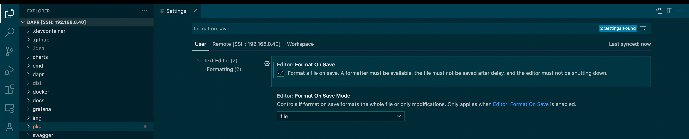
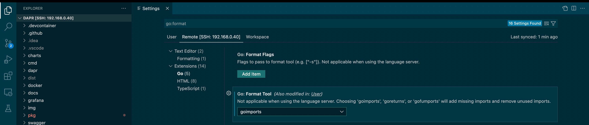

## golangci-lint

### amd64 机器上安装

> 适用于 amd64 linux 和 macOS。

dapr提供了 `make lint`  target 来执行  golangci-lint， 如果没有安装 golangci-lint 则会报错：

```bash
$ make lint
# Due to https://github.com/golangci/golangci-lint/issues/580, we need to add --fix for windows
golangci-lint run --timeout=20m
make: golangci-lint: Command not found
make: *** [Makefile:72: lint] Error 127
```

之前dapr用的是 v1.31 老版本，在2022年5月之后， dapr CI 中采用的是最新版本，具体是 golangci-lint 1.45.2。

安装方式参考 https://golangci-lint.run/usage/install/ 。linux下执行如下命令：

```bash
$ curl -sSfL https://raw.githubusercontent.com/golangci/golangci-lint/master/install.sh | sh -s -- -b $(go env GOPATH)/bin v1.45.2
golangci/golangci-lint info checking GitHub for tag 'v1.45.2'
golangci/golangci-lint info found version: 1.45.2 for v1.45.2/linux/amd64
golangci/golangci-lint info installed /home/sky/work/soft/gopath/bin/golangci-lint

$ golangci-lint --version
golangci-lint has version 1.45.2 built from 8bdc4d3f on 2022-03-24T11:51:26Z
```

{}
golangci-lint 一定要安装对应的版本！
{}

### m1 macbook上安装

在 m1 macbook 上， dapr之前使用的 1.31 版本发布较早，没有提供对 m1 （也就是darwin-arm64）的支持，但最新的dapr改用 1.45.2 版本之后就支持 arm64 了，所以可以用同样的方式安装：

```bash
$ curl -sSfL https://raw.githubusercontent.com/golangci/golangci-lint/master/install.sh | sh -s -- -b $(go env GOPATH)/bin v1.45.2
golangci/golangci-lint info checking GitHub for tag 'v1.45.2'
golangci/golangci-lint info found version: 1.45.2 for v1.45.2/linux/amd64
golangci/golangci-lint info installed /home/sky/work/soft/gopath/bin/golangci-lint
golangci/golangci-lint info checking GitHub for tag 'v1.45.2'
golangci/golangci-lint info found version: 1.45.2 for v1.45.2/darwin/arm64
golangci/golangci-lint info installed /Users/sky/work/soft/gopath/bin/golangci-lint
 
$ golangci-lint --version
golangci-lint has version 1.45.2 built from 8bdc4d3f on 2022-03-24T11:51:26Z
```

注意：golangci-lint  1.45.2 版本似乎对 go 有版本要求，我在 golang 1.17 版本下运行会报错：

```bash
$ golangci-lint --version

panic: load embedded ruleguard rules: rules/rules.go:13: can't load fmt

goroutine 1 [running]:
github.com/go-critic/go-critic/checkers.init.22()
	github.com/go-critic/go-critic@v0.6.2/checkers/embedded_rules.go:46 +0x494

$ go version  
go version go1.17.8 darwin/arm64
```

升级 golang 到 1.18 就正常了。

## gofumpt

运行 lint 之后如果发现 `File is not `gofumpt`-ed` ：

```bash
$ make lint
golangci-lint run --timeout=20m

tests/perf/utils/grpc_helpers.go:4               gofumpt    File is not `gofumpt`-ed
tests/perf/utils/grpc_helpers.go:9               gofumpt    File is not `gofumpt`-ed
```

则需要安装 gofumpt 进行文件格式，参考 https://github.com/mvdan/gofumpt ：

```bash
$ go install mvdan.cc/gofumpt@latest

go: downloading mvdan.cc/gofumpt v0.3.1
go: downloading golang.org/x/sys v0.0.0-20220319134239-a9b59b0215f8
go: downloading github.com/google/go-cmp v0.5.7
```

然后对有问题的文件执行 gofumpt :

```bash
gofumpt -w tests/perf/utils/grpc_helpers.go 
```


## goimports

运行 lint 之后如果发现 `File is not `goimports`-ed` ：

```bash
$ make lint
golangci-lint run --timeout=20m

tests/perf/utils/grpc_helpers.go:5               goimports  File is not `goimports`-ed with -local github.com/dapr/
```

则需要安装 goimports 对import内容进行文件格式：

```bash
go get golang.org/x/tools/cmd/goimports
```


### 手工执行

```bash
$ goimports -e -d -local github.com/dapr/ tests/perf/utils/grpc_helpers.go
diff -u tests/perf/utils/grpc_helpers.go.orig 
tests/perf/utils/grpc_helpers.go
--- tests/perf/utils/grpc_helpers.go.orig       2022-04-08 22:47:08.199473748 +0800
+++ tests/perf/utils/grpc_helpers.go    2022-04-08 22:47:08.199473748 +0800
@@ -4,10 +4,11 @@
        "context"
        "time"
 
-       v1 "github.com/dapr/dapr/pkg/proto/common/v1"
-       runtimev1pb "github.com/dapr/dapr/pkg/proto/runtime/v1"
        "google.golang.org/grpc"
        "google.golang.org/protobuf/types/known/anypb"
+
+       v1 "github.com/dapr/dapr/pkg/proto/common/v1"
+       runtimev1pb "github.com/dapr/dapr/pkg/proto/runtime/v1"
 )
 
 $ goimports -w tests/perf/utils/grpc_helpers.go
```

### 配置 goland 自动执行

参考下面文章的建议：

- [Running 'goimports' on save in GoLand](https://stackoverflow.com/questions/45590236/running-goimports-on-save-in-goland)

需要修改的地方有几个，打开 goland 的 settings：

- "Action on Save" 中，勾选 "reformat code" 和 "Optimize imports"

  

- "Code Style" -> "Go" -> "Import" 中，"sorting by" 下拉框默认是 "gofmt"，修改为 "goimports"，然后勾选相关的选项

  

-  "Code Style" -> "Go" -> "other" 中, 勾选 "add a leading space to comments"，这会在注释内容前加一个空格

  

### 配置vs code

参考： [Formatting Go code with goimports (hyr.mn)](https://hyr.mn/gofmt/)

打开 File -> Preferences -> Settings， 搜索 "format on save"，勾选:



搜索 go:format，在 format tool 中选择 goimports: 



注意：

1. 如果 go:format 搜索时找不到 extends / go，则应该是没有安装 go extensin，或者安装之后没有重启 vs code
2. 下拉框选 goimports 时如果报错没有安装 goimports，点安装即可

## 参考资料

- [How to Fix some golangci-lint errors](http://giaogiaocat.github.io/go/how-to-fix-file-is-not-gofumpt-ed-gofumpt-error/)
