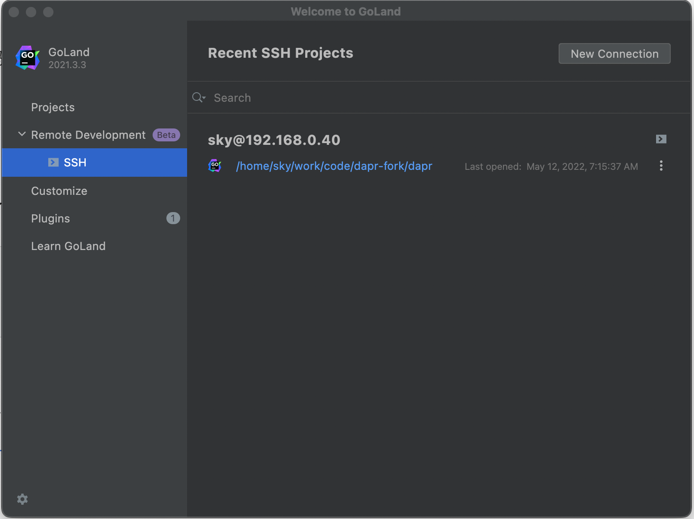
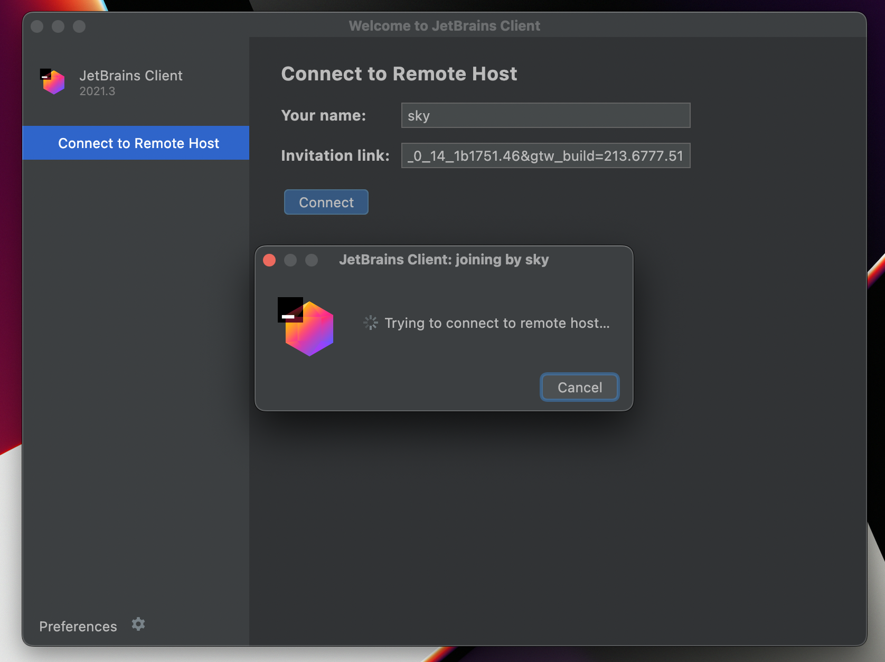

## 准备工作

### sftp

服务器端要求安装 sftp，通常安装ssh之后就可以了，尝试用sftp命令登录试试：

```bash
$ sftp sky@192.168.0.40              
Connected to 192.168.0.40.
sftp> 
```

### 安装 Jetbrans Gateway

参考 https://www.jetbrains.com/help/go/remote-development-starting-page.html 

在 goland 中启用 Remote Development Gateway 插件。重启 goland，就能在 goland 的欢迎界面看到 remote development 和 ssh 。

添加 ssh 登录之后：



## 运行

经常卡在这里，长时间等待然后报错，但有时又工作正常，快速进入ide界面。



反复测试过，不清楚原因。

这就导致每次使用时都有进不去的风险，非常头疼。

暂时没搞定。

## 参考

- https://www.jetbrains.com/help/go/remote-development-starting-page.htmls
