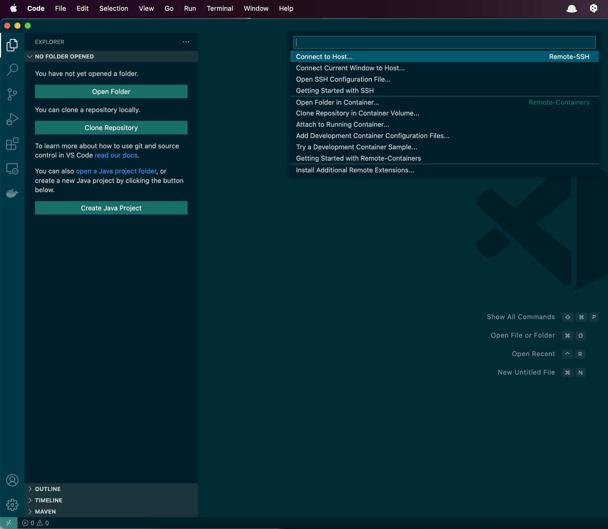
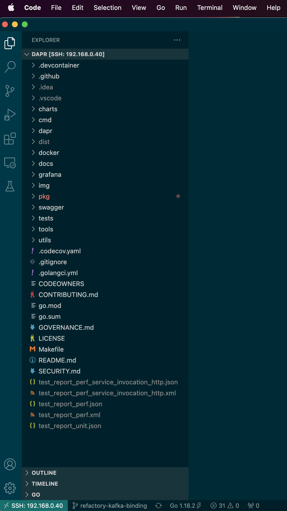

## 准备工作

无，只要安装好 vs code 和远程服务器能支持 ssh 即可，非常方便。

## 运行

打开vs code，左下角点击 "open a remote windows"，然后选 "connect to host...  Remote-SSH":



输入可以连接到远程服务器的 ssh 命令即可。

也可以通过 "open ssh configurtion file" 选择修改 config 文件，比如设置 port ：

```properties
Host home.yourdomain.com
  HostName home.yourdomain.com
  Port 34022
  User sky

Host 192.168.0.40
  HostName 192.168.0.40
  User sky
```

打开 dapr 项目所在目录：




注意：plugin 要在 remote 这边再安装一次，比如最基本的 go plugin。

## 参考

- https://code.visualstudio.com/docs/remote/ssh
