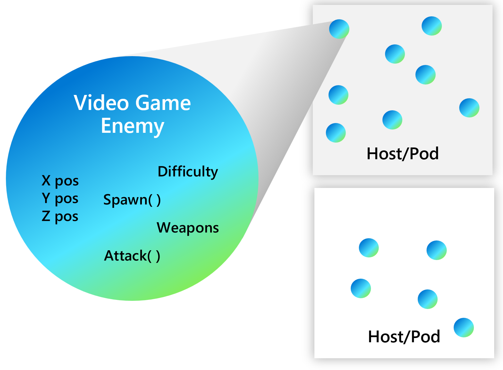
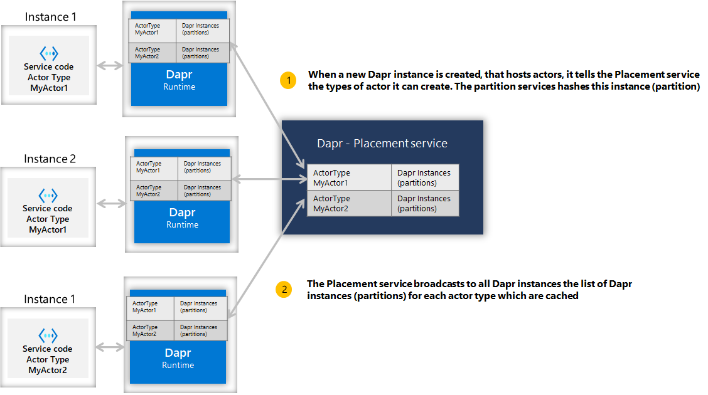
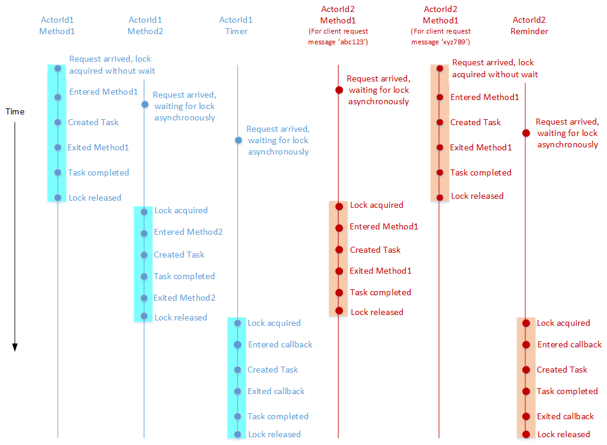

> 内容节选自：https://github.com/dapr/docs/blob/master/concepts/actors/README.md

Dapr运行时提供了一个基于 Virtual Actor 模式的actor实现。Dapr actors API提供了一个单线程编程模型，该模型利用了运行Dapr的底层平台所提供的可伸缩性和可靠性保证。

## Actor 介绍

Actor 是具有单线程执行的隔离，独立的计算和状态单元。

[Actor 模型](https://en.wikipedia.org/wiki/Actor_model) 是一种用于并发或者分布式系统的计算机模型，大量的 Actor 可以同时执行且彼此独立。Actor 可以相互交流，并且可以创建更多的 Actor。

### 何时使用Actor

Dapr actor 是 actor 设计模式的一种实现。与任何软件设计模式一样，是否使用特定模式取决于软件设计问题是否适合该模式。

尽管 Actor 设计模式可以很好地适配许多分布式系统的问题和场景，但是必须仔细考虑模式的约束以及实现该模式的框架。作为一般指导，在以下情况下，请考虑使用 Actor 模式来为您的问题或场景建模：

- 问题空间涉及大量（成千上万个）小型，独立且隔离的状态和逻辑单元。
- 想要使用单线程对象，无需与外部组件进行大量交互（包括跨参与者查询状态）
- actor实例不会通过发出I/O操作而以不可预测的延迟阻塞调用者。

### Dapr Actor

每个 Actor 都被定义为 Actor 类型的实例，类比对象是类的实例。例如，可能存在实现计算器功能的 Actor 类型，并且可能有许多这种类型的 Actor 分布在整个集群的各个节点上。每个此类 Actor 都由 Actor ID 唯一标识。



## Actor生命周期

Dapr Actor 是虚拟的，这意味着他们的生命周期不依赖于其在内存中的表示。结果就是，不需要显式创建或销毁它们。Dapr actor 运行时在其第一次收到对该 actor ID 的请求时会自动激活 actor。如果一段时间未使用actor，则Dapr Actors 运行时会垃圾收集内存中的对象。如果以后需要重新激活，它还将保留有关 Actor 存在的知识。

对 actor 方法和提醒的调用会重置空闲时间，例如提醒触发将使actor保持活动状态。Actor 提醒触发 Actor 是活跃还是不活跃，如果被激发为不活跃的演员，它将首先激活该 Actor。Actor timer不会重置空闲时间，因此 timer 触发不会使Actor保持活动状态。计时器仅在actor处于活动状态时触发。

Dapr运行时用于查看是否可以垃圾收集actor而使用的空闲超时和扫描间隔是可配置的。当Dapr运行时调用actor服务以获取受支持的actor类型时，可以传递此信息。

由于虚拟 Actor 模型，这种虚拟角色生命周期的抽象带来了一些警告，实际上，Dapr Actors的实现有时会偏离该模型。

第一次将消息发送到其 Actor ID 时，会自动激活一个 Actor（导致要构造一个 Actor 对象）。一段时间后，actor对象将被垃圾回收。将来，再次使用actor ID，将导致构造新的actor对象。由于状态存储在已配置的状态提供程序中以供Dapr运行时使用，因此 Actor 的状态比对象的生存期更长。

## 分发和故障转移

为了提供可伸缩性和可靠性，actor实例分布在整个群集中，Dapr会根据需要自动将其从故障节点迁移到正常节点。

Actor分布在actor服务的各个实例上，而这些实例分布在集群中的各个节点上。每个服务实例都包含一组给定类型的 Actor。

### Actor Placement 服务

Dapr actor运行时为您管理分发方案和密钥范围设置。这是由actor `Placement`服务完成的。创建服务的新实例时，相应的Dapr运行时会注册它可以创建的参与者类型，并且`Placement`服务会针对给定的参与者类型计算所有实例之间的分区。每种Actor类型的分区信息表都会更新并存储在环境中运行的每个Dapr实例中，并且可以在创建和破坏Actor服务的新实例时动态更改。如下图所示。



当客户端调用具有特定ID（例如，Actor ID 123）的actor时，客户端的 Dapr 实例会对actor类型和ID进行哈希处理，并使用该信息调用相应的Dapr实例，该实例可以为这个特定的Actor ID的请求提供服务。结果就是，总是为任何给定的Actor ID调用相同的分区（或服务实例）。如下图所示。

[](https://github.com/dapr/docs/blob/master/images/actors_id_hashing_calling.png)

这简化了一些选择，但也需要考虑一些问题：

- 默认情况下，Actor 被随机放置在 pod 中，以实现均匀分布。
- 因为 Actor 是随机放置的，所以期望 Actor 的操作总是需要网络通信，包括方法调用数据的序列化和反序列化，这会导致延迟和开销。

注意：Dapr Actor Placement 服务仅用于演员放置，因此，如果服务未使用Dapr Actor，则不需要。Placement 服务可以在所有托管环境中运行，例如，自托管，Kubernetes

## Actor通讯

可以通过调用 HTTP/gRPC 端点与 Dapr 交互以调用 actor 方法：

```
POST/GET/PUT/DELETE http://localhost:3500/v1.0/actors/<actorType>/<actorId>/<method/state/timers/reminders>
```

您可以在请求体中为actor方法提供任何数据，并且请求的响应将在响应体中，这是来自actor调用的数据。

### 并发

Dapr Actors运行时提供了一个简单的基于回合的访问模型，用于访问actor方法。这意味着在任何时候，调用一个actor对象的代码的时，最多只能有一个线程处于活动状态。基于回合的访问极大地简化了并发系统，因为不需要数据访问的同步机制。这也意味着，在设计系统时，必须为每个 Actor 实例的单线程访问性质做特殊考虑。

一个actor实例不能同时处理多个请求。如果期望 actor 实例处理并发请求，则可能导致吞吐量瓶颈。

如果两个 Actor 之间存在循环请求，而同时向其中一个 Actor 发出外部请求，则 Actor 之间可能会彼此死锁。Dapr actor运行时会在 actor 调用上自动超时，并向调用方抛出异常以中断可能的死锁情况。


### 基于回合的访问

回合包括响应其他 Actor 或客户端的请求而完全执行 Actor方法，或完全执行 timer/reminder 回调。即使这些方法和回调是异步的，Dapr Actors运行时也不会交错它们。在允许新的回合之前，必须将回合完全完成。换句话说，在允许对方法或回调的新调用之前，当前正在执行的actor方法或计时器/提醒回调必须完全完成。如果方法或回调已从该方法或回调返回执行，并且该方法或回调返回的任务已完成，则认为该方法或回调已完成。值得强调的是，即使在不同的方法，计时器和回调中，也要尊重基于回合的并发。

Dapr actors运行时强制执行基于回合的并发，方式是通过在回合开始时获取每个 Actor 的锁并在回合结束时释放该锁。因此，基于回合的并发是基于每个 Actor 而不是跨 Actor 实现的。Actor方法和计时器/提醒回调可以代表不同的actor同时执行。

以下示例说明了上述概念。考虑一个实现两个异步方法（例如Method1和Method2），一个计时器和一个提醒的actor类型。下图显示了代表属于此 Actor 类型的两个 Actor（ActorId1和ActorId2）执行这些方法和回调的时间线示例。



其他内容：

- [Dapr Actor Features](https://github.com/dapr/docs/blob/master/concepts/actors/actors_features.md)
- [Dapr Actor API Spec](https://github.com/dapr/docs/blob/master/concepts/actors/actors_api.md): （404中，估计还在写）