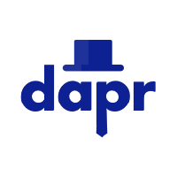

### Dapr是什么？

Dapr 是 Distributed Application Runtime （分布式应用运行时）的缩写。

Dapr github首页的介绍是：

> Dapr is a portable, event-driven, runtime for building distributed applications across cloud and edge.
>
> Dapr是一种可移植的，事件驱动的运行时，用于构建跨云和边缘的分布式应用。

号称可以：

> Any language, any framework, anywhere

详细介绍是：

> Dapr是一种可移植的，serverless的，事件驱动的运行时，它使开发人员可以轻松构建弹性，无状态和有状态微服务，这些服务运行在云和边缘上，并包含多种语言和开发框架。
>
> Dapr 整理了构建微服务应用为开放，独立的构建块的最佳实践，使您能够使用自己选择的语言和框架来构建可移植的应用程序。 每个构建块都是独立的，您可以在应用中使用其中的一个或多个。
>
> 注意：Dapr目前正处于社区开发中的 Alpha 阶段。 在其1.0稳定版本发布之前，不要将 Dapr 用于生产工作负载。

下图是 Dapr 的概念模型：

> 以下内容来自：https://github.com/dapr/dapr

### 目标

- 使开发人员能够使用任何语言或框架来编写分布式应用
- 通过提供最佳实践构建模块来解决开发人员构建微服务应用时面临的难题
- 社区驱动，开放，供应商无关
- 获得新的贡献者
- 通过开放的API提供一致性和可移植性
- 跨云和边缘，与平台无关
- 拥抱可扩展性并提供可插入组件，而无需供应商锁定
- 通过高性能和轻量级实现物联网（IoT）和边缘场景
- 可以从现有代码中逐步采用，而没有运行时依赖

### 工作方式

Dapr向每个计算单元注入了一个Sidecar容器/进程。Sidecar与事件触发器进行交互，并通过标准HTTP或gRPC协议与计算单元进行通信。这使Dapr能够支持所有现有和将来的编程语言，而无需您导入框架或库。

Dapr通过标准的HTTP verbs 或gRPC interface 提供内置的状态管理，可靠消息传递（至少一次传递），触发器和绑定。这使您可以遵循相同的编程范例编写无状态，有状态和类似于actor的服务。您可以自由选择一致性模型，线程模型和消息传递模式。

Dapr在Kubernetes上原生运行，也可以作为机器上的独立二进制文件，在IoT设备上运行，也可以作为容器注入到任何系统中，无论是在云端还是在本地。

Dapr使用可插拔状态存储和消息总线（例如Redis）以及gRPC来提供广泛的通信方法，包括使用gRPC的直接 dapr-to-dapr 通讯和具有保证传递和至少一次语义的异步Pub-Sub。

### 为什么用 Dapr？

编写高性能，可伸缩和可靠的分布式应用很困难。 Dapr带给您成熟的模式和实践。 它将事件驱动和 actor 的语义统一到一个简单而一致的编程模型中。 它支持所有编程语言，没有框架锁定。 您不会接触到低级原语，例如线程，并发控制，分区和伸缩。 相反，您可以通过使用所选的熟悉的Web框架实现简单的Web服务器来编写代码。

Dapr在线程和状态一致性模型方面很灵活。 如果愿意，可以利用多线程，还可以在不同的一致性模型中进行选择。 这种灵活性使得无需人为约束即可实施高级方案。 您可能还选择利用其他Actor框架中熟悉的单线程调用。 Dapr是独一无二的，因为您可以在这些模型之间无缝转换而无需重写代码。

### 特性

- 事件驱动的Pub-Sub系统，具有可插拔提供商和至少一次的语义
- 输入和输出绑定，使用可插拔提供商
- 具有可插拔数据存储的状态管理
- 一致的服务到服务发现和调用
- 选择加入状态模型：强大/最终的一致性，首次写入/最后写入获胜
- 跨平台虚拟 actor
- 密钥管理，从安全密钥库中提取密钥。
- 限速
- 内置可观测性支持
- 使用专用的Operator和CRD在Kubernetes上原生运行
- 通过HTTP和gRPC支持所有编程语言
- 来自Azure，AWS，GCP的多云，开放式组件（绑定，发布-订阅，状态）
- 在任何地方运行，无论是进程还是容器化
- 轻量级（58MB二进制，4MB物理内存）
- 作为Sidecar运行-无需特殊的SDK或类库
- 专用的CLI-开发人员友好的体验，易于调试
- Java，.NET Core，Go，Javascript，Python，Rust和C ++的客户端

