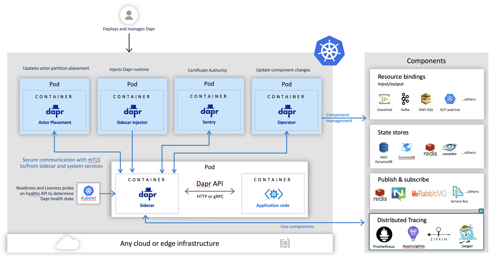

> 内容节选自：https://docs.dapr.io/developing-applications/building-blocks/observability/sidecar-health/

Dapr提供了一种使用HTTP `/healthz` 端点来确定其健康状况的方法。有了这个端点，Dapr进程或sidecar可以被探测到它的健康状况，从而确定它的准备度(readiness)和活力(liveness)。参见[健康API](https://docs.dapr.io/reference/api/health_api/)

Dapr `/healthz` 端点可以被应用托管平台的健康探针使用。本主题介绍了Dapr如何与来自不同托管平台的探针集成。

作为用户，当将Dapr部署到托管平台（例如Kubernetes）时，Dapr健康端点会自动为您配置。你不需要配置任何东西。

注意：Dapr actor 也有一个健康 API 端点，Dapr 会探测应用程序，以响应 Dapr 发出的信号，即 actor 应用程序是健康且正在运行的。请参阅actor健康API

### 健康端点：与Kubernetes的整合

Kubernetes使用就绪（*readiness*）和活泼度（*liveness*）探针来确定容器的健康状况。

kubelet使用 liveness probes 来知道何时重启容器。例如，liveness探针可以捕捉到一个死锁，即应用程序正在运行，但无法取得进展。在这样的状态下重启容器，可以帮助使应用在有bug的情况下仍有更多的可用性。

kubelet使用 readiness probes 来了解一个容器何时准备好开始接受流量。当一个pod的所有容器都准备好时，就认为它已经准备好了。这个就绪信号的一个用途是控制哪些pod被用作Kubernetes服务的后端。当一个pod没有准备好时，它将从Kubernetes服务负载平衡器中移除。

当与Kubernetes集成时，Dapr sidecar被注入一个Kubernetes探针配置，告诉它使用Dapr healthz端点。这是由Sidecar Injector系统服务完成的。与kubelet的集成如下图所示。



### 如何在Kubernetes中配置Liveness探针？

在pod配置文件中，在容器规范部分添加了活泼度(Liveness)探针，如下图所示。

```yaml
 livenessProbe:
      httpGet:
        path: /healthz
        port: 8080
      initialDelaySeconds: 3
      periodSeconds: 3
```

在上面的例子中，periodSeconds字段指定kubelet应该每3秒执行一次活度探测。initialDelaySeconds字段告诉kubelet在执行第一个探测之前应该等待3秒。要执行探测，kubelet会向在容器中运行并在本例中监听端口8080的服务器发送HTTP GET请求。如果服务器的 `/healthz` 路径的处理程序返回一个成功代码，那么kubelet认为容器还活着并且是健康的。如果处理程序返回失败代码，kubelet就会杀死容器并重新启动它。

任何大于或等于200且小于400的代码表示成功。任何其他代码表示失败。

### 如何在Kubernetes中配置readiness探针？

就绪（readiness）探针的配置与活度探针类似，唯一的区别是使用readinessProbe字段而不是活度探针字段。

```yaml
readinessProbe:
			httpGet:
        path: /healthz
        port: 8080
      initialDelaySeconds: 3
      periodSeconds: 3
```

### Dapr sidecar健康端点如何用Kubernetes配置？

如上所述，这个配置是由Sidecar Injector服务自动完成的。本节介绍了在活泼度和准备度探针上设置的具体数值。

Dapr在端口3500上有其HTTP健康端点 `/v1.0/healthz`，这可以和Kubernetes一起用于就绪和活泼度探针。当Dapr sidecar被注入时，在pod配置文件中用以下值配置就绪和活泼度探针。

```yaml
livenessProbe:
      httpGet:
        path: v1.0/healthz
        port: 3500
      initialDelaySeconds: 5
      periodSeconds: 10
      timeoutSeconds : 5
      failureThreshold : 3
readinessProbe:
      httpGet:
        path: v1.0/healthz
        port: 3500
      initialDelaySeconds: 5
      periodSeconds: 10
      timeoutSeconds : 5
      failureThreshold: 3
```