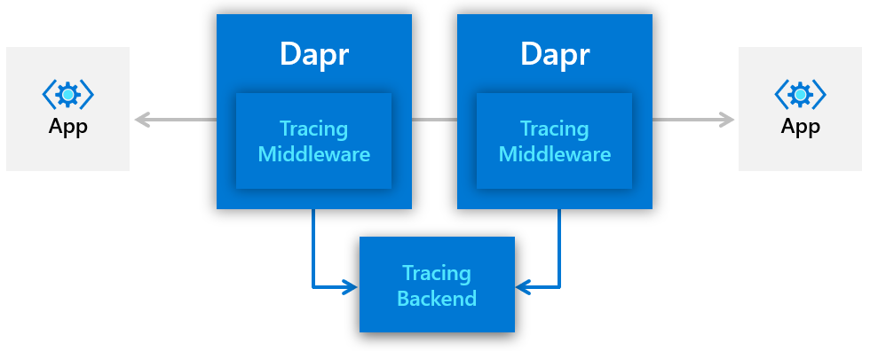

> 内容节选自：https://docs.dapr.io/developing-applications/building-blocks/observability/tracing/

Dapr 使用 OpenTelemetry（以前称为OpenCensus）进行分布式追踪和指标收集。OpenTelemetry支持各种后端，包括Azure Monitor、Datadog、Instana、Jaeger、SignalFX、Stackdriver、Zipkin等。



### 追踪设计

Dapr 向 Dapr sidecar 中添加了 HTTP/gRPC 中间件（middleware）。中间件拦截所有Dapr和应用流量，并自动注入相关ID以跟踪分布式事务。此设计具有以下优点：

- 无需代码检测。将自动跟踪所有流量（追踪级别可配置）。
- 跨微服务的一致追踪行为。追踪是在 Dapr Sidecar 上配置和管理的，因此它在服务中可能保持一致，这些服务是不同团队提供的，并且可能以不同的编程语言编写。
- 可配置和可扩展。通过利用 OpenTelemetry，可以将 Dapr 追踪配置为与流行的追踪后端一起使用，包括客户可能拥有的自定义后端。
- OpenTelemetry 导出器被定义为一等公民的 Dapr 组件。可以同时定义并启用多个导出器。

### W3C Correlation ID

Dapr使用标准的W3C跟踪上下文头文件。对于HTTP请求，Dapr使用 `traceparent` header。对于gRPC请求，Dapr使用 `grpc-trace-bin` header。当请求到达时没有trace ID时，Dapr会创建新的ID。否则，它将沿着调用链传递跟踪ID。

阅读W3C分布式跟踪，了解更多关于W3C Trace Context的背景。

> 这里有很大变化，早期的文档是这样描述，实现方式和现在的差异很大：
>
> 对于HTTP请求，Dapr会向请求注入 **X-Correlation-ID** header。对于gRPC调用，Dapr插入 **X-Correlation-ID** 作为 header 元数据的字段。当没有 Correlation ID 的请求到达时，Dapr将创建一个新的 Correlation。否则，它将沿调用链传递 Correlation ID。

### 配置

Dapr使用OpenCensus定义的概率才样 ([probabilistic sampling](https://opencensus.io/tracing/sampling/probabilistic/)) 。采样率定义了tracing span被采样的概率，其值可以在0和1之间（包括）。默认采样率是0.0001（即每10,000个span中采样一个）。

要改变默认的跟踪行为，请使用配置文件（在自托管模式下）或Kubernetes配置对象（在Kubernetes模式下）。例如，以下配置对象将采样率改为1（即每个span都会采样）。

```yaml
apiVersion: dapr.io/v1alpha1
kind: Configuration
metadata:
  name: tracing
  namespace: default
spec:
  tracing:
    samplingRate: "1"
```

同样，将 samplingRate 改为 0 将完全禁用跟踪。

有关如何在本地环境和Kubernetes环境中配置跟踪的更多细节，请参见[参考文档](https://docs.dapr.io/developing-applications/building-blocks/observability/tracing/#references)部分。

Dapr支持可插拔的导出器，由配置文件（在自托管模式下）或Kubernetes自定义资源对象（在Kubernetes模式下）定义。例如，下面的清单(manifest)定义了一个Zipkin导出器。

```yaml
apiVersion: dapr.io/v1alpha1
kind: Component
metadata:
  name: zipkin
  namespace: default
spec:
  type: exporters.zipkin
  metadata:
  - name: enabled
    value: "true"
  - name: exporterAddress
    value: "http://zipkin.default.svc.cluster.local:9411/api/v2/spans"
```

### 参考文档

- [How-To: Setup Application Insights for distributed tracing with OpenTelemetry Collector](https://docs.dapr.io/operations/monitoring/open-telemetry-collector/)
- [How-To: Set up Zipkin for distributed tracing](https://docs.dapr.io/operations/monitoring/zipkin/)
- [W3C distributed tracing](https://docs.dapr.io/developing-applications/building-blocks/observability/w3c-tracing/)


