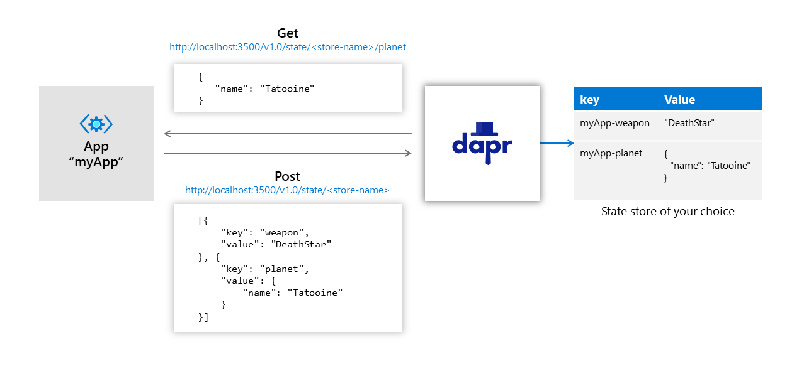

> 内容节选自：https://github.com/dapr/docs/blob/master/concepts/state-management/README.md

Dapr为状态管理提供了键/值存储API。当微服务使用状态管理时，它可以使用这些API来使用任何支持的状态存储，而不需要添加或学习第三方SDK。

当使用状态管理时，应用还可以使用其他一些功能，因为自己构建的功能会很复杂，容易出错，比如：

- 分布式并发和数据一致性
- 重试策略
- 批量CRUD操作

状态管理的高层架构图见下图：



### 状态管理API

开发者可以通过使用状态管理API来检索、保存和删除状态值，只需提供键。

Dapr数据存储是通过组件实现。Dapr 自开即用的自带 [Redis](https://redis.io/) ，用于在自主托管模式本地开发。Dapr允许您插入其他数据存储，例如 [Azure CosmosDB](https://azure.microsoft.com/services/cosmos-db/)，[SQL Server](https://azure.microsoft.com/services/sql-database/)，[AWS DynamoDB](https://aws.amazon.com/DynamoDB)，[GCP Cloud Spanner](https://cloud.google.com/spanner)和[Cassandra](http://cassandra.apache.org/)。

> **注意：** Dapr为状态的 key 添加前缀，前缀为当前Dapr实例的ID。这允许多个 Dapr 实例共享同一状态存储。

### 状态存储的行为

Dapr允许开发人员将额外的元数据附加到状态操作请求，该元数据描述了对如何处理该请求。例如，您可以将并发要求，一致性需求和重试策略附加到任何状态操作请求。

默认情况下，您的应用应假定数据存储是 **最终一致** 的，并使用 “ **last-write-wins”** 并发模式。另一方面，如果确实将元数据附加到请求，则Dapr会将元数据与请求一起传递到状态存储，并期望状态存储满足请求。

并非所有存储都是等价的。为了确保应用的可移植性，您可以查询存储的功能，并使代码适应于不同存储的功能。

下表总结了现有数据存储实现的功能。

| 商店          | 强一致的写入 | 强一致的读取 | ETag |
| ------------- | ------------ | ------------ | ---- |
| Cosmos DB     | 是           | 是           | 是   |
| PostgreSQL    | 是           | 是           | 是   |
| Redis         | 是           | 是           | 是   |
| Redis（集群） | 是           | 否           | 是   |
| SQL server    | 是           | 是           | 是   |

### 并发

Dapr 使用 ETag 来支持乐观并发控制（optimistic concurrency control / OCC）。当请求状态时，Dapr始终将 **ETag** 属性附加到返回的状态中。而且，当用户代码尝试更新或删除状态时，应该通过 **If-Match** 标头附加 ETag 。仅当提供的 ETag 与数据库中的 ETag 匹配时，写入操作才能成功。

Dapr 之所以选择 OCC，是因为在许多应用中，数据更新冲突很少发生，因为客户端被业务上下文自然地划分为不同的数据进行操作。当然，如果应用选择使用 ETag，则可能由于 ETag 不匹配而导致请求被拒绝。建议在使用 ETag 时使用 [重试策略](https://github.com/dapr/docs/blob/master/concepts/state-management/state-management.md#Retry-Policies) 来补偿此类冲突。

如果您的应用在编写请求时忽略了 ETag，则 Dapr 在处理请求时会跳过 ETag 检查。与使用 ETag 的“ **first-write-wins**”  模式相比，这实质上启用了“ **last-write-wins**” 模式。

> **注意：**对于原生不支持 ETag 的存储，预期相应的Dapr状态存储实现可以模拟 ETag 并在处理状态时遵循 Dapr 状态管理API规范。由于 Dapr 状态存储实现在技术上是基础数据存储的客户端，因此使用存储提供的并发控制机制，这种模拟应该很简单。

### 一致性

Dapr支持 **强一致性** 和 **最终一致性**，并且默认是最终一致性。

使用强一致性时，Dapr在确认写请求之前会等待所有副本（或指定的仲裁）确认。当使用最终一致性时，Dapr会在写入请求被底层数据存储接受后立即返回，即使底层数据存储是单个副本。

## 重试政策

Dapr允许您将重试策略附加到任何写请求。策略由 **retryInterval**，**retryPattern **和 **retryThreshold** 来描述。Dapr会以给定的时间间隔一直重试请求，直到达到指定的阈值。您可以在 **线性** 重试模式或 **指数**（backoff）模式之间进行选择。当使用 **指数** 模式时，每次重试间隔都会加倍。

## 批量操作

Dapr 支持两种类型的批量操作- **bulk** 或者 **multi**。您可以将几个相同类型的请求分组为一个大批/bulk（或批量/batch）。Dapr 将批量请求作为单个请求提交给底层数据存储。换句话说，批量操作不是事务性的。另一方面，您可以将不同类型的请求分组为一个多操作（multi-operation），将其作为原子事务处理。

### 直接查询状态存储

Dapr无需任何转换即可保存和检索状态值。您可以直接从底层状态存储中查询和聚合状态。例如，在 redis 中要获取与应用程序ID “ myApp” 相关联的所有状态键，可以使用：

```bash
KEYS "myApp*"
```

#### 查询 actor 状态

如果数据存储支持SQL查询，则可以使用SQL查询来查询 actor 的状态。例如使用：

```
SELECT * FROM StateTable WHERE Id='<app-id>||<actor-type>||<actor-id>||<key>'
```

您还可以跨 actor 实例执行聚合查询，从而避免了 actor 框架常见的基于回合的并发限制。例如，要计算所有温度计 actor 的平均温度，请使用：

```
SELECT AVG(value) FROM StateTable WHERE Id LIKE '<app-id>||<thermometer>||*||temperature'
```

> **注意：**状态存储的直接查询不受 Dapr 并发控制的约束，因为您没有通过 Dapr 运行时进行调用。您所看到的是已提交数据的快照，这些快照可用于多个 actor 之间的只读查询，但是应通过 actor 实例进行写入。


