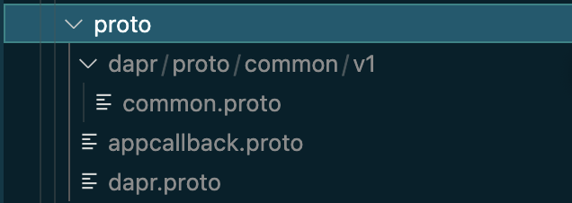
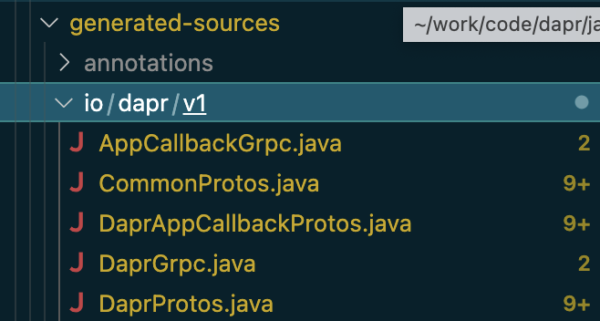
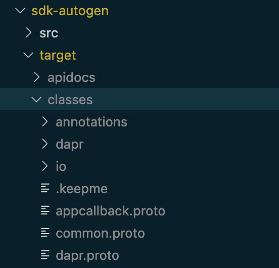
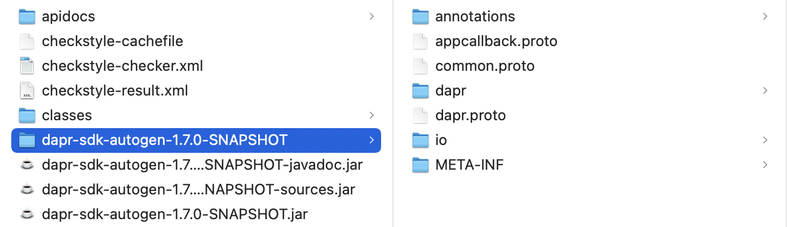

## 基本定义

### 依赖

定义的项目依赖：

- javax.annotation-api： provided
- grpc-netty-shaded： runtime
- grpc-protobuf
- grpc-stub
- grpc-testing： test

其中 grpc 版本为 1.42.1。

```xml
  <properties>
    <grpc.version>1.42.1</grpc.version>
  </properties>

<dependencies>
    <dependency>
      <groupId>javax.annotation</groupId>
      <artifactId>javax.annotation-api</artifactId>
      <version>1.3.2</version>
      <scope>provided</scope>
    </dependency>
    <dependency>
      <groupId>io.grpc</groupId>
      <artifactId>grpc-netty-shaded</artifactId>
      <version>${grpc.version}</version>
      <scope>runtime</scope>
    </dependency>
    <dependency>
      <groupId>io.grpc</groupId>
      <artifactId>grpc-protobuf</artifactId>
      <version>${grpc.version}</version>
    </dependency>
    <dependency>
      <groupId>io.grpc</groupId>
      <artifactId>grpc-stub</artifactId>
      <version>${grpc.version}</version>
    </dependency>
    <dependency>
      <groupId>io.grpc</groupId>
      <artifactId>grpc-testing</artifactId>
      <version>${grpc.version}</version>
      <scope>test</scope>
    </dependency>
  </dependencies>

```

### 代码生成的目录

两个目录：

- input： proto
- output： generated-sources

```xml
  <properties>
    <protobuf.output.directory>${project.build.directory}/generated-sources</protobuf.output.directory>
    <protobuf.input.directory>${project.build.directory}/proto</protobuf.input.directory>
  </properties>
```

## maven插件

### download-maven-plugin

download-maven-plugin 用来下载 proto 文件。

插件的功能可以简单理解为：

1. 用 wget 命令从 ${dapr.proto.baseurl}/common/v1/common.proto 处下载到 common.proto 文件
2. 用 wget 命令从 ${dapr.proto.baseurl}/common/v1/dapr.proto 处下载到 dapr.proto 文件
3. 用 wget 命令从 ${dapr.proto.baseurl}/common/v1/appcallback.proto 处下载到 appcallback.proto 文件
4. 以上三个文件下载后都会放置到目录 ${protobuf.input.directory}/dapr/proto/common/v1 下

```xml
<plugin>
        <groupId>com.googlecode.maven-download-plugin</groupId>
        <artifactId>download-maven-plugin</artifactId>
        <version>1.6.0</version>
        <executions>
          <execution>
            <id>getCommonProto</id>
            <!-- the wget goal actually binds itself to this phase by default -->
            <phase>initialize</phase>
            <goals>
              <goal>wget</goal>
            </goals>
            <configuration>
              <url>${dapr.proto.baseurl}/common/v1/common.proto</url>
              <outputFileName>common.proto</outputFileName>
              <!-- default target location, just to demonstrate the parameter -->
              <outputDirectory>${protobuf.input.directory}/dapr/proto/common/v1</outputDirectory>
            </configuration>
          </execution>
          <execution>
            <id>getDaprProto</id>
            <!-- the wget goal actually binds itself to this phase by default -->
            <phase>initialize</phase>
            <goals>
              <goal>wget</goal>
            </goals>
            <configuration>
              <url>${dapr.proto.baseurl}/runtime/v1/dapr.proto</url>
              <outputFileName>dapr.proto</outputFileName>
              <!-- default target location, just to demonstrate the parameter -->
              <outputDirectory>${protobuf.input.directory}</outputDirectory>
            </configuration>
          </execution>
          <execution>
            <id>getDaprClientProto</id>
            <!-- the wget goal actually binds itself to this phase by default -->
            <phase>initialize</phase>
            <goals>
              <goal>wget</goal>
            </goals>
            <configuration>
              <url>${dapr.proto.baseurl}/runtime/v1/appcallback.proto</url>
              <outputFileName>appcallback.proto</outputFileName>
              <!-- default target location, just to demonstrate the parameter -->
              <outputDirectory>${protobuf.input.directory}</outputDirectory>
            </configuration>
          </execution>
        </executions>
      </plugin>
```

### protoc-jar-maven-plugin

最关键的地方，protoc-jar-maven-plugin 用于将 proto 文件生成 java 代码。


```xml
<plugin>
        <groupId>com.github.os72</groupId>
        <artifactId>protoc-jar-maven-plugin</artifactId>
        <version>3.11.4</version>
        <executions>
          <execution>
            <phase>generate-sources</phase>
            <goals>
              <goal>run</goal>
            </goals>
            <configuration>
              <protocVersion>${protobuf.version}</protocVersion>
              <addProtoSources>inputs</addProtoSources>
              <includeMavenTypes>direct</includeMavenTypes>
              <includeStdTypes>true</includeStdTypes>
              <inputDirectories>
                <include>${protobuf.input.directory}/dapr/proto/common/v1</include>
                <include>${protobuf.input.directory}</include>
              </inputDirectories>
              <outputTargets>
                <outputTarget>
                  <type>java</type>
                  <outputDirectory>${protobuf.output.directory}</outputDirectory>
                </outputTarget>
                <outputTarget>
                  <type>grpc-java</type>
                  <outputDirectory>${protobuf.output.directory}</outputDirectory>
                  <pluginArtifact>io.grpc:protoc-gen-grpc-java:${grpc.version}</pluginArtifact>
                </outputTarget>
              </outputTargets>
            </configuration>
          </execution>
        </executions>
      </plugin>
```

### spotbugs-maven-plugin

没啥特殊，只是为自动生成的代码跳过 findbugs

```xml
      <plugin>
        <groupId>com.github.spotbugs</groupId>
        <artifactId>spotbugs-maven-plugin</artifactId>
        <configuration>
          <!-- Skip findbugs for auto-generated code -->
          <skip>true</skip>
        </configuration>
      </plugin>
```

### maven-javadoc-plugin

没啥特殊。

```xml
<plugin>
    <groupId>org.apache.maven.plugins</groupId>
    <artifactId>maven-javadoc-plugin</artifactId>
    <version>3.2.0</version>
    <executions>
        <execution>
        <id>attach-javadocs</id>
        <goals>
            <goal>jar</goal>
        </goals>
        </execution>
    </executions>
    </plugin>
```

### maven-source-plugin

没啥特殊。

```xml
<plugin>
        <groupId>org.apache.maven.plugins</groupId>
        <artifactId>maven-source-plugin</artifactId>
        <version>3.2.1</version>
        <executions>
          <execution>
            <id>attach-sources</id>
            <goals>
              <goal>jar-no-fork</goal>
            </goals>
          </execution>
        </executions>
      </plugin>
```

## 执行结果和分析

### 执行代码生成操作

执行 mvn install 命令，就可以看到代码生成的过程和结果。

download-maven-plugin 插件首先会下载 proto 文件到 target/proto 目录：



之后 protoc-jar-maven-plugin 插件会将这些 proto 文件生成 java 代码：



编译完成之后 proto 文件和 class 文件都被放到 target/classes 目录：



最后被打包为 jar 包，以及对应的 sources 和 javadoc 的 jar：


解开这个jar包，可以看到里面的文件内容和 target/classes 目录里面的内容是一致的：



里面不仅仅有 java classes文件，还有 proto 文件。

### 注意事项

dapr proto 文件是来源于 ${dapr.proto.baseurl}，通过 wget 命令下载。

而 `dapr.proto.baseurl` 的定义在 java-sdk 根目录下的 pom.xml 文件中定义：

```xml
<dapr.proto.baseurl>https://raw.githubusercontent.com/dapr/dapr/v1.7.0-rc.2/dapr/proto</dapr.proto.baseurl>
```

这里就涉及到 proto 文件的版本（所在分支 / tag /commit id）。本地开发时如果涉及到 proto 文件的修改，就需要更新这里的 url 地址以对应正确的 proto 文件。反过来说，如果发现根据 proto 生成的代码没有反映出 proto 中新的修改，则应该第一时间检查这个 url 地址的有效性。 