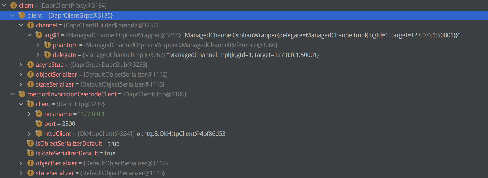
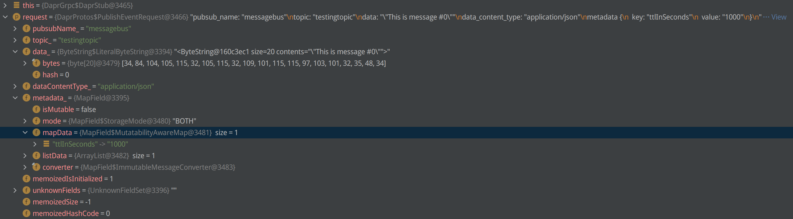
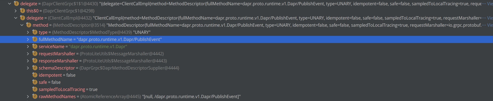

## Java SDK 实现

在业务代码中使用 pubsub 功能的示例可参考文件 dapr java-sdk 中的代码 `/src/main/java/io/dapr/examples/pubsub/http/Publisher.java`，代码示意如下：

```java
DaprClient client = (new DaprClientBuilder()).build();
String message = String.format("This is message #%d", i);
client.publishEvent(
    "messagebus",
    "testingtopic",
    message,
    singletonMap(Metadata."ttlInSeconds", "1000")).block();
```

java SDK 中除了 service invoke 默认使用 HTTP ，其他方法都是默认使用 gRPC，在 DaprClientProxy 类中初始化了两个 daprclient：

1. client 字段: 类型为 DaprClientGrpc，连接到 127.0.0.1:5001
2. methodInvocationOverrideClient 字段：类型为 DaprClientHttp，连接到 127.0.0.1:3500



pubsub 方法默认走 gRPC ，使用的是 `DaprClientGrpc` 类型 （文件为 `src/main/java/io/dapr/client/DaprClientGrpc.java`）：

```java
  @Override
  public Mono<Void> publishEvent(PublishEventRequest request) {
    try {
      String pubsubName = request.getPubsubName();
      String topic = request.getTopic();
      Object data = request.getData();
      DaprProtos.PublishEventRequest.Builder envelopeBuilder = DaprProtos.PublishEventRequest.newBuilder()
      ......
      return Mono.subscriberContext().flatMap(
              context ->
                  this.<Empty>createMono(
                      it -> intercept(context, asyncStub).publishEvent(envelopeBuilder.build(), it)
                  )
      ).then();
  }
```

在这里根据请求条件设置 PublishEvent 请求的各种参数，debug 时可以看到如下图的数据：



发出去给 dapr runtime 的 gRPC 请求如下图所示：



这里调用的 gRPC 服务是 `dapr.proto.runtime.v1.Dapr`， 方法是 `PublishEvent`，和前一章中 dapr runtime 初始化中设定的 gRPC API 对应。

```plantuml
title PublishEvent via gRPC
hide footbox
skinparam style strictuml
box "App-1"
participant user_code_client [
    =App-1
    ----
    producer
]
participant SDK_client [
    =SDK
    ----
    producer
]
end box
participant daprd_client [
    =daprd
    ----
    producer
]

user_code_client -> SDK_client : PublishEvent() 
note left: pubsub_name="name-1"\ntopic="topic-1"\ndata="[...]"\ndata_content_type=""\nmetadata="[...]"
SDK_client -[#blue]> daprd_client : gRPC (localhost)
note right: gRPC API @ 50001\n"dapr.proto.runtime.v1.Dapr/PublishEvent"
|||
SDK_client <[#blue]-- daprd_client
user_code_client <-- SDK_client
```

## Go sdk实现

在 go 业务代码中使用 service invoke 功能的示例可参考 https://github.com/dapr/go-sdk/blob/main/examples/pubsub/pub/pub.go，代码示意如下：

```go
client, err := dapr.NewClient()
err := client.PublishEvent(ctx, pubsubName, topicName, data)
```

Go SDK 中定义了 Client 接口，文件为 `client/client.go`：

```go
// Client is the interface for Dapr client implementation.
type Client interface {
	// PublishEvent publishes data onto topic in specific pubsub component.
	PublishEvent(ctx context.Context, pubsubName, topicName string, data interface{}, opts ...PublishEventOption) error
    ......
}
```

方法的实现在 `client/pubsub.go` 中，都只是实现了对 PublishEventRequest 对象的组装：

```go
func (c *GRPCClient) invokeServiceWithRequest(ctx context.Context, req *pb.InvokeServiceRequest) (out []byte, err error) {
    request := &pb.PublishEventRequest{
		PubsubName: pubsubName,
		Topic:      topicName,
	}
	_, err := c.protoClient.PublishEvent(c.withAuthToken(ctx), request)
	......
}
```

PublishEvent() 是 protoc 生成的 grpc 代码，在 `dapr/proto/runtime/v1/dapr_grpc.pb.go` 中，实现如下：

```go
func (c *daprClient) PublishEvent(ctx context.Context, in *PublishEventRequest, opts ...grpc.CallOption) (*emptypb.Empty, error) {
	out := new(emptypb.Empty)
	err := c.cc.Invoke(ctx, "/dapr.proto.runtime.v1.Dapr/PublishEvent", in, out, opts...)
	if err != nil {
		return nil, err
	}
	return out, nil
}
```

注意: 这里调用的 gRPC 服务是 `dapr.proto.runtime.v1.Dapr`， 方法是 `InvokeService`，和 dapr runtime 中 gRPC API 对应。

## 其他SDK

TODO

