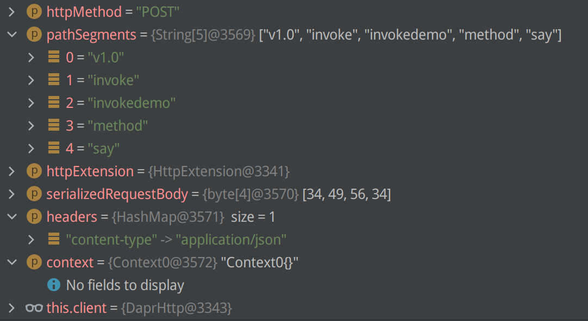

## Java SDK 实现

在业务代码中使用 service invoke 功能的示例可参考文件 `java-sdk/examples/src/main/java/io/dapr/examples/invoke/http/InvokeClient.java`，代码示意如下：

```java
DaprClient client = (new DaprClientBuilder()).build();
byte[] response = client.invokeMethod(SERVICE_APP_ID, "say", message, HttpExtension.POST, null,
            byte[].class).block();
```

java sdk 中 service invoke 默认使用 HTTP ，而其他方法默认使用 gRPC，在 DaprClientProxy 类中初始化了两个 daprclient：

1. client 字段: 类型为 DaprClientGrpc，连接到 127.0.0.1:5001
2. methodInvocationOverrideClient 字段：类型为 DaprClientHttp，连接到 127.0.0.1:3500


service invoke 方法默认走 HTTP ，使用的是 DaprClientHttp 类型 （文件为 src/main/java/io/dapr/client/DaprClientHttp.java）：

```bash
  @Override
  public <T> Mono<T> invokeMethod(String appId, String methodName,......) {
    return methodInvocationOverrideClient.invokeMethod(appId, methodName, request, httpExtension, metadata, clazz);
  }
  
  public <T> Mono<T> invokeMethod(InvokeMethodRequest invokeMethodRequest, TypeRef<T> type) {
    try {
      final String appId = invokeMethodRequest.getAppId();
      final String method = invokeMethodRequest.getMethod();
      ......
      Mono<DaprHttp.Response> response = Mono.subscriberContext().flatMap(
          context -> this.client.invokeApi(httpMethod, pathSegments,
              httpExtension.getQueryParams(), serializedRequestBody, headers, context)
      );
  }
```

在这里根据请求条件设置 HTTP 请求的各种参数，debug 时可以看到如下图的数据v：



最后发出 HTTP 请求的代码在 `src/main/java/io/dapr/client/DaprHttp.java` 中的 doInvokeApi() 方法：

```java
  private CompletableFuture<Response> doInvokeApi(String method,
                               String[] pathSegments,
                               Map<String, List<String>> urlParameters,
                               byte[] content, Map<String, String> headers,
                               Context context) {
      ......
      Request.Builder requestBuilder = new Request.Builder()
        .url(urlBuilder.build())
        .addHeader(HEADER_DAPR_REQUEST_ID, requestId);
      
    CompletableFuture<Response> future = new CompletableFuture<>();
    this.httpClient.newCall(request).enqueue(new ResponseFutureCallback(future));
    return future;
  }
```

发出去给 dapr runtime 的 HTTP 请求如下图所示：


调用的是 dapr runtime 的 HTTP API。

注意: 这里调用的 gRPC 服务是 `dapr.proto.runtime.v1.Dapr`， 方法是 `InvokeService`，和 dapr runtime 中 gRPC API 对应。


```plantuml
title Service Invoke via HTTP
hide footbox
skinparam style strictuml
box "App-1"
participant user_code_client [
    =App-1
    ----
    client
]
participant SDK_client [
    =SDK
    ----
    client
]
end box
participant daprd_client [
    =daprd
    ----
    client
]

user_code_client -> SDK_client : invokeMethod() 
note left: appId="app-2"\nmethodName="method-1"
SDK_client -[#blue]> daprd_client : HTTP (localhost)
note right: HTTP API @ 3500\n/v1.0/invoke/app-2/method/method-1
|||
SDK_client <[#blue]-- daprd_client
user_code_client <-- SDK_client
```


## Go sdk实现

在 go 业务代码中使用 service invoke 功能的示例可参考 https://github.com/dapr/go-sdk/blob/main/examples/service/client/main.go，代码示意如下：

```go
client, err := dapr.NewClient()
content := &dapr.DataContent{
		ContentType: "text/plain",
		Data:        []byte("hellow"),
	}
// invoke a method named "app-2" on another dapr enabled service named "method-1"
resp, err := client.InvokeMethodWithContent(ctx, "app-2", "method-1", "post", content)
```

Go sdk 中定义了 Client 接口，文件为 `client/client.go`：

```go
// Client is the interface for Dapr client implementation.
type Client interface {
    	// InvokeMethod invokes service without raw data
	InvokeMethod(ctx context.Context, appID, methodName, verb string) (out []byte, err error)

	// InvokeMethodWithContent invokes service with content
	InvokeMethodWithContent(ctx context.Context, appID, methodName, verb string, content *DataContent) (out []byte, err error)

	// InvokeMethodWithCustomContent invokes app with custom content (struct + content type).
	InvokeMethodWithCustomContent(ctx context.Context, appID, methodName, verb string, contentType string, content interface{}) (out []byte, err error)
    ......
}
```

这三个方法的实现在 `client/invoke.go` 中，都只是实现了对 InvokeRequest 对象的组装，核心的代码实现在 invokeServiceWithRequest 方法中：：

```go
func (c *GRPCClient) invokeServiceWithRequest(ctx context.Context, req *pb.InvokeServiceRequest) (out []byte, err error) {
	resp, err := c.protoClient.InvokeService(c.withAuthToken(ctx), req)
	......
}
```

InvokeService() 是 protoc 生成的 grpc 代码，在 `dapr/proto/runtime/v1/dapr_grpc.pb.go` 中，实现如下：

```go
func (c *daprClient) InvokeService(ctx context.Context, in *InvokeServiceRequest, opts ...grpc.CallOption) (*v1.InvokeResponse, error) {
	out := new(v1.InvokeResponse)
	err := c.cc.Invoke(ctx, "/dapr.proto.runtime.v1.Dapr/InvokeService", in, out, opts...)
	......
}
```

注意: 这里调用的 gRPC 服务是 `dapr.proto.runtime.v1.Dapr`， 方法是 `InvokeService`，和 dapr runtime 中 gRPC API 对应。

```plantuml
title Service Invoke via gRPC
hide footbox
skinparam style strictuml
box "App-1"
participant user_code_client [
    =App-1
    ----
    client
]
participant SDK_client [
    =SDK
    ----
    client
]
end box
participant daprd_client [
    =daprd
    ----
    client
]

user_code_client -> SDK_client : InvokeMethodWithContent() 
note left: appId="app-2"\nmethodName="method-1"
SDK_client -[#blue]> daprd_client : gRPC (localhost)
note right: gRPC API @ 50001\n/dapr.proto.runtime.v1.Dapr/InvokeService
|||
SDK_client <[#blue]-- daprd_client
user_code_client <-- SDK_client
```


## 其他SDK


TODO


## 分析总结

所有的语言 SDK 都会实现了从客户端 SDK API 调用到发出远程调用请求给 dapr runtime的功能。具体实现上会有一些差别：

- go sdk

	全部请求走 gPRC API。

- Java sdk

	- service invoke 默认走 HTTP API，其他请求默认走 gRPC API。

- 其他SDK

	- 待更新