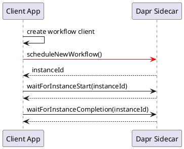

## 流程整体

client app 启动时，典型代码如下（忽略细节和异常处理）：

```java
DaprWorkflowClient workflowClient = new DaprWorkflowClient();
String instanceId = workflowClient.scheduleNewWorkflow(OrderProcessingWorkflow.class, order);
workflowClient.waitForInstanceStart(instanceId, Duration.ofSeconds(10), false);
WorkflowInstanceStatus workflowStatus = workflowClient.waitForInstanceCompletion(instanceId,
          Duration.ofSeconds(30),
```

这个过程中，初始化 workflowClient，然后通过 workflowClient 调度执行了一个 workflow 实例：包括等待实例启动，等待实例完成。


