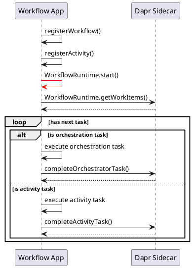
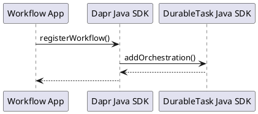
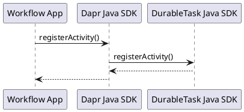
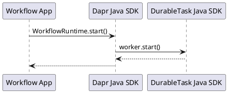
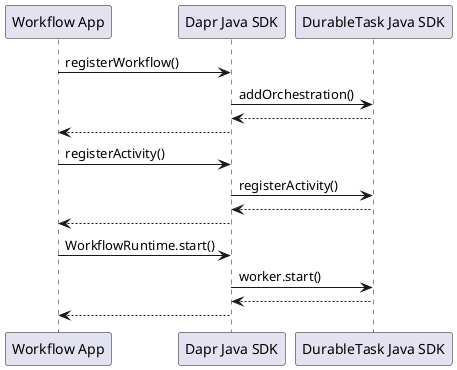

## 流程整体

workflow app 启动时，典型代码如下：

```java
    // Register the OrderProcessingWorkflow and its activities with the builder.
    WorkflowRuntimeBuilder builder = new WorkflowRuntimeBuilder().registerWorkflow(OrderProcessingWorkflow.class);
    builder.registerActivity(NotifyActivity.class);
    builder.registerActivity(ProcessPaymentActivity.class);
    builder.registerActivity(RequestApprovalActivity.class);
    builder.registerActivity(ReserveInventoryActivity.class);
    builder.registerActivity(UpdateInventoryActivity.class);

    // Build and then start the workflow runtime pulling and executing tasks
    try (WorkflowRuntime runtime = builder.build()) {
      System.out.println("Start workflow runtime");
      runtime.start(false);
    }
```

这个过程中，注册了 workflow 和 activity，然后 start workflow runtime。workflow runtime 会启动 worker，从 dapr sidecar 持续获取工作任务，包括 workflow task 和 activity task，然后执行这些任务并把任务结果返回给到 dapr sidecar。



## 详细流程

### register workflow 




### register activity 



### start workflow runtime 



### worker execute tasks 

