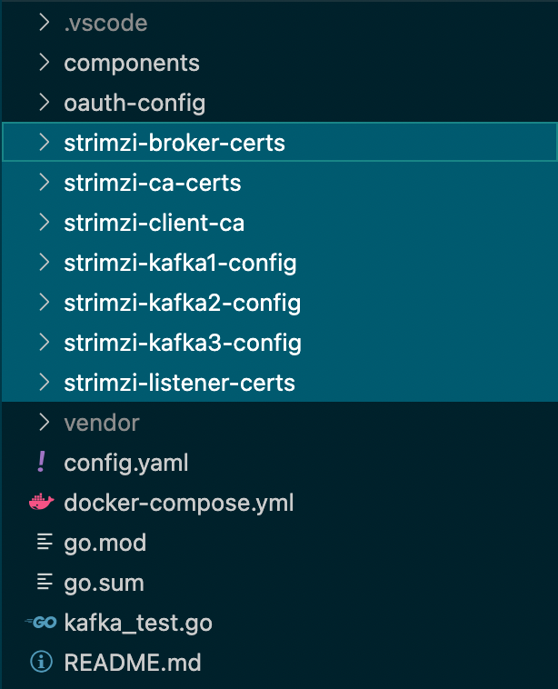

## test plan

按照 README.md 文件中 test plan 描述的：

```markdown
### Basic tests

* Bring up a 3-node Kafka cluster
    * Configured to have 10+ partitions per topic
```

kafka集群将有三个节点，每个 topic 配置有10+的分区

> TBD: 配置分区在哪里实现的？

## docker-compose.yml

在项目根目录下有 docker-compose.yml 文件，定义了测试中需要使用到的 kafka 集群的配置，主要有:

- zookeeper: 端口 "2181:2181"
- kafka1：端口 "19094:19094" / "19093:19093" / "19092:19092"
- Kafka2：端口 "29094:29094" / "29093:29093" / "29092:29092"
- kafka3：端口 "39094:39094" / "39093:39093" / "39092:39092"
- hydra：端口 "4443:4443" / "4444:4444"
- hydra-config

以及三个volumes:

- kafka1-data
- kafka2-data
- kafka3-data


### kafka证书文件

在 kafka1 / kafka2 / kafka3 三个kafka 容器的配置中， 都有一段相同的证书文件配置和类似的自定义配置文件：

```yaml
    volumes:
      - type: bind
        source: ./strimzi-ca-certs
        target: /opt/kafka/cluster-ca-certs
        read_only: true
      - type: bind
        source: ./strimzi-broker-certs
        target: /opt/kafka/broker-certs
        read_only: true
      - type: bind
        source: ./strimzi-client-ca
        target: /opt/kafka/client-ca-certs
        read_only: true
      - type: bind
        source: ./strimzi-listener-certs
        target: /opt/kafka/certificates/custom-mtls-9094-certs
        read_only: true
      - type: bind
        source: ./strimzi-listener-certs
        target: /opt/kafka/certificates/custom-oauth-9093-certs
        read_only: true
      - type: bind
        source: ./strimzi-listener-certs
        target: /opt/kafka/certificates/oauth-oauth-9093-certs
        read_only: true
      - type: bind
        source: ./strimzi-kafka1-config
        target: /opt/kafka/custom-config
        read_only: true
```

这些证书对应的项目文件为：


