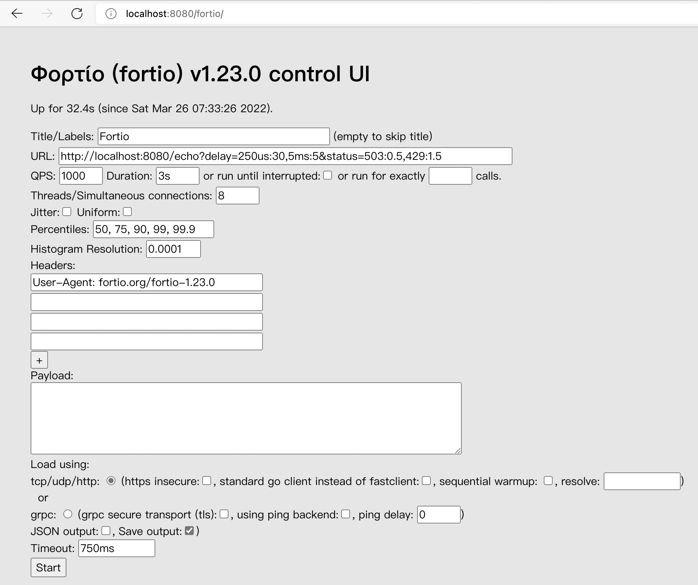

## 介绍


https://fortio.org/

Fortio is a microservices (http, grpc) load testing library, command line tool, advanced echo server, and web UI in go (golang). Fortio allows to specify a set query-per-second load and record latency histograms and other useful stats.

> Fortio是一个微服务（http，grpc）负载测试库，命令行工具，高级 echo 服务器，以及go（golang）的web UI。Fortio允许指定一组每秒查询的负载，并记录延迟直方图和其他有用的统计数据。

Fortio (Φορτίο)开始是 Istio 的负载测试工具，现在已经发展成为自己的开源项目。

Fortio以指定的每秒查询次数（qps）运行，记录执行时间的柱状图，并计算百分比（例如，p99即响应时间，如99%的请求耗时少于该数字（秒，SI单位））。它可以运行一个设定的时间，固定的调用次数，或直到中断（在一个恒定的目标QPS，或每个连接/线程的最大速度/负载）。

Fortio的名字来自希腊语φορτίο（Play），意思是负载/负担。

Fortio是一个快速、小型（3MB的docker镜像，最小的依赖性）、可重用、可嵌入的go库以及一个命令行工具和服务器进程，服务器包括一个简单的web UI和结果的图形表示（既有单一的延迟图，也有多个结果的比较min、max、avg、qps和百分比图）。

Fortio还包括一组服务器端的功能（类似于httpbin），以帮助调试和测试：请求echo，包括头文件，添加延迟或错误代码的概率分布，tcp echo，tcp代理，http fan out/ scatter 和收集代理服务器，HTTP 之外的 GRPC echo/健康等等。

Fortio是相当成熟和非常稳定的，没有已知的主要bug（不过如果你想做出贡献，有很多可能的改进！），当发现bug时，他们会很快修复，所以经过1年的开发和42个增量版本，我们在2018年6月达到1.0。

Fortio组件甚至可以用于不相关的项目，例如，日志、统计或fhttp实用程序的客户端和服务器。以及新集成的动态标志支持（最初从https://github.com/mwitkow/go-flagz，受到很大启发/导入）。

参见github.com/fortio/fortio，了解更多关于fortio的信息，查看使用实例和截图，下载最新版本，提交任何问题或以任何其他方式为开源工作做贡献。

你也可以在istio网站的性能和可扩展性部分看到Fortio的现场情况

## 安装

```bash
go get fortio.org/fortio
```

或者 

```bash
brew install fortio
```

## 命令行参数

Fortio 可以成为一个 http 或 grpc 负载生成器，使用 `load` 子命令收集统计数据，或者使用 `server` 命令启动简单的 http 和 grpc ping 服务器，以及一个基本的web用户界面，结果图表，tcp/udp echo，代理，https重定向器，或者使用 `grpcping` 命令发布 `grpc ping` 消息。当使用 `curl` 命令（或 `load` 命令的 `-curl` 标志）时，它还可以获取单个URL的数据用于调试。同样地，你可以使用 `nc` 命令（像独立的 netcat 包）建立一个单一的 TCP（或 unix domain 或 UDP（使用 `udp://` 前缀））连接。你可以用 `redirect` 只运行redirector，或者用` tcp-echo` 只运行 tcp echo。如果你保存了 JSON 结果（使用 web UI 或直接从命令行），你可以使用 `report` 命令浏览和绘制这些结果。`version` 命令将打印版本和构建信息，`fortio version -s` 只打印版本。最后，你可以用 `help` 命令了解哪些标志是可用的。

对于http负载生成最重要的标志:

| Flag                                    | Description, example                                         |
| --------------------------------------- | ------------------------------------------------------------ |
| `-qps rate`                             | 每秒查询次数，或0表示无等待/最大qps                          |
| `-c connections`                        | 并行同时连接的数量（和匹配的 go routine）。                  |
| `-t duration`                           | 运行测试的时间（例如 `-t 30m` 为30分钟）或0运行到 `^C`，示例（默认为5s）。 |
| `-n numcalls`                           | 准确地运行这个数量的调用，而不是持续时间。默认（0）则使用持续时间（-t）。 |
| `-payload str` or `-payload-file fname` | 切换到使用给定有效载荷的POST（随机有效载荷见`-payload-size`）。 |
| `-uniform`                              | 在线程中分散调用                                             |
| `-r resolution`                         | 直方图最低桶的分辨率，以秒为单位（默认为0.001，即1ms），使用你预期典型延迟的1/10。 |
| `-H "header: value"`                    | 可以多次指定以添加头信息（包括Host:）。                      |
| `-a`                                    | 根据标签和时间戳，自动保存带有文件名的JSON结果               |
| `-json filename`                        | 文件名或 `-` 用于 stdout 输出 json 结果（默认为相对于`-data-dir`，如果你想让 `fortio report` 显示它们，应该以 .json 结尾；使用 `-a` 通常是一个更好的选择。） |
| `-labels "l1 l2 ..."`                   | 额外的配置数据/标签添加到生成的JSON中，默认为目标URL和主机名。 |

你可以通过设置 `-content-type` 或通过 `-payload-*` 选项之一，从 http GET 查询切换到 POST。

命令行标志的完整列表请见 `fortio help`。

### fortion helo

```bash
$ fortio help

Φορτίο 1.23.0 usage:
	fortio command [flags] target
where command is one of: load (load testing), server (starts ui, http-echo,
 redirect, proxies, tcp-echo and grpc ping servers), tcp-echo (only the tcp-echo
 server), report (report only UI server), redirect (only the redirect server),
 proxies (only the -M and -P configured proxies), grpcping (grpc client),
 or curl (single URL debug), or nc (single tcp or udp:// connection),
 or version (prints the version).
where target is a url (http load tests) or host:port (grpc health test).
flags are:
  -H header
    	Additional header(s)
  -L	Follow redirects (implies -std-client) - do not use for load test
  -M value
    	Http multi proxy to run, e.g -M "localport1 baseDestURL1 baseDestURL2" -M ...
  -P value
    	Tcp proxies to run, e.g -P "localport1 dest_host1:dest_port1" -P "[::1]:0 www.google.com:443" ...
  -a	Automatically save JSON result with filename based on labels & timestamp
  -abort-on code
    	Http code that if encountered aborts the run. e.g. 503 or -1 for socket errors.
  -access-log-file path
    	file path to log all requests to. Maybe have performance impacts
  -access-log-format format
    	format for access log. Supported values: [json, influx] (default "json")
  -allow-initial-errors
    	Allow and don't abort on initial warmup errors
  -base-url URL
    	base URL used as prefix for data/index.tsv generation. (when empty, the url from the first request is used)
  -c int
    	Number of connections/goroutine/threads (default 4)
  -cacert Path
    	Path to a custom CA certificate file to be used for the TLS client connections, if empty, use https:// prefix for standard internet/system CAs
  -calc-qps
    	Calculate the qps based on number of requests (-n) and duration (-t)
  -cert Path
    	Path to the certificate file to be used for client or server TLS
  -compression
    	Enable http compression
  -config path
    	Config directory path to watch for changes of dynamic flags (empty for no watch)
  -content-type string
    	Sets http content type. Setting this value switches the request method from GET to POST.
  -curl
    	Just fetch the content once
  -curl-stdout-headers
    	Restore pre 1.22 behavior where http headers of the fast client are output to stdout in curl mode. now stderr by default.
  -data-dir Directory
    	Directory where JSON results are stored/read (default ".")
  -echo-debug-path URI
    	http echo server URI for debug, empty turns off that part (more secure) (default "/debug")
  -echo-server-default-params value
    	Default parameters/querystring to use if there isn't one provided explicitly. E.g "status=404&delay=3s"
  -gomaxprocs int
    	Setting for runtime.GOMAXPROCS, <1 doesn't change the default
  -grpc
    	Use GRPC (health check by default, add -ping for ping) for load testing
  -grpc-max-streams uint
    	MaxConcurrentStreams for the grpc server. Default (0) is to leave the option unset.
  -grpc-ping-delay duration
    	grpc ping delay in response
  -grpc-port port
    	grpc server port. Can be in the form of host:port, ip:port or port or /unix/domain/path or "disabled" to not start the grpc server. (default "8079")
  -h	Print usage/help on stdout
  -halfclose
    	When not keepalive, whether to half close the connection (only for fast http)
  -health
    	grpc ping client mode: use health instead of ping
  -healthservice string
    	which service string to pass to health check
  -http-port port
    	http echo server port. Can be in the form of host:port, ip:port, port or /unix/domain/path. (default "8080")
  -http1.0
    	Use http1.0 (instead of http 1.1)
  -httpbufferkb kbytes
    	Size of the buffer (max data size) for the optimized http client in kbytes (default 128)
  -httpccch
    	Check for Connection: Close Header
  -https-insecure
    	Long form of the -k flag
  -jitter
    	set to true to de-synchronize parallel clients' by 10%
  -json path
    	Json output to provided file path or '-' for stdout (empty = no json output, unless -a is used)
  -k	Do not verify certs in https connections
  -keepalive
    	Keep connection alive (only for fast http 1.1) (default true)
  -key Path
    	Path to the key file matching the -cert
  -labels string
    	Additional config data/labels to add to the resulting JSON, defaults to target URL and hostname
  -log-errors
    	Log http non 2xx/418 error codes as they occur (default true)
  -logcaller
    	Logs filename and line number of callers to log (default true)
  -loglevel value
    	loglevel, one of [Debug Verbose Info Warning Error Critical Fatal] (default Info)
  -logprefix string
    	Prefix to log lines before logged messages (default "> ")
  -max-echo-delay value
    	Maximum sleep time for delay= echo server parameter. dynamic flag. (default 1.5s)
  -maxpayloadsizekb Kbytes
    	MaxPayloadSize is the maximum size of payload to be generated by the EchoHandler size= argument. In Kbytes. (default 256)
  -multi-mirror-origin
    	Mirror the request url to the target for multi proxies (-M) (default true)
  -multi-serial-mode
    	Multi server (-M) requests one at a time instead of parallel mode
  -n int
    	Run for exactly this number of calls instead of duration. Default (0) is to use duration (-t). Default is 1 when used as grpc ping count.
  -nc-dont-stop-on-eof
    	in netcat (nc) mode, don't abort as soon as remote side closes
  -offset duration
    	Offset of the histogram data
  -p string
    	List of pXX to calculate (default "50,75,90,99,99.9")
  -payload string
    	Payload string to send along
  -payload-file path
    	File path to be use as payload (POST for http), replaces -payload when set.
  -payload-size int
    	Additional random payload size, replaces -payload when set > 0, must be smaller than -maxpayloadsizekb. Setting this switches http to POST.
  -ping
    	grpc load test: use ping instead of health
  -profile file
    	write .cpu and .mem profiles to file
  -proxy-all-headers
    	Determines if only tracing or all headers (and cookies) are copied from request on the fetch2 ui/server endpoint (default true)
  -qps float
    	Queries Per Seconds or 0 for no wait/max qps (default 8)
  -quiet
    	Quiet mode: sets the loglevel to Error and reduces the output.
  -r float
    	Resolution of the histogram lowest buckets in seconds (default 0.001)
  -redirect-port port
    	Redirect all incoming traffic to https URL (need ingress to work properly). Can be in the form of host:port, ip:port, port or "disabled" to disable the feature. (default "8081")
  -resolve IP
    	Resolve host name to this IP
  -runid int
    	Optional RunID to add to json result and auto save filename, to match server mode
  -s int
    	Number of streams per grpc connection (default 1)
  -sequential-warmup
    	http(s) runner warmup done in parallel instead of sequentially. When set, restores pre 1.21 behavior
  -server-idle-timeout value
    	Default IdleTimeout for servers (default 30s)
  -static-dir path
    	Deprecated/unused path.
  -stdclient
    	Use the slower net/http standard client (slower but supports h2)
  -sync URL
    	index.tsv or s3/gcs bucket xml URL to fetch at startup for server modes.
  -sync-interval duration
    	Refresh the url every given interval (default, no refresh)
  -t duration
    	How long to run the test or 0 to run until ^C (default 5s)
  -tcp-port port
    	tcp echo server port. Can be in the form of host:port, ip:port, port or /unix/domain/path or "disabled". (default "8078")
  -timeout duration
    	Connection and read timeout value (for http) (default 3s)
  -udp-async
    	if true, udp echo server will use separate go routine to reply
  -udp-port port
    	udp echo server port. Can be in the form of host:port, ip:port, port or "disabled". (default "8078")
  -udp-timeout duration
    	Udp timeout (default 750ms)
  -ui-path URI
    	http server URI for UI, empty turns off that part (more secure) (default "/fortio/")
  -uniform
    	set to true to de-synchronize parallel clients' requests uniformly
  -unix-socket path
    	Unix domain socket path to use for physical connection
  -user user:password
    	User credentials for basic authentication (for http). Input data format should be user:password
```


## 服务器URL和特性

Fortio `server` 有以下功能，即在 8080 上监听 http（所有路径和端口都可以通过上面的标志进行配置）。

- 简单的 echo 服务器，它将回传发布的数据（对于下面没有提到的任何路径）。

​	例如，`curl -d abcdef` http://localhost:8080/ 会返回 `abcdef`。它支持以下可选的查询参数:

| Parameter | Usage, example                                               |
| --------- | ------------------------------------------------------------ |
| delay     | 延迟响应的时间。可以是一个单一的值或一个逗号分隔的概率列表，例如 `delay=150us:10,2ms:5,0.5s:1` 表示有10%的机会出现150us延迟，5%的机会出现2ms延迟，1%的机会出现半秒延迟 |
| status    | 返回的 http 状态，而不是200。可以是一个单一的值或一个逗号分隔的概率列表，例如 `status=404:10,503:5,429:1` 表示出现404状态的概率为10%，503状态为5%，429状态为1%。 |
| size      | 响应的有效载荷的大小，而不是 echo 输入。也可以作为概率列表使用。`size=1024:10,512:5` 10%的响应将是1k，5%将是512字节的有效载荷，其余的默认为 echo。 |
| close     | 应答后关闭套接字，例如 `close=true` 在所有请求后关闭，或者 `close=5.3` 在约5.3% 的请求后关闭。 |
| header    | 要添加到回复中的标头，例如：`&header=Foo:Bar&header=X:Y`。   |

你可以通过在 server 命令行中传递 `-echo-server-default-params` 来设置所有这些的默认值，例如：`fortio server -echo-server-default-params="delay=0.5s:50,1s:40&status=418"` 将使服务器响应http 418，一半时间的延迟为0.5s，40%为1s，10%的呼叫没有延迟；除非客户传递任何 '?' 查询args。请注意，引号（"）是为了让 shell 转义（&），但不应该放在yaml或动态标志的url中。

- `/debug` 将以纯文本形式 echo 请求，以便于人类调试。

- `/fortio/` UI 用于：
  - 运行/触发测试并绘制结果图。
  - 浏览保存的结果的用户界面，单图或多图（最小、平均、中位数、p75、p99、p99.9和最大值的比较图）。
  - 代理/获取其他URL
  - `/fortio/data/index.tsv` 一个符合谷歌云存储URL列表数据传输格式的tab分离值文件，所以你可以导出/备份本地结果到云端。
  - 从其他Fortio服务器下载/同步点对点的JSON结果文件（使用他们的index.tsv URL）。
  - 从亚马逊S3或谷歌云兼容的桶列表中下载/同步XML URLs

- 从运行的服务器上触发和取消运行的API（就像form ui，但更直接，并且有 `async=on` 选项）。

  - `/fortio/rest/run` 启动 run；参数可以来自命令行，也可以来自POST的JSON；可以提供 jsonPath 来寻找json对象的子集，例如 jsonPath=metadata 允许使用flagger webhook元数据作为fortio运行参数（见下面远程触发的负载测试部分）。
  - `/fortio/rest/stop` 停止所有当前运行或按运行ID停止。

报告模式是上述直接在/上的一个只读子集。

还有GRPC health和PING服务器，以及http->https重定向器。

## 示例和输出实例

### 启动内部服务器

```bash
$ fortio server &

[1] 38147
Fortio 1.23.0 tcp-echo TCP server listening on [::]:8078                        
Fortio 1.23.0 udp-echo UDP server listening on [::]:8078
Fortio 1.23.0 grpc 'ping' TCP server listening on [::]:8079
Fortio 1.23.0 https redirector TCP server listening on [::]:8081
Fortio 1.23.0 echo TCP server listening on [::]:8080
Data directory is /Users/sky
UI started - visit:
http://localhost:8080/fortio/
(or any host/ip reachable on this server)
07:35:09 I fortio_main.go:283> Note: not using dynamic flag watching (use -config to set watch directory)
07:35:09 I fortio_main.go:291> All fortio 1.23.0 2022-03-25 02:08 8c28aec56c639807472392db3b0ebb3fd5d448ed go1.18 servers started!
```

此时访问 http://localhost:8080/fortio/ 可以打开 control UI。



```bash
➜  ~ 07:39:16 I http_server.go:487> UI: GET /fortio/ HTTP/1.1 [::1]:53289 ()  "Mozilla/5.0 (Macintosh; Intel Mac OS X 10_15_7) AppleWebKit/537.36 (KHTML, like Gecko) Chrome/99.0.4844.51 Safari/537.36 Edg/99.0.1150.39"
```

### 改变端口/绑定地址

默认情况下，Fortio的 Web/echo 服务器在所有接口上都监听8080端口。使用 `-http-port` 标志来改变这一行为。

```bash
$ fortio server -http-port 0.0.0.0:8088    

Fortio 1.23.0 tcp-echo TCP server listening on [::]:8078
Fortio 1.23.0 udp-echo UDP server listening on [::]:8078
Fortio 1.23.0 grpc 'ping' TCP server listening on [::]:8079
Fortio 1.23.0 https redirector TCP server listening on [::]:8081
Fortio 1.23.0 echo TCP server listening on [::]:8088
Data directory is /Users/sky
UI started - visit:
http://[::]:8088/fortio/
07:41:39 I fortio_main.go:283> Note: not using dynamic flag watching (use -config to set watch directory)
07:41:39 I fortio_main.go:291> All fortio 1.23.0 2022-03-25 02:08 8c28aec56c639807472392db3b0ebb3fd5d448ed go1.18 servers started!
```

### Unix domain Socket

你可以为任何服务器/客户端使用 unix domain socket。

```bash
$ fortio server --http-port /tmp/fortio-uds-http &
[1] 46551
Fortio 1.23.0 tcp-echo TCP server listening on [::]:8078                        
Fortio 1.23.0 udp-echo UDP server listening on [::]:8078
Fortio 1.23.0 grpc 'ping' TCP server listening on [::]:8079
Fortio 1.23.0 https redirector TCP server listening on [::]:8081
Fortio 1.23.0 echo TCP server listening on /tmp/fortio-uds-http
Data directory is /Users/sky
UI started - visit:
fortio curl -unix-socket=/tmp/fortio-uds-http http://localhost/fortio/
07:52:53 I fortio_main.go:283> Note: not using dynamic flag watching (use -config to set watch directory)
07:52:53 I fortio_main.go:291> All fortio 1.23.0 2022-03-25 02:08 8c28aec56c639807472392db3b0ebb3fd5d448ed go1.18 servers started!
```

此时可以通过 `fortio curl -unix-socket=/tmp/fortio-uds-http http://localhost/fortio/` 访问 UI，但这不是浏览器啊，体验就很不好了。

### TCP

单独启动 echo-server 并运行一个负载（使用 `tcp://` 前缀的负载测试是针对tcp echo server的）。

```bash
$ fortio tcp-echo &

[1] 49475
Fortio 1.23.0 tcp-echo TCP server listening on [::]:8078                        
07:59:00 I fortio_main.go:283> Note: not using dynamic flag watching (use -config to set watch directory)
07:59:00 I fortio_main.go:291> All fortio 1.23.0 2022-03-25 02:08 8c28aec56c639807472392db3b0ebb3fd5d448ed go1.18 servers started!
```

启动客户端测试一下：

```bash
$ fortio load -qps -1 -n 100000 tcp://localhost:8078

Fortio 1.23.0 running at -1 queries per second, 10->10 procs, for 100000 calls: tcp://localhost:8078
08:00:44 I tcprunner.go:222> Starting tcp test for tcp://localhost:8078 with 4 threads at -1.0 qps
Starting at max qps with 4 thread(s) [gomax 10] for exactly 100000 calls (25000 per thread + 0)
08:00:45 I periodic.go:693> T001 ended after 841.767125ms : 25000 calls. qps=29699.425479463815
08:00:45 I periodic.go:693> T002 ended after 842.130875ms : 25000 calls. qps=29686.597109980088
08:00:45 I periodic.go:693> T003 ended after 843.450958ms : 25000 calls. qps=29640.13469055779
08:00:45 I periodic.go:693> T000 ended after 843.5375ms : 25000 calls. qps=29637.093786583286
Ended after 843.547666ms : 100000 calls. qps=1.1855e+05
Aggregated Function Time : count 100000 avg 3.356944e-05 +/- 1.372e-05 min 1.0916e-05 max 0.000790291 sum 3.35694396
# range, mid point, percentile, count
>= 1.0916e-05 <= 0.000790291 , 0.000400604 , 100.00, 100000
# target 50% 0.0004006
# target 75% 0.000595445
# target 90% 0.000712353
# target 99% 0.000782497
# target 99.9% 0.000789512
Sockets used: 4 (for perfect no error run, would be 4)
Total Bytes sent: 2400000, received: 2400000
tcp OK : 100000 (100.0 %)
All done 100000 calls (plus 0 warmup) 0.034 ms avg, 118546.9 qps
```

### UDP

单独启动 udp-echo 服务器并运行负载（使用`tcp://`前缀来进行负载测试，用于tcp echo服务器）。

```bash
$ fortio udp-echo &

[1] 52500
Fortio 1.23.0 udp-echo UDP server listening on [::]:8078                        
08:05:14 I fortio_main.go:283> Note: not using dynamic flag watching (use -config to set watch directory)
08:05:14 I fortio_main.go:291> All fortio 1.23.0 2022-03-25 02:08 8c28aec56c639807472392db3b0ebb3fd5d448ed go1.18 servers started!
```

启动客户端测试一下：

```bash
$ fortio load -qps -1 -n 100000 udp://localhost:8078/

Fortio 1.23.0 running at -1 queries per second, 10->10 procs, for 100000 calls: udp://localhost:8078/
08:06:05 I udprunner.go:223> Starting udp test for udp://localhost:8078/ with 4 threads at -1.0 qps
Starting at max qps with 4 thread(s) [gomax 10] for exactly 100000 calls (25000 per thread + 0)
08:06:05 I periodic.go:693> T000 ended after 495.835667ms : 25000 calls. qps=50419.930763068725
08:06:05 I periodic.go:693> T001 ended after 496.026834ms : 25000 calls. qps=50400.4990988048
08:06:05 I periodic.go:693> T002 ended after 496.076084ms : 25000 calls. qps=50395.495381309294
08:06:05 I periodic.go:693> T003 ended after 497.298834ms : 25000 calls. qps=50271.58378577658
Ended after 497.309334ms : 100000 calls. qps=2.0108e+05
Aggregated Function Time : count 100000 avg 1.9739768e-05 +/- 1.144e-05 min 8.167e-06 max 0.000469792 sum 1.9739768
# range, mid point, percentile, count
>= 8.167e-06 <= 0.000469792 , 0.00023898 , 100.00, 100000
# target 50% 0.000238977
# target 75% 0.000354385
# target 90% 0.000423629
# target 99% 0.000465176
# target 99.9% 0.00046933
Sockets used: 4 (for perfect no error run, would be 4)
Total Bytes sent: 2400000, received: 2400000
udp OK : 100000 (100.0 %)
All done 100000 calls (plus 0 warmup) 0.020 ms avg, 201082.1 qps
```

### gRPC

#### 简单 gRPC ping

启动 grpc echo server:

```bash
$ fortio server  -grpc

Fortio 1.23.0 tcp-echo TCP server listening on [::]:8078
Fortio 1.23.0 udp-echo UDP server listening on [::]:8078
Fortio 1.23.0 grpc 'ping' TCP server listening on [::]:8079
Fortio 1.23.0 https redirector TCP server listening on [::]:8081
Fortio 1.23.0 echo TCP server listening on [::]:8080
Data directory is /Users/sky
UI started - visit:
http://localhost:8080/fortio/
(or any host/ip reachable on this server)
08:12:48 I fortio_main.go:283> Note: not using dynamic flag watching (use -config to set watch directory)
08:12:48 I fortio_main.go:291> All fortio 1.23.0 2022-03-25 02:08 8c28aec56c639807472392db3b0ebb3fd5d448ed go1.18 servers started!
```

运行 grpc ping 测试：

```bash
$ fortio grpcping -n 5 localhost 

08:14:56 I pingsrv.go:151> Ping RTT 196666 (avg of 173000, 215000, 202000 ns) clock skew 25500
08:14:56 I pingsrv.go:151> Ping RTT 169666 (avg of 142000, 175000, 192000 ns) clock skew 20500
08:14:56 I pingsrv.go:151> Ping RTT 151666 (avg of 153000, 156000, 146000 ns) clock skew 10000
08:14:56 I pingsrv.go:151> Ping RTT 183000 (avg of 185000, 175000, 189000 ns) clock skew -500
08:14:56 I pingsrv.go:151> Ping RTT 154333 (avg of 160000, 161000, 142000 ns) clock skew 500
Clock skew histogram usec : count 5 avg 11.2 +/- 10.43 min -0.5 max 25.5 sum 56
# range, mid point, percentile, count
>= -0.5 <= 0 , -0.25 , 20.00, 1
> 0 <= 2 , 1 , 40.00, 1
> 8 <= 10 , 9 , 60.00, 1
> 18 <= 22 , 20 , 80.00, 1
> 22 <= 25.5 , 23.75 , 100.00, 1
# target 50% 9
RTT histogram usec : count 15 avg 171.06667 +/- 21.56 min 142 max 215 sum 2566
# range, mid point, percentile, count
>= 142 <= 160 , 151 , 40.00, 6
> 160 <= 180 , 170 , 66.67, 4
> 180 <= 200 , 190 , 86.67, 3
> 200 <= 215 , 207.5 , 100.00, 2
# target 50% 167.5
```

### 改变grpc的目标端口

在 grpcping 中指定一个主机名或IP地址时，会使用 `-grpc-port` 的值（默认为8079）。在 grpcping 的目标中添加 `:port` 来改变这种行为。

启动 grpc echo server，通过 `-grpc-port 8018` 指定 grpc echo 端口 :

```bash
$ fortio server  -grpc -grpc-port 8018

Fortio 1.23.0 tcp-echo TCP server listening on [::]:8078
Fortio 1.23.0 udp-echo UDP server listening on [::]:8078
Fortio 1.23.0 grpc 'ping' TCP server listening on [::]:8018
Fortio 1.23.0 https redirector TCP server listening on [::]:8081
Fortio 1.23.0 echo TCP server listening on [::]:8080
Data directory is /Users/sky
UI started - visit:
http://localhost:8080/fortio/
(or any host/ip reachable on this server)
08:17:57 I fortio_main.go:283> Note: not using dynamic flag watching (use -config to set watch directory)
08:17:57 I fortio_main.go:291> All fortio 1.23.0 2022-03-25 02:08 8c28aec56c639807472392db3b0ebb3fd5d448ed go1.18 servers started!
```

运行 grpc ping 测试，通过在地址后面增加 `:8018` 来指定端口：

```bash
$ fortio grpcping -n 5 localhost:8018 

08:19:28 I pingsrv.go:151> Ping RTT 120000 (avg of 121000, 117000, 122000 ns) clock skew 7500
08:19:28 I pingsrv.go:151> Ping RTT 122000 (avg of 118000, 128000, 120000 ns) clock skew 2000
08:19:28 I pingsrv.go:151> Ping RTT 118333 (avg of 131000, 114000, 110000 ns) clock skew 3000
08:19:28 I pingsrv.go:151> Ping RTT 136333 (avg of 134000, 140000, 135000 ns) clock skew -4000
08:19:28 I pingsrv.go:151> Ping RTT 145333 (avg of 106000, 163000, 167000 ns) clock skew 36500
Clock skew histogram usec : count 5 avg 9 +/- 14.23 min -4 max 36.5 sum 45
# range, mid point, percentile, count
>= -4 <= -4 , -4 , 20.00, 1
> 0 <= 2 , 1 , 40.00, 1
> 2 <= 4 , 3 , 60.00, 1
> 6 <= 8 , 7 , 80.00, 1
> 30 <= 36.5 , 33.25 , 100.00, 1
# target 50% 3
RTT histogram usec : count 15 avg 128.4 +/- 17.04 min 106 max 167 sum 1926
# range, mid point, percentile, count
>= 106 <= 110 , 108 , 13.33, 2
> 110 <= 120 , 115 , 40.00, 4
> 120 <= 140 , 130 , 86.67, 7
> 160 <= 167 , 163.5 , 100.00, 2
# target 50% 124.286
```

#### 使用 TLS 进行 grpcping 

TBD

#### GRPC到标准HTTPS服务

grpcping 可以通过在目的地前加上 https://，连接到一个非Fortio TLS服务器。

TBD：会报错

```bash
fortio grpcping https://fortio.io      
08:23:17 I grpcrunner.go:280> stripping https scheme. grpc destination: fortio.io. grpc port: 443
08:23:17 E pingsrv.go:119> grpc error from Ping0 rpc error: code = Unavailable desc = connection error: desc = "transport: authentication handshake failed: EOF"
```

### 简单负载测试

负载（低默认qps/线程）测试：

```bash
$ fortio load http://cn.bing.com   

Fortio 1.23.0 running at 8 queries per second, 10->10 procs, for 5s: http://cn.bing.com
08:25:38 I httprunner.go:87> Starting http test for http://cn.bing.com with 4 threads at 8.0 qps and parallel warmup
Starting at 8 qps with 4 thread(s) [gomax 10] for 5s : 10 calls each (total 40)
08:25:43 I periodic.go:693> T003 ended after 5.166413959s : 10 calls. qps=1.9355785423620175
08:25:43 I periodic.go:693> T001 ended after 5.183228s : 10 calls. qps=1.9292996565074894
08:25:43 I periodic.go:693> T002 ended after 5.187237542s : 10 calls. qps=1.9278083795145389
08:25:43 I periodic.go:693> T000 ended after 5.19214325s : 10 calls. qps=1.9259869226450945
Ended after 5.192197459s : 40 calls. qps=7.7039
Sleep times : count 36 avg 0.37322796 +/- 0.02494 min 0.238568277 max 0.393221374 sum 13.4362066
Aggregated Function Time : count 40 avg 0.18119194 +/- 0.02388 min 0.16124825 max 0.315697375 sum 7.24767762
# range, mid point, percentile, count
>= 0.161248 <= 0.18 , 0.170624 , 62.50, 25
> 0.18 <= 0.2 , 0.19 , 95.00, 13
> 0.2 <= 0.25 , 0.225 , 97.50, 1
> 0.3 <= 0.315697 , 0.307849 , 100.00, 1
# target 50% 0.176093
# target 75% 0.187692
# target 90% 0.196923
# target 99% 0.309418
# target 99.9% 0.315069
Sockets used: 4 (for perfect keepalive, would be 4)
Uniform: false, Jitter: false
Code 200 : 40 (100.0 %)
Response Header Sizes : count 40 avg 1855 +/- 0 min 1855 max 1855 sum 74200
Response Body/Total Sizes : count 40 avg 80185.625 +/- 21.12 min 80172 max 80239 sum 3207425
All done 40 calls (plus 4 warmup) 181.192 ms avg, 7.7 qps
```

### 远程触发的负载测试（服务器模式的rest API）。

从1.18开始，服务器有一个 `fortio/rest/run` 端点，类似于 form UI 在 `fortio/` 中提交的启动运行。

- 加上 `async` 查询参数或 json 值 "on" 将使运行成为异步的（只返回运行的 runid 而不是等待结果）。
- 加上从查询参数或 jsonPath 发布的信息中读取所有的运行配置
- 与 flagger 和其他 webhooks 兼容
- 1.22 版中的新功能：使用 headers json 数组来发送头信息（或多个&H=查询条件）。

示例：

TBD

### gRPC 负载测试

使用 `-s` 来使用每个连接（`-c`）的多个（h2/grpc）流，请求击中 fortio ping grpc 端点，回复延迟 0.25 s，并有10字节的额外有效载荷，自动保存json结果。

```bash
$ fortio load -a -grpc -ping -grpc-ping-delay 0.25s -payload "01234567890" -c 2 -s 4 https://cn.bing.com
```

## 实现细节

Fortio 是用 Go 语言编写的，包括 stats.go 中的可扩展的半日志直方图和 periodic.go 中的周期性运行引擎，并对 http 和 grpc 进行了专门化。`http/` 软件包包括一个非常高性能的专门的http 1.1客户端。你可能会发现fortio的记录器也很有用。

你可以在 `histogram/` 中作为命令行独立运行直方图代码，在 `echosrv/` 中运行基本的http echo 服务器，或者通过 `fortio server` 运行http echo 和 GRPC ping 服务器，fortio 的命令行界面位于这个顶级目录 `fortio_main.go` 中。

还有 `fcurl/` 是 fortio curl 部分的代码（如果你需要一个没有grpc或服务器端的轻型http客户端）。一个匹配的小（2Mb压缩）docker镜像是 `fortio/fortio.fcurl`