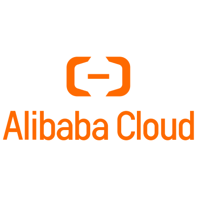

## 公司介绍

## 主要应用场景

主要编程语言： Java，需要支持 nodejs,golang 等新语言

### 多语言支持

Faas / Serverless 场景

多语言应用的接入

复杂的Java遗留系统

### 云间迁移（多云下的可移植性）

背景：业务应用对外输出时有跨平台需求

通过不同yaml文件激活不同组件来屏蔽组件实现的方式给SaaS业务多云部署形态带来了极大的便利。

### 阿里云函数计算集成 Dapr

函数计算更加关注能够给开发者带来更好的研发体验，提升整体的研发效率。

Dapr 可以让函数轻量化：

### 总结

## 案例资料

- [How Alibaba is using Dapr | Dapr Blog](https://blog.dapr.io/posts/2021/03/19/how-alibaba-is-using-dapr/)
- [云原生分布式应用运行时 Dapr 在阿里的实践 | 敖小剑的博客 (skyao.io)](https://skyao.io/post/202103-how-alibaba-is-using-dapr/)
- [Dapr 在阿里云原生的实践-阿里云开发者社区 (aliyun.com)](https://developer.aliyun.com/article/785943)

