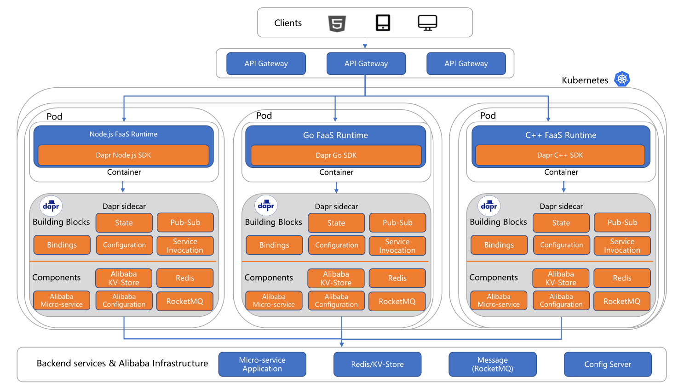

## 公司介绍

## 主要应用场景

AutoNavi是中国领先的数字地图和导航服务提供商，拥有超过1亿的日活跃用户。AutoNavi 于 2020 年 4 月启动了无服务器/FaaS（功能即服务）项目，仅仅一年后，我们的解决方案就已经超过了每秒 100，000 次查询 （QPS）。Dapr 可以帮助我们解决的两个挑战：使用轻量级解决方案连接现有的后端服务，以及我们对支持多种语言的运行时的需求。

主要编程语言：java, c++， golang，node.js

### 轻量级解决方案

需求：FaaS必须能够调用在我们的RPC框架之上开发的现有后端微服务。

利用 Dapr 可以避免在代码中使用任何 SDK 库。

### 多语言支持

我们在无服务器解决方案中设计了一个 FaaS 运行时组件，因此开发人员只需编写函数代码，这些代码将被下载、加载到运行时，并最终在我们的 FaaS 运行时中运行。为了实现这一目标，我们为每种语言开发了不同的FaaS运行时，例如C++，Go，Rust等。每种语言中的函数都需要连接到后端服务或基础设施服务，如Redis，MySQL，MQ等，因此，如果我们想要避免对每种不同的语言使用类库，我们需要一个多语言解决方案来帮助我们实现这一目标。

## 案例资料

- [Dapr 如何帮助 AutoNavi 构建新的无服务器解决方案](https://blog.dapr.io/posts/2021/09/02/how-dapr-helped-autonavi-build-a-new-serverless-solution/)

