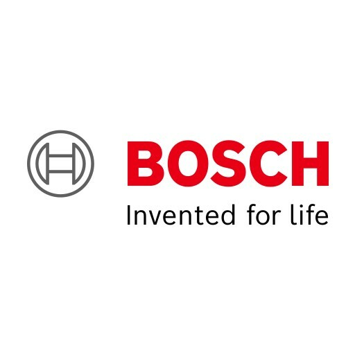
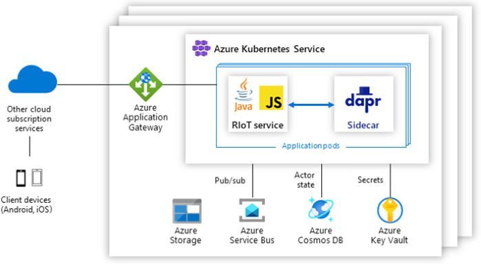

## 公司介绍

世界知名制造商博世（Bosch）创建了一家名为 Residential IoT Services GmbH ( 住宅物联网服务有限公司 / RIoT)  的初创公司。专注于智能家居解决方案。

RIoT 运营着一个智能家居平台，用于跨设备和电器的自动化和信息，并开发了 [Home Connect Plus](https://www.home-connect-plus.com/) 应用程序。家庭用户可以通过 Home Connect Plus 连接，自动化和集中控制来自不同品牌的各种智能家居设备和整个系统。

Customer：Residential IoT Services GmbH  (Bosch-Group) 

Industry：Manufacturing 

Size：10,000+ employees 

Country：Germany 

Products and services 

- Azure Application Gateway 
- Azure Cosmos DB 
- Azure Key Vault  
- Azure Kubernetes Service (AKS) 
- Azure Service Bus

## 主要应用场景

为了控制和自动化智能家居设备，客户使用来自RIoT的Home Connect Plus移动应用程序，该应用程序向RIoT平台发送请求。

### 事件驱动的微服务

- binding 构建块
- pub / sub 构建块

"Dapr 为我们提供了对基础结构组件（如服务总线）的抽象级别。这使得进入发布/订阅模型变得更加容易，

通过调用 Dapr API，开发人员可以将其应用程序代码与状态管理、资源绑定、发布/订阅消息传递和其他常见的分布式系统挑战分离。

### 自动缩放

为了满足服务的预期规模，RIoT 工程师很早就决定使用 Azure 和[分布式应用程序运行时](https://dapr.io/) （Dapr），这是一个开源框架，可以更轻松地为云和边缘构建微服务。RIoT受益于Azure的全球规模以及Dapr与Azure Kubernetes Service（AKS）的集成，这有助于团队更快地将其创新推向市场。

为了部署服务并在 Kubernetes 集群中运行它，开发人员向 Dapr 部署方案添加了一些注释。AKS 可自动执行操作和维护任务，例如预配、缩放和监视，这有助于降低开发人员的复杂性。

### Dapr抽象带来的开发便利

Dapr 提供的抽象层还使开发人员可以轻松更改不同环境中使用的组件：

| 抽象层  | 云上部署          | 本地开发测试 |
| ------- | ----------------- | ------------ |
| pub/sub | Azure Service Bus | Redis        |
| status  | Azure Cosmos DB   | Redis        |
| secret  | Azure Key Vault   | Redis        |

Jasper Mang: Lead Developer: 

We used the Dapr SDK to publish events, which gave us the time to focus on what we wanted to communicate, instead of, ‘How do I get this communication implemented?’ We could focus on the real things that matter. 

> 我们使用 Dapr SDK 发布事件，这让我们有时间专注于我们想要传达的内容，而不是如何实现这种沟通？我们可以专注于真正重要的事情。

即专注于 "**What** to do"，而不是 "**How** to do"，这也就是云原生的精髓所在：业务逻辑和技术实现分离解耦。

### actor模型

*actor* 是具有单线程执行的计算和状态的隔离单元。使用 Dapr actor 来表示设备及其逻辑，IoT 开发人员可以更轻松地跨群集管理计算任务。

在RIoT平台中，Actor用于表示基于时间的自动化。RIoT 使用了 dapr actor 自带的 timer 和 reminder。 

> 备注：Bosch 是 dapr actor 构建块的第一个 Java 用户，一起完善了 dapr java sdk。

### 总结

- 基于微服务的架构支持大量的并发用户，而Dapr简化了 事件驱动的后端系统。
- Dapr的pub/sub构建模块允许服务之间使用消息进行通信。
- 而Dapr绑定使Azure服务总线能够接收这些消息并将其发送到指定的微服务中。
- Azure Cosmos DB是生产状态 存储，而Redis则用于本地开发和测试。

## 案例资料

- [Microsoft Customer Story-Bosch builds smart homes using Dapr and Azure](https://customers.microsoft.com/en-us/story/1435725395247777374-bosch-builds-smart-homes-using-dapr-azure)
- [RIoT GmbH 技术案例摘要.pdf](https://ms-f7-sites-03-cdn.azureedge.net/docs/stories/1435725395247777374-bosch-builds-smart-homes-using-dapr-azure/resources/d250c724-4242-4729-b39e-c6e55c22b961/riot_gmbh_technical_story_summary.pdf)
