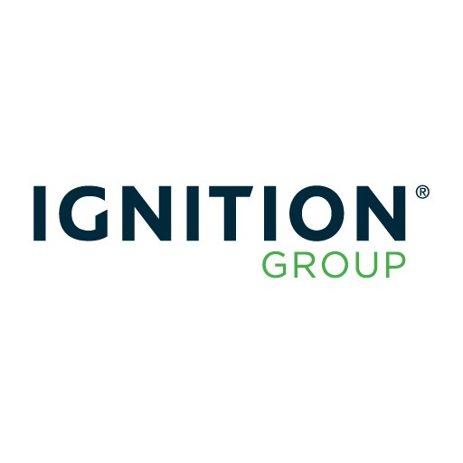

## 公司介绍

Ignition Group成立于2002年，是非洲最大的技术，媒体，电信和金融服务提供商之一。

## 主要应用场景

*Ignition Group 使用 Dapr 来加速 Azure Kubernetes Service 的开发，用于其新的、可扩展的订单处理和支付系统。*

主要编程语言：.NET Core （最初是使用.NET Framework和Windows Workflow Foundation开发）

### 简化微服务开发

类似。

### Dapr抽象带来的可移植性

Dapr Binding API 的使用：

在构建 Marketic 时，团队意识到它正在使用关系数据库 SQL Server 来存储文档，后来切换到MongoDB。

我们所做的只是使用与 SQL Server 通信的 ID 相同的 ID 进行部署，因此没有其他任何内容注意到我们更改了后端存储。

Dapr Secret API 的使用：

开发环境使用 Kubernetes secrets，生产环境使用 Azure Key Vault 。

## 案例资料

- [Microsoft Customer Story-Ignition Group speeds development and payment processing using Dapr and Azure](https://customers.microsoft.com/en-us/story/1335733425802443016-ignition-group-speeds-development-and-payment-processing-using-dapr-and-azure)
- [Ignition Group technical story summary.pdf](https://ms-f7-sites-03-cdn.azureedge.net/docs/stories/1335733425802443016-ignition-group-speeds-development-and-payment-processing-using-dapr-and-azure/resources/0d3693c4-823d-4d22-8070-34e88370ee6f/ignition_group_technical_story_summary.pdf)

