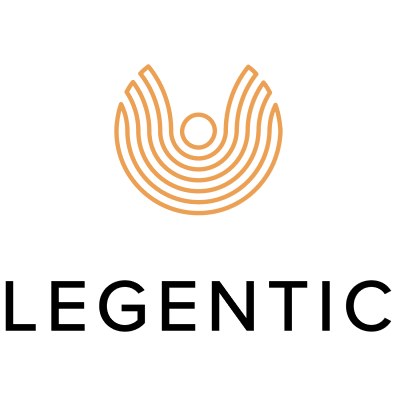

## 公司介绍

Legentic在其解决方案中利用了 Dapr 与Python和运行在AWS上的FastAPI。

## 主要应用场景

主要编程语言：Python

### 消息通讯

The fact that we could focus on the core logic and let Dapr deal with the underlying messaging systems allowed us to iterate much faster than we expected.

> 我们可以专注于核心逻辑，让Dapr处理底层的消息传递系统，这让我们的迭代速度远远超过我们的预期。

## 案例资料

- https://www.youtube.com/watch?v=Mn0vjMMktGA

