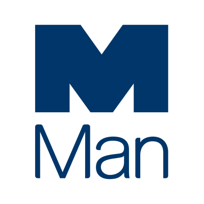

## 公司介绍

Man Group

## 主要应用场景

Man集团使用Dapr来更新其交易平台，该平台在内部部署的虚拟机上运行。

With Dapr we can introduce platform-wide capabilities across a broad spectrum of technologies and deployment models with minimal effort, allowing us to more effectively evolve our core trading system

> 有了Dapr，我们可以用最小的努力在广泛的技术和部署模式中引入平台范围的功能，使我们能够更有效地发展我们的核心交易系统。

主要编程语言： .net

使用HashiCorp Consul进行 Dapr名称解析

TBD

## 案例资料

- https://www.youtube.com/watch?v=hEKlsyRFtzI

