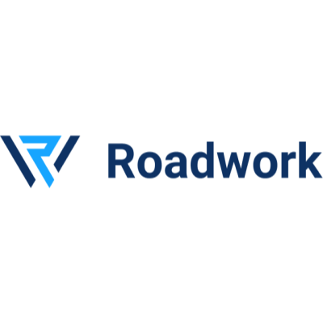
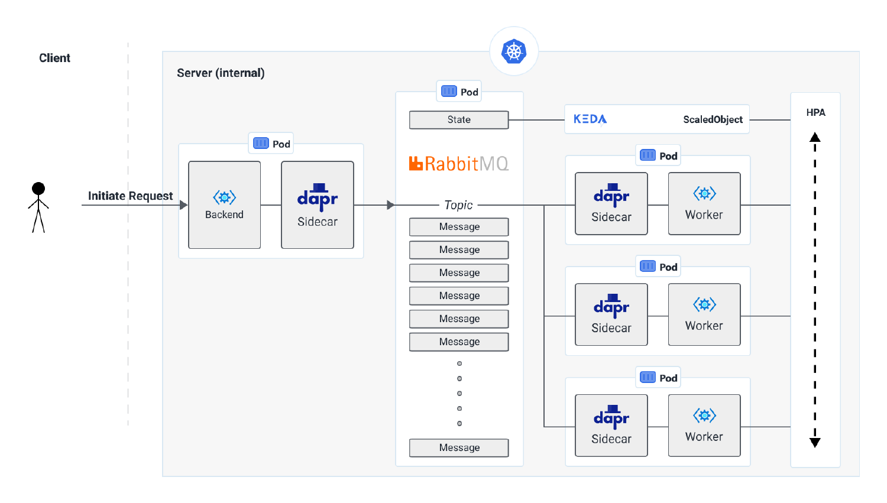

## 公司介绍

初创公司，数据处理。

To create a platform that allows our customers to gain actionable insights from their data without additional operational effort

> 创建一个平台，使我们的客户能够从他们的数据中获得可操作的见解，而不需要额外的运营努力。

## 主要应用场景

[Scraper.AI](https://scraper.ai/) 网站，允许任何用户访问任何网站，指向他们想要提取或监视的数据，它会提取数据，然后以结构化的方式将其呈现给用户。

- 按需任务：在后台，Scraper.AI 创建实例，用于执行用户设置的操作。实例占用约 2048MB 的 RAM，平均持续时间为 30 秒。

- 调度任务：此外还有各种定时调度任务（hourly, daily, weekly / monthly）。

成本考虑，必须实现硬件和软件上的自动伸缩方案，是典型的 serverless 场景。

核心诉求：希望保持我们的解决方案的 "可移植性"和"与云无关"，以便它可以移动到我们想要的任何位置，尽可能避免"供应商锁定"。

### serverless解决方案

Dapr + KEDA 

- Dapr：用于和 rabbitmq的连接，仅仅需要调用 dapr 的 rest 接口 (HTTP API，绕开了 dapr sdk)。

- KEDA： 用于 Kubernetes 的事件驱动自动缩放

  监控队列大小，一旦队列中的项目超过某个阈值，KEDA 将自动横向扩展部署，以向集群中添加额外的容器。

### 可移植性

从Digital Ocean 迁移到AWS，最后迁移到Azure，迁移只需要几个小时，因为所要做的就是再次配置Kubernetes，Dapr和KEDA，然后我们就可以再次设置和运行！

## 案例资料

- [Running Dapr in production at Roadwork | Dapr Blog](https://blog.dapr.io/posts/2021/02/09/running-dapr-in-production-at-roadwork/)

