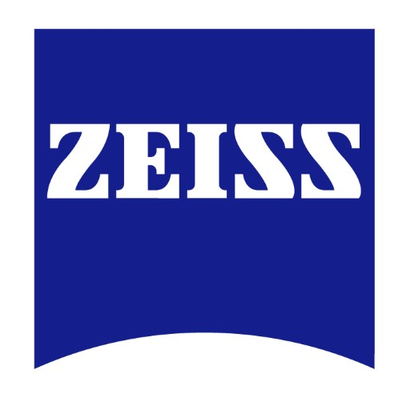
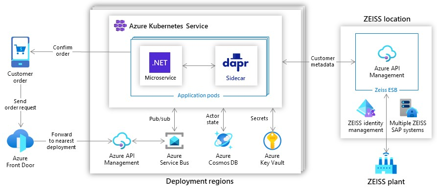
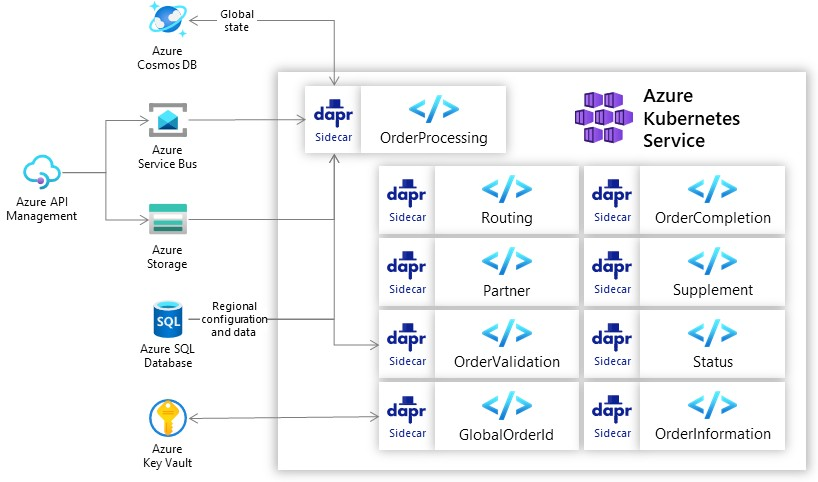

## 公司介绍

蔡司是光学和光电子领域的国际技术领导者。蔡司集团是一家国际领先的技术企业，在半导体制造技术、工业质量和研究、医疗技术和消费市场等领域开展业务。自1846年成立以来，蔡司不断推动光学领域的发展，并塑造技术进步。

Customer：[Carl Zeiss AG](https://www.zeiss.com/)

Industry：Manufacturing 

Size：10,000+ employees 

Country：Germany 

Products and services 

- Azure API Management
- Azure Container Registry
- Azure Cosmos DB
- Azure DevOps
- Azure Front Door
- Azure Key Vault
- Azure Kubernetes Service
- Azure Service Bus
- Azure Storage

## 主要应用场景

主要场景：消费者业务，需要一个更敏捷的订单管理和处理系统。主要挑战是一个拥有20年历史的后端系统，具有硬编码的业务规则，最初的订单验证和路由解决方案基于具有固定容量的单体架构，存在很多系统依赖性，更改始终需要昂贵且耗时的开发人员干预。

主要编程语言： Java和JavaScript

### 简化微服务开发

开发人员面临着使用微服务架构构建分布式应用程序的复杂性。他们希望专注于业务逻辑，同时依靠运行时和托管平台，为他们的应用程序提供可扩展性、弹性、可维护性、弹性以及微服务架构的其他属性。

使用了 service invoke，statue，secret，还有可观测性：从其应用程序中获取详细的跟踪、指标和日志记录信息，以发送到 Azure Application Insights。

Dapr really simplifies the case of distributed application architectures. With Dapr, any  developer can do it

> Dapr真正简化了分布式应用架构的情况。有了Dapr，任何开发者都可以做到这一点。

### 事件驱动的工作流程：全球和区域

Azure Front Door 将请求路由到最近的区域，每个区域都包含处理和存储特定于该区域设置的数据所需的 Azure 资源。

Azure API Management 充当区域资源的网关，用于有效管理其在本地和 Azure 上托管的 API。

使用到 Azure Service Bus 和 Dapr pub/sub 构建块。

*蔡司订单处理逻辑在 AKS 中与 Dapr 结合使用在区域上运行。唯一的订单号全局存储在 Azure Cosmos DB 中。*

### Dapr抽象带来的开发便利和多云支持

编写代码的开发人员不必知道和学习特定技术的所有细节即可发布和订阅消息，从而使代码具有可移植性并更快地开发。

This flexibility enables the ZEISS developers to swap out alternative services to support multiple cloud and on-premises environments. Without having to change one line of code, we can still use the same state and use the same business code.

> 这种灵活性使蔡司的开发人员能够调换替代服务，以支持多种云和企业内部环境。无需改变一行代码，我们仍然可以使用相同的状态，使用相同的业务代码。

In our multicloud environment, Dapr gave us the flexibility we needed. It provides a layer of abstraction that allows the developers to focus on the business case at hand.

> 在我们的多云环境中，Dapr为我们提供了所需的灵活性。它提供了一个抽象层，使开发人员能够专注于手头的业务案例。

### actor模型

Order Processing 应用程序编排其他八个微服务，这些微服务做出有关供应链物流的决策，例如将订单传送到何处以及订单是否有效。

为了管理订单的生命周期，蔡司使用了Dapr virtual actor。*actor* 是具有单线程执行的计算和状态的隔离单元。Actor 非常适合创建工作流、IoT 和其他具有独立计算单元的应用程序。

蔡司创建了**GlobalOrderID**和**Status**作为Dapr  virtual actor：

- **GlobalOrderID** 服务生成唯一的订单号

- Statue 服务将订单的当前状态报告给附加的子系统。

actor 状态全局存储在 Azure Cosmos DB 中。

### 总结

We wanted a platform-agnostic, microservices architecture with a very small footprint. We got that with Dapr and Azure Kubernetes Service.

> 我们想要一个与平台无关的微服务架构，占用空间非常小。我们通过Dapr和Azure Kubernetes Service获得了这一点。

## 案例资料

- [微软客户案例蔡司加速了Azure上的云优先开发，并简化了订单处理 (microsoft.com)](https://customers.microsoft.com/en-us/story/1336089737047375040-zeiss-accelerates-cloud-first-development-on-azure-and-streamlines-order-processing)
- [蔡司技术案例摘要.pdf](https://ms-f7-sites-03-cdn.azureedge.net/docs/stories/1336089737047375040-zeiss-accelerates-cloud-first-development-on-azure-and-streamlines-order-processing/resources/ff98b7cb-7b3e-4411-aaca-0d4515e96111/zeiss_technical_story_summary.pdf)
